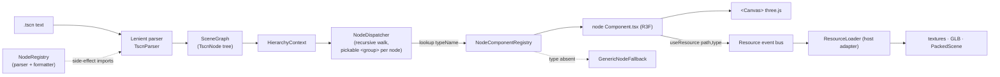
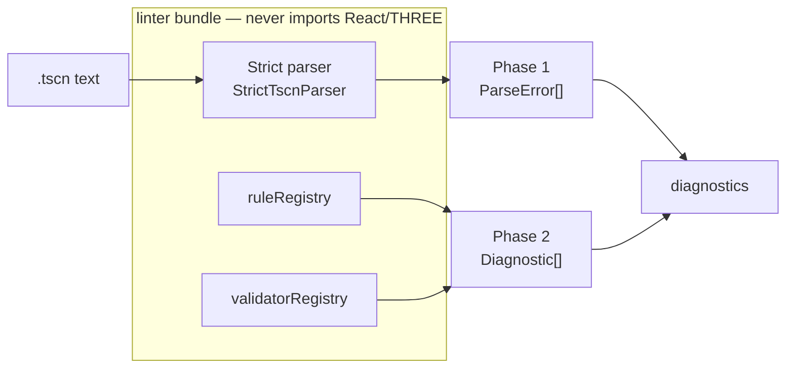
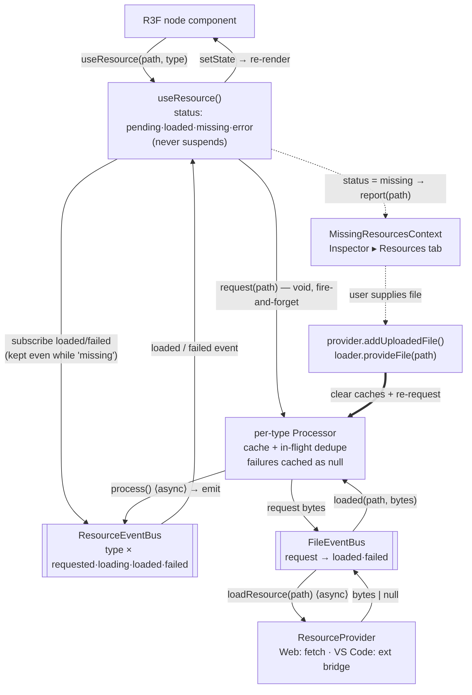
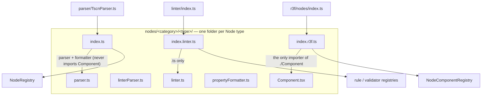
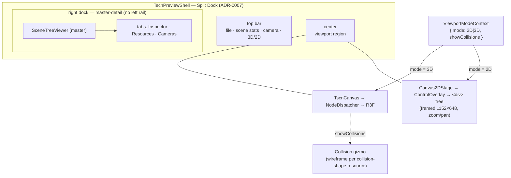

# Architecture

## Technology Stack

- TypeScript 6 (strict mode)
- pnpm workspaces with catalog dependency versions
- Vitest 4.1 (with `@react-three/test-renderer` and `@testing-library/react`)
- React 19 + react-three-fiber 9 + @react-three/drei
- three.js 0.184
- Vite 6 (web app) + esbuild (VS Code extension)

## Domain language & decisions

- **[CONTEXT.md](./CONTEXT.md)** — the shared glossary (Node, SceneGraph, vertical slice, viewport mode, Control overlay, collision gizmo, …). Use these terms exactly.
- **[docs/adr/](./docs/adr/)** — architecture decision records, one per load-bearing decision, sequentially numbered with self-describing filenames (the directory is the source of truth — read it rather than a list mirrored here). Start with [0001 unified slice + React-free linter](./docs/adr/0001-unified-slice-react-free-linter.md) and [0002 three registries](./docs/adr/0002-three-separate-registries.md), which fix the overall shape; the rest record feature-level decisions (viewport-mode seam, render intent, animation drivers, instance-root merge, …).

## System Overview

### Render pipeline (lenient parser → R3F)



### Linter pipeline (strict parser, React/THREE-free bundle)



The render and linter pipelines are **separately bundleable** because the parse, lint, and render domains use three distinct registries keyed by the same `typeName` (see [ADR-0002](./docs/adr/0002-three-separate-registries.md)). The linter never transitively imports a `Component.tsx` (see [ADR-0001](./docs/adr/0001-unified-slice-react-free-linter.md)).

## Project Structure

```
/
├── packages/
│   └── textscene-core/          # Core library: parser, linter, R3F components
│       └── src/
│           ├── parser/          # Lenient TSCN parser used for rendering
│           ├── linter/          # Strict parser + lint rule registry
│           ├── nodes/           # UNIFIED vertical slices — one folder per node type,
│           │   │                #   each holding parser + linter + formatter + Component
│           │   │                #   + 3 entry points (index.ts / index.linter.ts / index.r3f.ts)
│           │   ├── node/
│           │   ├── base/{node2d,node3d}/
│           │   ├── 2d/
│           │   │   ├── ui/                  # 17 Control slices (control, label, button, containers, ...) — DOM overlay (ADR-0003)
│           │   │   ├── tiles/{tilemap,tilemaplayer}/    # + shared/ — TileSet/atlas decoding
│           │   │   └── {sprite2d,camera2d,animatedsprite2d,polygon2d,line2d,
│           │   │        marker2d,path2d,pathfollow2d,navigationregion2d}/
│           │   ├── 3d/
│           │   │   ├── meshinstance3d/      # parser.ts, linter.ts, Component.tsx, index{,.linter,.r3f}.ts
│           │   │   ├── camera3d/
│           │   │   ├── csg/{csgbox3d,csgcylinder3d,csgsphere3d,     # real booleans (ADR-0026)
│           │   │   │        csgtorus3d,csgmesh3d,csgpolygon3d,
│           │   │   │        csgcombiner3d}/
│           │   │   ├── lights/{directional,omni,spot,area}light3d/  (+ shared/ — parser, formatter, lint checks, lightShared/lightHelpers render code)
│           │   │   ├── {sprite3d,skeleton3d,particles/gpuparticles3d,marker3d,
│           │   │   │     gridmap,navigationregion3d,decal}/
│           │   │   ├── worldenvironment/
│           │   │   └── label3d/
│           │   ├── audio/audiostreamplayer{,2d,3d}/
│           │   ├── animation/{animationplayer,animationtree}/
│           │   ├── paths/{path3d,pathfollow3d}/
│           │   ├── physics/2d/{staticbody2d,rigidbody2d,characterbody2d,area2d,collisionshape2d}/
│           │   └── physics/3d/{staticbody3d,area3d,collisionshape3d,...}/  # transform-only render + collision gizmo (ADR-0005/0008)
│           ├── core/            # SceneGraph + immutable resolution helpers
│           │   ├── NodeRegistry.ts        # Parser + formatter registry
│           │   ├── SceneGraph.ts          # Immutable resolved scene + buildSceneGraph()
│           │   └── createTypeRegistry.ts  # Shared Map-backed registry factory (ADR-0002)
│           ├── r3f/             # react-three-fiber UI surface (render infrastructure)
│           │   ├── TscnCanvas.tsx         # <Canvas> + NodeDispatcher
│           │   ├── NodeDispatcher.tsx     # SceneGraph -> React tree
│           │   ├── NodeComponentRegistry.ts
│           │   ├── nodeTransform.ts        # Node3D properties -> THREE transform
│           │   ├── nodes/index.ts          # barrel: imports every slice's index.r3f
│           │   ├── internal/{generic-node-fallback,glb-scene-root}/  # synthetic render-only types
│           │   ├── contexts/{Selection,Hierarchy,CameraControl,NodePath}Context.tsx,
│           │   │             {AnimationTransport,AnimationDriver,AnimatedValue}Context.tsx
│           │   ├── controls/               # 2D Control overlay subsystem (ADR-0003):
│           │   │                           #   ControlComponentRegistry, ControlDispatcher,
│           │   │                           #   ControlOverlay, layout/StyleBox→CSS mapping
│           │   ├── components/{TscnPreviewShell,Canvas2DStage,
│           │   │               SceneTreeViewer,NodeDetailsPanel,ViewportSelector,...}/
│           │   │   # TscnPreviewShell is a thin composition root; ViewportArea,
│           │   │   # CamerasPanel, and DockChrome are files inside TscnPreviewShell/;
│           │   │   # the 2D stage and viewport switch are sibling focused units
│           │   └── hooks/{useViewportSelection.tsx,useParsedScene.ts}
│           └── resources/       # Async resource loading
│               ├── FileEventBus.ts        # request(path) -> loaded/failed
│               ├── ResourceEventBus.ts    # typed processor events
│               ├── ResourceLoader.ts      # Texture/Material/GLB/Scene
│               ├── useResource.ts         # React hook over the event bus
│               ├── ResourceLoaderContext.tsx
│               ├── meshes/                # Primitive mesh parsers
│               └── materials/standardmaterial3d/  # Material parser + renderer
└── apps/
    ├── textscene-vscode/         # VS Code extension (esbuild)
    ├── textscene-web/            # Web previewer (Vite) — owns the Source pane (ADR-0020)
    └── textscene-linter/         # CLI linter (Node)
```

## Key Concepts

### React-Three-Fiber Rendering

Rendering is owned by `<TscnCanvas>`, which mounts an R3F `<Canvas>`,
reads the active `SceneGraph` from `HierarchyContext`, and delegates
the node tree to `<NodeDispatcher>`. The dispatcher walks the scene
recursively: for each `TscnNode` it looks up the component in
`nodeComponentRegistry`, renders it with the node's pre-walked children,
and wraps the subtree in pointer handlers from `useViewportSelection`
plus a `<NodePathProvider>` so descendants can read their own TSCN path.

Each node type owns one unified vertical slice under
`packages/textscene-core/src/nodes/<category>/<type>/` containing its
`parser.ts`, `linterParser.ts`, `linter.ts`, `propertyFormatter.ts`,
`types.ts`, `Component.tsx`, co-located tests, and three registration
entry points: `index.ts` (parser/formatter → `NodeRegistry`),
`index.linter.ts` (validators + rules → linter registries), and
`index.r3f.ts` (render component → `nodeComponentRegistry`). The
`r3f/nodes/index.ts` barrel imports each slice's `index.r3f` for its
side effect. Unknown types render as `<GenericNodeFallback>` (a labeled
placeholder cube) from `r3f/internal/`. Not every slice carries every
file: `propertyFormatter.ts` is present only for types with non-default
Inspector formatting, and linter entry points exist only for types with
validators/rules (Controls are render-only per
[ADR-0003](./docs/adr/0003-2d-ui-dom-overlay.md)). Registration
granularity also varies deliberately: the five 2D physics bodies share
one loop-based registration (`nodes/physics/2d/`) because they are
five identical transform-only slices, while the 3D physics types keep
per-type folders because each carries real per-type lint rules. See
[ADR-0001](./docs/adr/0001-unified-slice-react-free-linter.md).

### Two-Parser Architecture

Two parsers serve different use cases, but they share ONE scanning loop:
`packages/textscene-core/src/parser/TscnParserCore.ts`. The core loop
takes an optional `ParseObserver` (`onError` / `onSectionStart` /
`onProperty` hooks) — strict behavior is an observer adapter, lenient
behavior is the bare loop:

- **`packages/textscene-core/src/parser/TscnParser.ts`** — lenient
  parser used by the renderer. Runs the core loop with NO observer:
  recovers from errors, logs warnings, keeps rendering whatever it can.
- **`packages/textscene-core/src/linter/StrictTscnParser.ts`** — strict
  parser used by the CLI linter and the language-feature providers. A
  thin adapter that runs the SAME core loop with an observer that
  collects every syntax/format error (with line/column information),
  performs strict heading checks (missing node name/identifier), and
  runs `validatorRegistry` property validators.

The observer is purely additive — it never changes what the lenient
loop parses or recovers, so renderer behavior is identical with or
without it. `TscnParserCore` stays three.js-free, preserving the
React-free linter boundary (ADR-0001).

The lenient parser uses `NodeRegistry` to convert raw TSCN body
properties (snake_case strings) into the strongly-typed shape declared
by each node type's `parser.ts`. Each node-type's `index.ts` registers
its parser + property formatter on module load via side-effect
imports declared in `parser/TscnParser.ts`.

### Godot → three.js orientation conversions

Godot and three.js disagree on three axis conventions. Each is converted at the
boundary where Godot data becomes a three.js object — never in the parsers or
decoders, which stay faithful readers of what the file says:

- **Texture V.** Godot's UV origin is the image's **top**-left. Textures load
  with three's default `flipY=true` (nothing in the codebase sets it), which
  uploads the image bottom-up, so a Godot V must be mirrored: `v → 1 - v`.
  Textures are shared **by identity** between 2D and 3D consumers, so this is
  converted per consumer, never by flipping the texture:
  `resources/meshes/arrayMeshGeometry.ts` (mesh UV attribute),
  `resources/tileset/tileGeometry.ts` (`pxRectToUv`) and `r3f/spriteFrame.ts`
  (region/frame windowing via texture offset+repeat). The shapes differ enough
  that the shared part is only the `1 -`; there is deliberately no helper.
  The material UV transform (`uv1_scale`/`uv1_offset`) does **not** convert —
  see the `uv1 V-anchoring` note in the StandardMaterial3D comparison sheet
  ([docs/comparison/sheets/standardmaterial3d.md](./docs/comparison/sheets/standardmaterial3d.md)).
- **Triangle winding.** Godot fronts triangles clockwise, three.js expects
  counter-clockwise — every decoded index triple is reversed (`arrayMeshGeometry.ts`).
  Without it, flat meshes vanish and closed meshes render inside-out.
- **2D Y.** Godot's 2D Y grows downward; the Y negation lives in
  `r3f/node2dTransform.ts`.

A regression here is invisible to most fixtures — an untextured mesh, or a
vertically symmetric texture, cannot show a V error at all. `unit-arraymesh-uv.tscn`
exists to pin it: a four-band atlas whose green band must read at the TOP.

### Resource Loading

External resources (textures, materials, GLB meshes, packed scenes) flow through
a **two-bus, event-driven pipeline** — *not* promises/Suspense at the component
boundary. `request(path)` is fire-and-forget (returns `void`); a component learns
a resource loaded by **receiving an event**, not by awaiting a promise. (Promises
do the async I/O underneath — see the note below.)

**The layers, host → component:**

1. **`ResourceProvider`** (app layer): the host's file access —
   `WebResourceProvider` (HTTP `fetch`) or `VSCodeResourceProvider` (the
   extension's `res://` bridge, CSP-honoring). `loadResource(path)` returns
   `string | ArrayBuffer | null` (async).
2. **`FileEventBus`** — type-agnostic raw bytes: `request(path) →`
   `loaded(path, bytes) | failed(path, err)`. Calls the provider, caches bytes,
   dedupes in-flight requests.
3. **Per-type processors** (`createResourceProcessor`): one
   cache + in-flight + emit machine per type. On raw bytes it runs `process()`
   (async), caches the result (**failures cached as `null`** so they don't
   retry), and emits on the… (One documented edge: a path that **no**
   processor's `shouldProcess` claims stays pending forever — by design,
   since sibling processors share one `FileEventBus`; pinned in
   `createResourceProcessor.test.ts`.)
4. **`ResourceEventBus`** (core layer): typed events namespaced
   `texture|material|glb|scene` × `requested|loading|loaded|failed|invalidated`,
   carrying the processed payload. Scenes load "directly" (the parser needs path +
   content together) but emit the same events. `invalidated` fires per
   formerly-cached path on `ResourceLoader.clearCaches()` (corpus switch) —
   mounted hooks hold their value in React state, so without it they would keep
   serving the cleared corpus's resource forever; on receiving it they
   re-request under whatever provider state the HOST has arranged (the host must
   repoint the provider/URL modifier before clearing — **and must clear only with
   the outgoing corpus's scene already torn down**, since every consumer still
   mounted answers the announcement by re-requesting its own `res://` paths out
   of the incoming corpus, downloading an unrelated fixture's files). The LOADER
   owns the announcement, emitting only after every cache layer is reset and
   before metadata clears (scene loads validate registration synchronously); a
   processor's own full clear is silent. Both the `FileEventBus` and each
   processor also carry a clear **generation**: a fetch that departed before a
   full clear finishes under the cleared era and its result (success or
   failure) is dropped, never cached or announced.
5. **`ResourceLoader`**: owns the `MetadataStore` + the four processors
   (`textures`, `materials`, `glbMeshes`, `scenes` — WI-ARCH-2 collapsed the old
   standalone `SceneLoader` into a `createSceneProcessor`). `register()` records
   `ExtResource` id↔path; `provideFile(path)` drives the late-arrival flow below.
6. **`useResource(path, type)`** — the only thing R3F components see. It **never
   suspends**; it returns `{ value, status, error? }` with
   `status ∈ 'pending' | 'loaded' | 'missing' | 'error'`. On mount it does a
   synchronous cache check, then **subscribes** to the bus and fires `request()`
   *after* subscribing (so a synchronous cache-hit emit isn't missed). Object3D
   values (`GLBMesh`) are cloned per consumer (three.js single-parent rule,
   CLAUDE.md). Components branch on `status` and render placeholders for missing
   resources — the subtree never suspends.

**Late arrival — why it's events, not a one-shot promise.** When a load fails the
hook flips to `missing` and reports the path to `MissingResourcesContext`, which
lists it in the Inspector's **Resources** tab. **The hook keeps its subscription
while `missing`.** When the user supplies the file the host calls
`provider.addUploadedFile(path, file)` + **`loader.provideFile(path)`**, which
clears the file/processor caches for that path and **re-requests** it. The fresh
bytes → `process()` → a new `loaded` event → the still-subscribed hook flips
`missing → loaded` and the component re-renders **with no remount**. A promise
resolves once; a live subscription lets a node that was missing for minutes wake
up the instant its file appears.

**Where promises live (supporting role only):** the actual fetch/parse is async
(`loadResource`, `process()`, the scene `loadDirectly`); `finishLoad` awaits them
then emits. One deliberate event→promise *adapter*: when a material needs an
inline texture, `ResourceLoader` does `await eventBus.once('texture','loaded',id)`
— a linear `await` over a single event. The component contract stays a pure
`(status, value)` reacting to events.



### Linter Bundle Isolation

The linter package stays React-free. `packages/textscene-core/src/
linter/index.ts` imports each slice's `index.linter.ts` entry point
(which pulls only `linterParser.ts` + `linter.ts`) plus the
resource-level `linterValidators.ts` files — never the `r3f/` tree or
`nodes/**/Component.tsx`. This keeps the linter CLI bundle small.

### Self-Registration Patterns

Two parallel registries:

- `nodeRegistry` (`core/NodeRegistry.ts`): node-type parser + formatter.
  Used by `TscnParser` to convert TSCN body properties.
- `nodeComponentRegistry` (`r3f/NodeComponentRegistry.ts`): node-type
  React component. Used by `NodeDispatcher` to render the SceneGraph.

Each node type registers itself in both registries via side-effect
imports — `parser/TscnParser.ts` and `r3f/index.ts` import every node
type's `index.ts` / `nodes/index.ts` for the registration.

### Multi-Panel State Isolation

Each `<TscnPreviewShell>` instance creates its own `HierarchyContext`,
`SelectionContext`, and `CameraControlContext`. Two panels open in the
same VS Code window cannot corrupt each other's selection state because
the React context is scoped per shell. The `panelId` prop is the stable
key for log correlation and (future) multi-panel coordination.

### Camera Switching

`CameraControlContext` exposes `activeCameraPath` plus `switchToCamera`
/ `returnToFreeView` actions. The `<NodeDetailsPanel>` renders a "Use
This Camera" / "Reset Camera" button when the selected node is a
Camera3D. The `<TscnCanvas>` houses an `ActiveCameraSwitcher` that
swaps the R3F active camera via `useThree(state => state.set)` based on
the `userData.tscnPath` tag the Camera3D component writes to its
three.js camera.

### Animation

Godot's animation system drives *other* nodes' properties, deliberately
breaking the "each component renders itself" invariant (ADR-0011): an
`AnimationPlayer` renders as an invisible transform-only group but is also an
**animation driver**. Each `[sub_resource type="Animation"]` (a
**GodotAnimation** — `length`/`loop_mode`/`step` plus **Track**s targeting
`NodePath("Node:property")`) is parsed render-side and built into a
`THREE.AnimationClip`. Two paths carry values, split by what a
`THREE.AnimationMixer` can bind:

- **Transform tracks** (`position`/`rotation`/`rotation_degrees`/`scale`) drive
  a mixer rooted at the player's **Animation root** (`root_node`, default
  `..`); `THREE.PropertyBinding` resolves each target by name through the
  dispatcher's unnamed pickable wrappers (ADR-0011).
- **Non-transform tracks** (a discrete `Sprite2D:frame`, continuous
  `Decal:modulate`/`Decal:size`) can't go through the mixer, so the player
  samples the live mixer playhead and pushes values through the
  **AnimatedValue push registry** (`r3f/contexts/AnimatedValueContext.tsx`) —
  a ref-backed registry keyed by `${nodePath}:${property}` that the target
  component subscribes to, overriding its authored value while a value is
  pushed (ADR-0016, ADR-0017).

Playback is owned by one **Animation transport** (`AnimationTransportContext`)
that follows the **currently selected node** — one driver plays at a time,
mirroring the Godot editor's Animation panel. Three node types can act as a
driver, unified behind the same transport and `usePlaybackLoop`:

- **`AnimationPlayer`** — the GodotAnimation path above.
- **`GLBSceneRoot`** acting as a **GLB animation driver** (ADR-0014): a GLB's
  own **GLB-embedded clip**s (ready-made `THREE.AnimationClip`s straight from
  the glTF loader — never parsed as a GodotAnimation) surface on a
  synthesized, tree-only `GLBAnimationPlayer` row; selecting that row runs a
  mixer rooted on the GLB object itself (no `root_node`).
- **`AnimatedSprite2D`** (ADR-0015) — no mixer; the transport advances a
  displayed frame directly via `frameAtTime`.
- **`AnimationTree`** (ADR-0019) owns no clips itself: it resolves its
  `tree_root` `AnimNode` graph at the authored `parameters/*` state into a
  **blend program** (`{clip, weight, timeScale}[]`), looks up the driver its
  `anim_player` NodePath names in the **AnimationDriverRegistry**
  (`AnimationDriverContext` — the `nodePath → {object, clips}` map every
  AnimationPlayer/GLB driver publishes on load), and drives that object with
  weighted actions. It evaluates only while `active = true` (Godot parity) AND
  selected, and exposes a single read-only transport entry (no clip picker).

Playback starts **stopped** (authored pose/frame preserved); play is
user-initiated. `RESET` (Godot's conventional rest-pose animation) lists like
any clip but is skipped by the transport's default-clip heuristic (prefers the
`autoplay` clip, else the first non-`RESET` clip) unless it is the only clip.
Because playback is non-deterministic over time, playback fixtures are
excluded from the visual-regression manifest; the default (stopped) render
stays byte-stable.

### VS Code Editor Features

- `TscnDefinitionProvider`: Ctrl/Cmd-click (Go to Definition) on a
  `SubResource("id")` / `ExtResource("id")` reference jumps to that id's
  `[sub_resource]` / `[ext_resource]` heading **within the same file**
  (text-layer feature, unaffected by R3F). It does **not** resolve an
  `ExtResource`'s `res://` path to the external file it points at — see
  `docs/user-guide-vscode.md` (VSCODE-04) for that gap.
- `TscnDocumentSymbolProvider`: scene tree appears in the VS Code
  Outline panel.
- File watcher: when a `.tscn` file changes, the extension host posts
  a fresh `loadTscn` message to the webview, which re-parses and
  re-renders. The R3F canvas DOM node is preserved across content
  changes so the viewport camera state survives hot-reload.

### Web Source Pane

The web app — only the web app; VS Code has its own real text editor — mounts
an editable **Source pane** (ADR-0020): a left sibling of
`<TscnPreviewShell>`, wired entirely through the shell's existing `toolbar`
slot and `content` prop so the shared shell's API and VS Code parity stay
untouched. A bare, forced-monospace `<textarea>` (`apps/textscene-web/src/r3f-main.tsx`)
holds the buffer — no Monaco/CodeMirror — fed by fixture selection, file
upload, or direct paste/type.

Edits reach the shell only through a debounced (~250 ms) gate
(`apps/textscene-web/src/sourceGate.ts` → `resolveForwardedContent`): the
buffer is forwarded when it still parses under the **Lenient parser** (the
same `parseTscnContent` the shell renders with, so gate and render can never
drift apart); otherwise the shell keeps its last-good content, so a mid-edit
file that transiently breaks holds the viewport on its last valid render
instead of blanking. Pane visibility and width persist in `localStorage`
(mirroring the existing active-fixture persistence); a draggable splitter
resizes it. Edits are ephemeral — switching scene or reloading resets the
buffer to the file's content, and nothing is written back to disk.

The web app is the first browser consumer of `@textscene/core/linter`
(`apps/textscene-web/src/r3f-main.tsx`): the buffer is linted continuously,
debounced independently of the render-forward gate above (a buffer that
fails to render can still be linted — the gutter is what explains why). A
pure helper (`lineDiagnostics.ts`) groups `Diagnostic[]` by line — highest
severity per line, every message kept — feeding a `<SourceGutter>` column
(`SourceGutter.tsx`) that renders an error/warning/info dot per offending
line, scroll-synced with the textarea, with a hover/focus popover listing
that line's message(s). The pane's toggle carries a compact problem-count
badge (`✖ 1 / ⚠ 2`) so a collapsed pane still nudges. A "Download .tscn"
button (Blob + anchor, no write-back to disk) sits in a small pane header;
the textarea carries a native placeholder for the empty state. When a
from-scratch paste/type never produces a valid render (`forwardedContent`
never leaves `''`), the web app shows its own "nothing has rendered yet"
notice layered over the viewport — the shared shell has no such state to
expose, so this lives entirely in the web app's own layer, never touching
`TscnPreviewShell`.

The web app also surfaces a missing-resource count badge in the toolbar:
`<Toolbar>` is rendered through the shell's `toolbar` prop, i.e. as a
descendant of the shell's own `<MissingResourcesProvider>`, so calling
`useMissingResources()` directly inside it reads the exact same live
`missingPaths` set the Resources tab's `<MissingResourcesPanel>`
aggregates — no new plumbing. A loading overlay covers the viewport while
a fixture's `fetch()` is in flight. `?fixture=` is now written back to the
URL via `history.replaceState` on every scene switch (never `pushState`),
so reloading or sharing the URL reopens the same scene. The app root
accepts a dropped `.tscn` (with a drop-zone hint while dragging), and the
toolbar's file input accepts multiple files at once; a shared
`handleFilesUpload` (backed by the pure, unit-tested
`multiFileUpload.ts`) picks the first `.tscn` as the scene and matches
every other file to one of its external-resource `res://` paths by
basename, so a scene and its textures can open in one gesture.

### Dependency Versions (Phase 14)

Spike-validated stack:

- React 19.2, react-dom 19.2, @react-three/fiber 9.6, @react-three/drei 10.7
- @react-three/test-renderer 9.1, @testing-library/react 16.3
- three 0.184, @types/three 0.184
- Vitest 4.1, happy-dom 20, @vitejs/plugin-react 5 (workspace is on Vite 6);
  `jsdom` also sits in the catalog as a devDependency but no vitest config
  actually selects it as a test `environment` — every DOM-needing project uses
  happy-dom, and node-only projects (CLI linter, VS Code extension host) use
  `environment: 'node'`.
- TypeScript 6.0.3

### Bundle Size Target

**Extension HOST bundles** (separate from the webview budget below): the
extension-host import graph uses only React-free core subpaths
(`@textscene/core/parser`, `/linter`, `/logger`, plus targeted resource
utils) — never the root barrel, whose React/CSS side effects defeat
tree-shaking. That keeps `dist/extension.js` ≈ 204 KB and
`dist/extension.web.js` (the vscode.dev worker host) ≈ 204 KB with zero
`react`/`three` occurrences. If a host file imports the root
`@textscene/core` barrel again, the host bundle balloons ~4× — check
sizes after touching host imports. This is no longer just a documented
claim: `scripts/check-bundle-size.mjs`'s host-bundle guard scans both
built files for a word-boundaried `react`/`three` token and hard-fails
unconditionally (never gated behind `--enforce`, unlike the webview
budget below) — wired into `pnpm check:bundle-size`, `pnpm validate`,
and CI (issue #215).

The PRD acceptance for WI-R3F-6 was "VS Code webview bundle no larger
than `main + 200 KB gzipped`". History:

- `main` baseline: 1,429,646 B raw / **247,543 B gzipped**
- WI-R3F-6 (iife, no code-splitting): 3,691,702 B raw / **638,980 B gzipped** — +382 KB gz, **+182 KB over budget**
- WI-R3F-18 (ESM + splitting + React.lazy panels): initial-paint static-import closure is 1,357,273 B raw / 390,322 B gzipped — +143 KB gz vs main, 57 KB under the +200 KB budget ✅
- Post-WI-R3F-18 feature growth (GLB support — GLTFLoader/KTX2Loader/DRACOLoader/MeshoptDecoder — plus further node/animation coverage) pushed the closure back over budget: **536,997 B gzipped, 87.4 KB OVER budget**. Part of that regrowth was drei's `<Text>` (troika-three-text + bidi-js + its sdf-generator worker, statically imported by `InternalTextLabel` for the empty-state placeholder label) baked directly into `webview.js`.
- **Issue #215: `InternalTextLabel`'s drei `<Text>` converted to `React.lazy`.** It no longer sits in `webview.js`; it resolves in its own on-demand chunk the first time it actually renders. Result: **492,801 B gzipped — still 44.2 KB OVER budget**, a ~44 KB gz reduction from the troika split alone.
- **Issue #241: GLTFLoader + SkeletonUtils converted to dynamic `import()` in `glbProcessing.ts`.** Both modules are now split into on-demand lazy chunks (`GLTFLoader-*.js`, `SkeletonUtils-*.js`) that only load on the first actual GLB resource request. Scenes without any GLB references pay no loading cost for the loader chain at all. Result (measured on PR #286): **496,404 B gzipped before the split, 484,921 B gzipped after**, an 11.2 KB gz reduction; that left the closure 36.5 KB OVER the original 447,543 B budget. Investigation confirmed DRACOLoader, KTX2Loader, and MeshoptDecoder are NOT imported anywhere in source — they only appear as string plugin-name literals inside GLTFLoader; none of the vendored fixture GLBs use Draco or Meshopt compression.
- **Budget renegotiated (2026-07-14, PR #286): absolute ceiling of 600,000 B (600 kB) gzipped.** The original `main + 200 KB` criterion (447,543 B gz) came from the WI-R3F-6 PRD acceptance and predates GLB support becoming a committed, shipped feature. With the realistic lazy-loading landed (drei `<Text>`/troika in issue #215, GLTFLoader + SkeletonUtils in issue #241), the remaining closure is legitimate feature cost, so growth is accepted for now. Current closure of **484,921 B gz leaves ~115 KB headroom** under the new ceiling. Longer term the plan is to evaluate lighter rendering technologies to shrink the webview, not to squeeze this stack further.

WI-R3F-18 closed the gap (at the time) with three combined changes:

1. **Webview build flipped from `iife` to `esm` + `splitting`**
   (`apps/textscene-vscode/esbuild.config.mjs`). iife couldn't
   code-split — every transitive import landed in one bundle. ESM
   with splitting emits `dist/webview/webview.js` (entry) plus
   `dist/webview/chunks/*.js` (shared + lazy chunks).
2. **DOM panels lazy-loaded via `React.lazy` + `<Suspense>`**
   (`packages/textscene-core/src/r3f/components/TscnPreviewShell/TscnPreviewShell.tsx`).
   `<SceneTreeViewer>` and `<NodeDetailsPanel>` are no longer in the
   initial static-import closure; they load on demand with a
   `Loading tree…` / `Loading details…` fallback while resolving.
3. **CSP + html template updated for ESM** — `<script type="module">`
   and `script-src ${cspSource}` (in addition to the nonce'd entry)
   so the webview can fetch chunk URIs.

The initial chunk now contains: React, react-dom/react-reconciler
(react-three-fiber's runtime), drei's non-`Text` runtime, three.js core,
the scene canvas (`<TscnCanvas>`), the node component registry (registers
all node types on import), the resource pipeline, contexts, and selection.
The lazy chunks contain: the tree viewer, the details panel, drei's
`<Text>` (troika-three-text + bidi-js + its sdf-generator worker),
GLTFLoader + SkeletonUtils (loaded on the first GLB resource request),
and the CSS modules the DOM panels own.

**Bundle-size guard.** `scripts/check-bundle-size.mjs` walks the
static-import closure starting at `webview.js`, gzips the
concatenation, and compares against the renegotiated absolute budget of
**600,000 B gzipped**; it also runs the host-bundle react/three guard
described above. Wired into `pnpm validate` and CI
(`.github/workflows/ci.yml`, issue #215), and the repo's
`check:bundle-size` script passes `--enforce` (issue #241), so a budget
breach is a hard failure everywhere the script runs.

**Status of the budget gate: ENFORCED.** On 2026-07-14 (PR #286,
closing issue #241) the webview budget was renegotiated from
`main + 200 KB` (447,543 B gz) to an absolute **600,000 B gzipped**
ceiling, and `pnpm check:bundle-size` now passes `--enforce`, so
`pnpm validate`, the pre-push hook, and CI hard-fail whenever the
initial-paint closure exceeds 600 kB gz. Rationale: the original
criterion predates GLB support and react-three-fiber becoming committed
shipped features, and with the realistic lazy-loading done (troika
`<Text>`, GLTFLoader/SkeletonUtils) the remaining closure is legitimate
feature cost: React + react-dom/react-reconciler, three.js core,
react-three-fiber's runtime, and drei's non-Text helpers account for
the bulk of the ~232 KB gz delta over the plain-JS `main` baseline. The
closure currently sits at **484,921 B gz, ~115 KB under the ceiling**.
Rather than squeezing this stack further, the forward-looking direction
is to evaluate lighter rendering technologies later if the webview
needs to shrink.

### Known limitations

**Web app: content-only hot-reload from disk is not implemented.** When a
fixture's TSCN content changes out-of-band on disk (e.g. via the dev server
filesystem, or an external editor touching the file the browser fetched it
from) the web app does not detect the change — it only re-fetches a fixture
on an explicit dropdown re-selection. The **Source pane** (ADR-0020,
above) does not close this gap: it holds an in-memory buffer, not a
filesystem watch, so it re-renders on every keystroke made *inside the pane*
but is blind to edits made anywhere else. What the pane does change is the
workaround available to a user: rather than re-selecting the fixture, they
can paste the updated `.tscn` text straight into the pane and see it render
immediately (gated on the lenient parser, same as any other pane edit). The
VS Code extension does NOT share the disk-level limitation — there the
editor's `onDidSaveTextDocument` fires `loadTscn` and the React shell
reconciles cleanly on save, from any editor or external tool.

Actually watching disk from the browser would mean either:
1. Subscribing to the Vite HMR `import.meta.hot.on('update')` event
   when in dev mode, then re-fetching the active fixture, or
2. Polling the fixture URL with `ETag` / `Last-Modified` and
   re-fetching on change.

Neither is implemented; deferred to a follow-up WI. The v1 flow expects
users who need true filesystem hot-reload to use the VS Code extension;
the web app's Source pane covers the "I have new text, show me the result"
case without it.

## Planned Evolution — real-world scene corpus breadth

This section is **forward-looking** and is updated phase-by-phase as the work lands. Goal: render a full real-world Godot project — not just isolated per-feature fixtures — end to end in both apps, exercising the mesh/CSG/physics/lighting/2D-UI breadth an actual shipped game touches rather than a synthetic sampler. See [CONTEXT.md](./CONTEXT.md) and [docs/adr/](./docs/adr/).

### Unified vertical slice (P1 — [ADR-0001](./docs/adr/0001-unified-slice-react-free-linter.md))

Each Node type collapses from the current **split slice** (parser/linter in `nodes/`, component in `r3f/nodes/`) into one folder with three registration entry points — one per registry domain — so the linter stays React/THREE-free by construction:



A module-graph guard test (over both `linter/index.ts` and `parser/TscnParser.ts`) plus an ESLint `no-restricted-imports` rule turn the React-free invariant from discipline into a red/green signal. Synthetic render-only types (`GenericNodeFallback`, `GLBSceneRoot`) move to `r3f/internal/` — they are not Node types.

### Viewport mode + app chrome (P3/P4/P6 — [ADR-0003](./docs/adr/0003-2d-ui-dom-overlay.md), [ADR-0006](./docs/adr/0006-viewport-mode-seam.md), [ADR-0007](./docs/adr/0007-adopt-split-dock-shell.md))

**Status:** the 2D-UI Control set, the viewport toggle, and the **Split Dock** chrome (which replaced the 3-column DCC layout — ADR-0007) are all **shipped**.

- **P3 — Control set (done).** All 15 Control types the target real-world corpus uses are registered DOM components: `Control`, `ColorRect`, `Label`, `VBoxContainer`, `HBoxContainer`, `GridContainer`, `CenterContainer`, `MarginContainer`, `ScrollContainer`, `Panel`, `PanelContainer`, `Button`, `TextureRect`, `RichTextLabel`, and the passthrough `CanvasLayer`. Each is a unified slice whose `index.r3f.ts` registers into `ControlComponentRegistry`; `ControlDispatcher` walks the subtree and `controlLayoutStyle` + `styleBoxToCss` + `resolveStyleBoxCss` map Godot layout/theme to CSS. `TextureRect` loads images host-agnostically via `useResource` (type-only `THREE` import — no runtime three in the slice). `CheckBox` and `OptionButton` were added later, beyond that original scope, bringing the current total to 17 (see Project Structure above).
- **P4 — viewport toggle (done).** `TscnPreviewShell` is wrapped in `<ViewportModeProvider>`; a shared `<ViewportToolbar>` (3D/2D switch + Collisions checkbox) writes through `useViewportMode()`, and `<ViewportArea>` renders `TscnCanvas` (3D) or the lazy-loaded `ControlOverlay` (2D, fed the root scene's nodes + resources). The overlay is a separate lazy chunk, so the (now 17) Control components stay out of the initial canvas-paint bundle.
- **P5 — 3-column DCC chrome (superseded by P6).** The first chrome was a full-width top bar over three columns: a left **Scene** dock (SceneInfoCard + tree), the center viewport, and a right **Inspector** dock. Resizable + collapsible docks, stacked vertically under 768px. Replaced by the Split Dock (P6).
- **P6 — Split Dock chrome (done, [ADR-0007](./docs/adr/0007-adopt-split-dock-shell.md)).** A prototype exploration (5 fresh-eyes designs → A+B hybrids → "Split Dock") landed the user-chosen layout: a slim top bar (file/brand + host toolbar + scene-stat chips) over **two** columns — a large center viewport (with the `ViewportToolbar` floated over its top-right corner) and a single right dock. **No left rail** (a VS Code webview sits right of VS Code's own activity bar + Explorer, so a left rail clashes + wastes width). The dock is a vertical **master-detail**: `SceneTreeViewer` on top over a tabbed detail (**Inspector / Resources / Cameras**) — selecting a node updates the inspector with no tab hop; the on-pane tab strip switches only the lower section; the Cameras tab lists `Camera3D` nodes with a one-click "use". `SceneInfoCard` was removed (node count moved to the top bar + tree header). Resizable width (`<Splitter>`) + a draggable master/detail handle; collapsible to a full-width viewport; stacks under 768px. In 2D mode the viewport becomes a framed pan/zoom `Canvas2DStage` wrapping the live `ControlOverlay`. The web app's scene picker is a Ctrl/Cmd+K command palette in the web toolbar (`apps/textscene-web/src/r3f-main.tsx`; "Open .tscn" primary — the built-in fixtures it lists are dev-only scaffolding). Restyled via the shared `--tsi-*` tokens (VS Code-theme-aware).

A single `ViewportModeContext` chooses between the 3D canvas and the 2D Control overlay (a sibling DOM layer, never inside `<Canvas>`), and drives the collision gizmo. The Split Dock shell is shared by both apps:



The 2D overlay maps `layout_mode = 2` (container-managed, the majority case) to CSS flex/grid, the LayoutPreset 0..15 table to absolute positioning, and StyleBox resources to CSS; system fonts only, images via the host file provider (`useResource`, so VS Code webview CSP is honored). Per-app mode persistence behind a `usePersistedMode()` hook (`localStorage` web / webview state API) is **deferred** — the switch is per-session today.

### Scope (P2 — [ADR-0004](./docs/adr/0004-csg-as-primitive.md), [ADR-0005](./docs/adr/0005-physics-bodies-transform-only.md))

Scoped to exactly the types the target real-world corpus uses: CSGBox3D/CSGCylinder3D (since extended to all seven CSG types with real boolean evaluation, ADR-0026), StaticBody3D/Area3D (transform-only groups), CollisionShape3D + BoxShape3D/ConvexPolygonShape3D/ConcavePolygonShape3D (toggleable wireframe gizmos), plain AudioStreamPlayer (zero-geometry node), and a ShaderMaterial→translucent-standard-material fallback.

### Tracked deepening candidates (not yet scheduled)

None currently tracked. (The lenient parser's transform decomposition — `nodes/node/parser.ts` → `utils/transform.ts` — used to depend on `THREE.Matrix4`/`Euler`; it was rewritten as pure math, so `parser/TscnParser.ts` value-imports no `three`/`react` end to end. `three` now enters the picture only through the `r3f/` render layer, pinned by `reactFree.test.ts`; `transform.threeEquivalence.test.ts` keeps a THREE-based cross-check purely as a test-only bit-equivalence oracle.)
