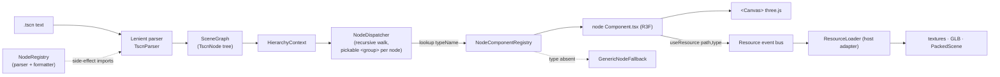
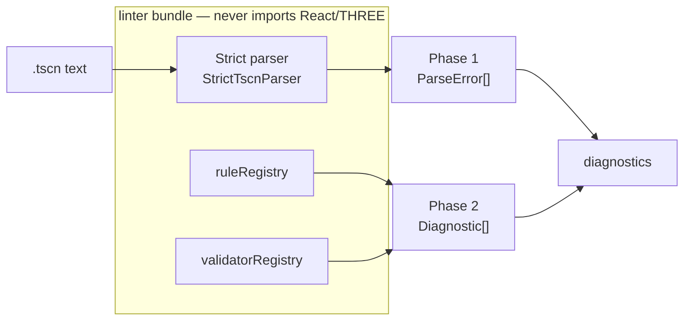
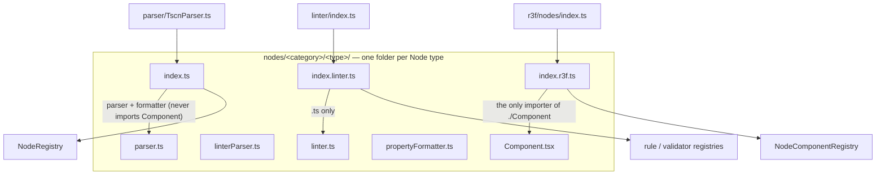
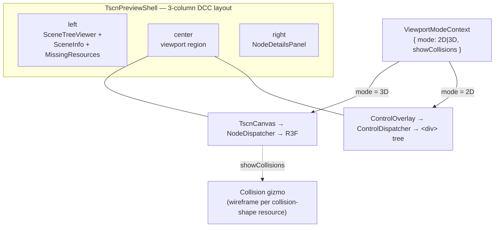

# Architecture

## Technology Stack

- TypeScript 6 (strict mode)
- pnpm workspaces with catalog dependency versions
- Vitest 4.1 (with `@react-three/test-renderer` and `@testing-library/react`)
- React 19 + react-three-fiber 9 + @react-three/drei
- three.js 0.184
- Vite 6 (web app) + esbuild (VS Code extension)

## Domain language & decisions

- **[CONTEXT.md](./CONTEXT.md)** — the shared glossary (Node, SceneGraph, vertical slice, viewport mode, Control overlay, collision gizmo, …). Use these terms exactly.
- **[docs/adr/](./docs/adr/)** — architecture decision records. The load-bearing ones: [0001 unified slice + React-free linter](./docs/adr/0001-unified-slice-react-free-linter.md), [0002 three registries](./docs/adr/0002-three-separate-registries.md), [0003 2D-UI DOM overlay](./docs/adr/0003-2d-ui-dom-overlay.md), [0004 CSG-as-primitive](./docs/adr/0004-csg-as-primitive.md), [0005 physics = transform-only](./docs/adr/0005-physics-bodies-transform-only.md), [0006 viewport-mode seam](./docs/adr/0006-viewport-mode-seam.md), [0007 ld-58 fixtures](./docs/adr/0007-ld58-fixture-assets.md).

## System Overview

### Render pipeline (lenient parser → R3F)



### Linter pipeline (strict parser, React/THREE-free bundle)



The render and linter pipelines are **separately bundleable** because the parse, lint, and render domains use three distinct registries keyed by the same `typeName` (see [ADR-0002](./docs/adr/0002-three-separate-registries.md)). The linter never transitively imports a `Component.tsx` (see [ADR-0001](./docs/adr/0001-unified-slice-react-free-linter.md)).

## Project Structure

```
/
├── packages/
│   └── textscene-core/          # Core library: parser, linter, R3F components
│       └── src/
│           ├── parser/          # Lenient TSCN parser used for rendering
│           ├── linter/          # Strict parser + lint rule registry
│           ├── nodes/           # UNIFIED vertical slices — one folder per node type,
│           │   │                #   each holding parser + linter + formatter + Component
│           │   │                #   + 3 entry points (index.ts / index.linter.ts / index.r3f.ts)
│           │   ├── node/
│           │   ├── base/node3d/
│           │   ├── 3d/
│           │   │   ├── meshinstance3d/      # parser.ts, linter.ts, Component.tsx, index{,.linter,.r3f}.ts
│           │   │   ├── camera3d/
│           │   │   ├── lights/{directional,omni,spot}light3d/  (+ lightHelpers, lightShared)
│           │   │   ├── worldenvironment/
│           │   │   └── label3d/
│           │   ├── audio/audiostreamplayer3d/
│           │   ├── animation/{animationplayer,animationtree}/
│           │   └── physics/3d/{staticbody3d,area3d,collisionshape3d,...}/  # parser+linter (render WIP)
│           ├── core/            # SceneGraph + immutable resolution helpers
│           │   ├── NodeRegistry.ts        # Parser + formatter registry
│           │   ├── SceneGraph.ts          # Immutable resolved scene
│           │   ├── SceneGraphBuilder.ts   # Builder for SceneGraph
│           │   └── nodeDependsOnPath.ts   # Dependency-walk predicate
│           ├── r3f/             # react-three-fiber UI surface (render infrastructure)
│           │   ├── TscnCanvas.tsx         # <Canvas> + NodeDispatcher
│           │   ├── NodeDispatcher.tsx     # SceneGraph -> React tree
│           │   ├── NodeComponentRegistry.ts
│           │   ├── nodeTransform.ts        # Node3D properties -> THREE transform
│           │   ├── nodes/index.ts          # barrel: imports every slice's index.r3f
│           │   ├── internal/{generic-node-fallback,glb-scene-root}/  # synthetic render-only types
│           │   ├── contexts/{Selection,Hierarchy,CameraControl,NodePath}Context.tsx
│           │   ├── components/{TscnPreviewShell,SceneTreeViewer,NodeDetailsPanel,ViewportSelector}/
│           │   └── hooks/useViewportSelection.tsx
│           └── resources/       # Async resource loading
│               ├── FileEventBus.ts        # request(path) -> loaded/failed
│               ├── ResourceEventBus.ts    # typed processor events
│               ├── ResourceLoader.ts      # Texture/Material/GLB/Scene
│               ├── useResource.ts         # React hook over the event bus
│               ├── ResourceLoaderContext.tsx
│               ├── meshes/                # Primitive mesh parsers
│               └── materials/standardmaterial3d/  # Material parser + renderer
└── apps/
    ├── textscene-vscode/         # VS Code extension (esbuild)
    ├── textscene-web/            # Web previewer (Vite)
    └── textscene-linter/         # CLI linter (Node)
```

## Key Concepts

### React-Three-Fiber Rendering

Rendering is owned by `<TscnCanvas>`, which mounts an R3F `<Canvas>`,
reads the active `SceneGraph` from `HierarchyContext`, and delegates
the node tree to `<NodeDispatcher>`. The dispatcher walks the scene
recursively: for each `TscnNode` it looks up the component in
`nodeComponentRegistry`, renders it with the node's pre-walked children,
and wraps the subtree in pointer handlers from `useViewportSelection`
plus a `<NodePathProvider>` so descendants can read their own TSCN path.

Each node type owns one unified vertical slice under
`packages/textscene-core/src/nodes/<category>/<type>/` containing its
`parser.ts`, `linterParser.ts`, `linter.ts`, `propertyFormatter.ts`,
`types.ts`, `Component.tsx`, co-located tests, and three registration
entry points: `index.ts` (parser/formatter → `NodeRegistry`),
`index.linter.ts` (validators + rules → linter registries), and
`index.r3f.ts` (render component → `nodeComponentRegistry`). The
`r3f/nodes/index.ts` barrel imports each slice's `index.r3f` for its
side effect. Unknown types render as `<GenericNodeFallback>` (a labeled
placeholder cube) from `r3f/internal/`. See [ADR-0001](./docs/adr/0001-unified-slice-react-free-linter.md).

### Two-Parser Architecture

Two parsers serve different use cases:

- **`packages/textscene-core/src/parser/TscnParser.ts`** — lenient
  parser used by the renderer. Recovers from errors, logs warnings,
  keeps rendering whatever it can.
- **`packages/textscene-core/src/linter/StrictTscnParser.ts`** — strict
  parser used by the CLI linter and the language-feature providers.
  Reports every syntax/format error with line/column information.

The lenient parser uses `NodeRegistry` to convert raw TSCN body
properties (snake_case strings) into the strongly-typed shape declared
by each node type's `parser.ts`. Each node-type's `index.ts` registers
its parser + property formatter on module load via side-effect
imports declared in `parser/TscnParser.ts`.

### Resource Loading

External resources (textures, materials, GLB meshes, packed scenes)
flow through a layered event-bus pipeline:

1. **`FileEventBus`** (app layer): hosts implement `ResourceProvider`
   and the bus turns `request(path)` into a `loaded`/`failed` event.
2. **`ResourceEventBus`** (core layer): typed `texture:loaded`,
   `material:loaded`, `glb:loaded`, `scene:loaded` events with their
   processed payloads.
3. **`ResourceLoader`**: coordinates per-type processors
   (`textures`, `materials`, `glbMeshes`, `sceneLoader`). The host
   calls `provideFile(path)` after the user uploads a previously-missing
   file, which clears the failed-cache and re-routes through the right
   processor.

`useResource(path, type)` is the only thing R3F components see. The hook
subscribes to the bus and returns `{ value, status, error? }` where
`status` is `'pending' | 'loaded' | 'missing' | 'error'`. Missing files
do NOT suspend the subtree; components branch on `status` and render
placeholders for missing resources. Object3D-typed values (`GLBMesh`)
are cloned per consumer per CLAUDE.md's three.js single-parent rule.

### Linter Bundle Isolation

The linter package stays React-free. `packages/textscene-core/src/
linter/index.ts` imports each node type's `linterValidators.ts` and
`linter.ts` directly, never the `r3f/` tree or `nodes/**/Component.tsx`.
This keeps the linter CLI bundle small.

### Self-Registration Patterns

Two parallel registries:

- `nodeRegistry` (`core/NodeRegistry.ts`): node-type parser + formatter.
  Used by `TscnParser` to convert TSCN body properties.
- `nodeComponentRegistry` (`r3f/NodeComponentRegistry.ts`): node-type
  React component. Used by `NodeDispatcher` to render the SceneGraph.

Each node type registers itself in both registries via side-effect
imports — `parser/TscnParser.ts` and `r3f/index.ts` import every node
type's `index.ts` / `nodes/index.ts` for the registration.

### Multi-Panel State Isolation

Each `<TscnPreviewShell>` instance creates its own `HierarchyContext`,
`SelectionContext`, and `CameraControlContext`. Two panels open in the
same VS Code window cannot corrupt each other's selection state because
the React context is scoped per shell. The `panelId` prop is the stable
key for log correlation and (future) multi-panel coordination.

### Camera Switching

`CameraControlContext` exposes `activeCameraPath` plus `switchToCamera`
/ `returnToFreeView` actions. The `<NodeDetailsPanel>` renders a "Use
This Camera" / "Reset Camera" button when the selected node is a
Camera3D. The `<TscnCanvas>` houses an `ActiveCameraSwitcher` that
swaps the R3F active camera via `useThree(state => state.set)` based on
the `userData.tscnPath` tag the Camera3D component writes to its
three.js camera.

### VS Code Editor Features

- `TscnDefinitionProvider`: Ctrl/Cmd-click on a `res://` path navigates
  to that resource file (text-layer feature, unaffected by R3F).
- `TscnDocumentSymbolProvider`: scene tree appears in the VS Code
  Outline panel.
- File watcher: when a `.tscn` file changes, the extension host posts
  a fresh `loadTscn` message to the webview, which re-parses and
  re-renders. The R3F canvas DOM node is preserved across content
  changes so OrbitControls camera state survives hot-reload.

### Dependency Versions (Phase 14)

Spike-validated stack:

- React 19.2, react-dom 19.2, @react-three/fiber 9.6, @react-three/drei 10.7
- @react-three/test-renderer 9.1, @testing-library/react 16.3
- three 0.184, @types/three 0.184
- Vitest 4.1, jsdom 29, @vitejs/plugin-react 5 (workspace is on Vite 6)
- TypeScript 6.0.3

### Bundle Size Target

The PRD acceptance for WI-R3F-6 was "VS Code webview bundle no larger
than `main + 200 KB gzipped`". History:

- `main` baseline: 1,429,646 B raw / **247,543 B gzipped**
- WI-R3F-6 (iife, no code-splitting): 3,691,702 B raw / **638,980 B gzipped** — +382 KB gz, **+182 KB over budget**
- **WI-R3F-18 (ESM + splitting + React.lazy panels)**: initial-paint static-import closure is **1,357,273 B raw / 390,322 B gzipped** — **+143 KB gz vs main**, **57 KB under the +200 KB budget** ✅

WI-R3F-18 closed the gap with three combined changes:

1. **Webview build flipped from `iife` to `esm` + `splitting`**
   (`apps/textscene-vscode/esbuild.config.mjs`). iife couldn't
   code-split — every transitive import landed in one bundle. ESM
   with splitting emits `dist/webview/webview.js` (entry) plus
   `dist/webview/chunks/*.js` (shared + lazy chunks).
2. **DOM panels lazy-loaded via `React.lazy` + `<Suspense>`**
   (`packages/textscene-core/src/r3f/components/TscnPreviewShell/TscnPreviewShell.tsx`).
   `<SceneTreeViewer>` and `<NodeDetailsPanel>` are no longer in the
   initial static-import closure; they load on demand with a
   `Loading tree…` / `Loading details…` fallback while resolving.
3. **CSP + html template updated for ESM** — `<script type="module">`
   and `script-src ${cspSource}` (in addition to the nonce'd entry)
   so the webview can fetch chunk URIs.

The initial chunk now contains: React, react-three-fiber, drei
runtime, three.js, the scene canvas (`<TscnCanvas>`), the node
component registry (registers all node types on import), the
resource pipeline, contexts, and selection. The lazy chunks
contain: the tree viewer, the details panel, and the CSS modules
they own.

**Bundle-size guard.** `scripts/check-bundle-size.mjs` walks the
static-import closure starting at `webview.js`, gzips the
concatenation, and compares against `main + 200 KB`. Wired into
`pnpm validate` and runs informationally (warn-only) for now. Once
follow-up WIs land without regressing the figure, flip to
`--enforce` for hard-fail in CI.

**Status of the budget gate.** As of this commit, the build PASSes
with 55.9 KB headroom under the budget. The recommendation for
PR-merge readiness: the gate is already structurally enforceable.
The reason to keep it warn-only until at least one follow-up WI
lands is that the headroom is thin (~14% of the budget) and any
of these would push back over: a drei addition (e.g. effects
postprocessing), a new top-level component import in
`<TscnCanvas>`, or a node type that pulls in a new dependency at
the registry-load step. Flipping to `--enforce` should happen after
WI-R3F-16 (audio/animation) lands and the budget is re-verified.

### Known limitations

**Web app: content-only hot-reload is not implemented.** When the user
edits a fixture's TSCN content out-of-band (e.g. via the dev server
filesystem watcher) the web app does not detect the change. The
workaround is to re-select the fixture from the dropdown, which
re-fetches and re-mounts the shell. The VS Code extension does NOT
share this limitation — there the editor's `onDidSaveTextDocument`
fires `loadTscn` and the React shell reconciles cleanly.

Fixing this on the web side would mean either:
1. Subscribing to the Vite HMR `import.meta.hot.on('update')` event
   when in dev mode, then re-fetching the active fixture, or
2. Polling the fixture URL with `ETag` / `Last-Modified` and
   re-fetching on change.

Neither is implemented; deferred to a follow-up WI. The current v1
flow expects users to edit fixtures via the VS Code extension where
hot-reload works.

## Planned Evolution — full ld-58 support

This section is **forward-looking** and is updated phase-by-phase as the work lands. Goal: render all 44 scenes of the ld-58 Godot project in both apps. See [CONTEXT.md](./CONTEXT.md) and [docs/adr/](./docs/adr/).

### Unified vertical slice (P1 — [ADR-0001](./docs/adr/0001-unified-slice-react-free-linter.md))

Each Node type collapses from the current **split slice** (parser/linter in `nodes/`, component in `r3f/nodes/`) into one folder with three registration entry points — one per registry domain — so the linter stays React/THREE-free by construction:



A module-graph guard test (over both `linter/index.ts` and `parser/TscnParser.ts`) plus an ESLint `no-restricted-imports` rule turn the React-free invariant from discipline into a red/green signal. Synthetic render-only types (`GenericNodeFallback`, `GLBSceneRoot`) move to `r3f/internal/` — they are not Node types.

### Viewport mode + 3-column DCC chrome (P3/P4 — [ADR-0003](./docs/adr/0003-2d-ui-dom-overlay.md), [ADR-0006](./docs/adr/0006-viewport-mode-seam.md))

A single `ViewportModeContext` chooses between the 3D canvas and the 2D Control overlay (a sibling DOM layer, never inside `<Canvas>`), and drives the collision gizmo. `TscnPreviewShell` becomes a 3-column grid shared by both apps:



The 2D overlay maps `layout_mode = 2` (container-managed, the majority case) to CSS flex/grid, the LayoutPreset 0..15 table to absolute positioning, and StyleBox resources to CSS; system fonts only, images via blob URLs (VS Code webview CSP). Mode is persisted per app behind a `usePersistedMode()` hook (`localStorage` web / webview state API).

### Scope (P2 — [ADR-0004](./docs/adr/0004-csg-as-primitive.md), [ADR-0005](./docs/adr/0005-physics-bodies-transform-only.md))

Scoped to exactly the types ld-58 uses: CSGBox3D/CSGCylinder3D (base primitive, all union), StaticBody3D/Area3D (transform-only groups), CollisionShape3D + BoxShape3D/ConvexPolygonShape3D/ConcavePolygonShape3D (toggleable wireframe gizmos), plain AudioStreamPlayer (zero-geometry node), and a ShaderMaterial→translucent-standard-material fallback.

### Tracked deepening candidates (not yet scheduled)

- **Lenient parser depends on `three` via transform decomposition.** `nodes/node/parser.ts` → `utils/transform.ts` uses `THREE.Matrix4`/`Euler` to decompose a Transform3D at parse time. Acceptable today (the parser ships only alongside the renderer; the linter uses its own three-free strict parser), but moving decomposition to render time would make the lenient parser pure-data. The `reactFree.test.ts` guard documents and deliberately permits this edge while forbidding react/react-three in the parser and any `.tsx`/three in the linter.
