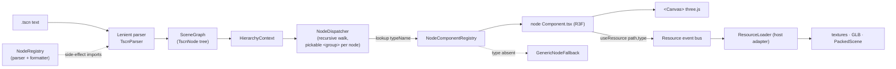
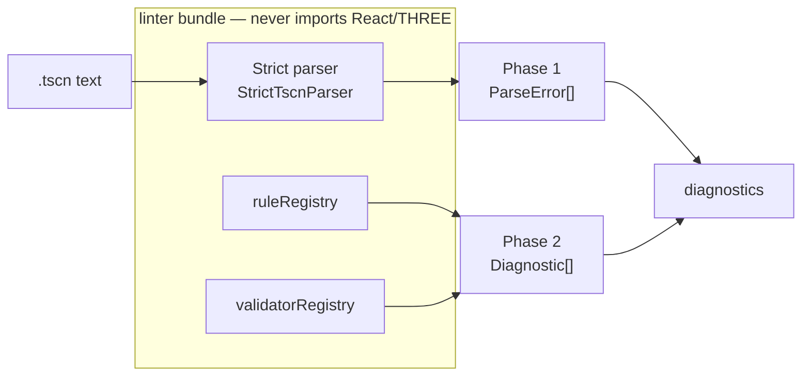
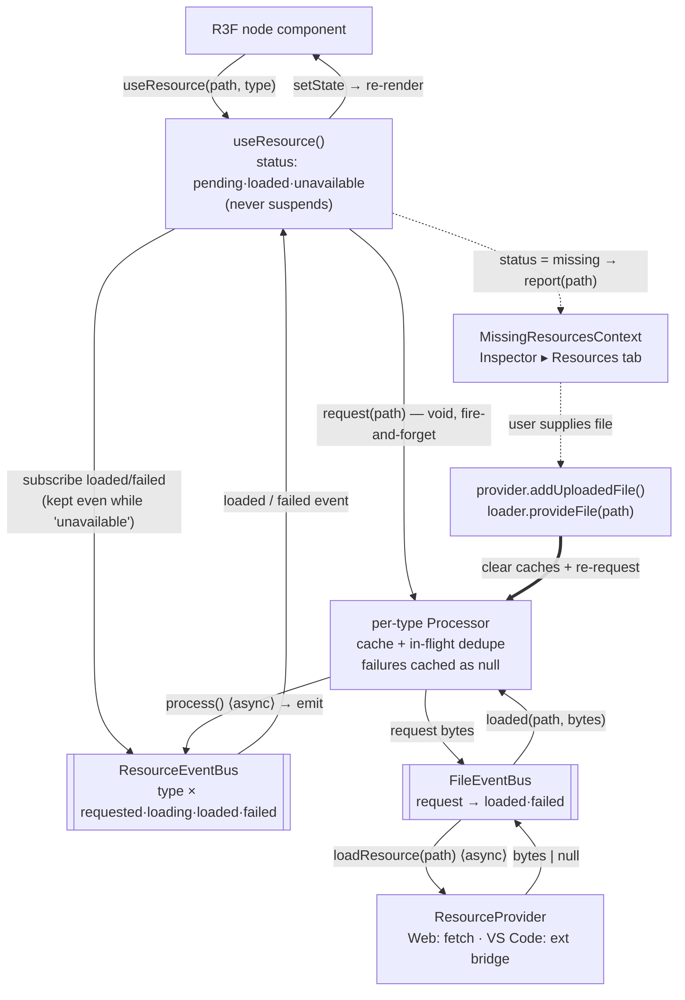
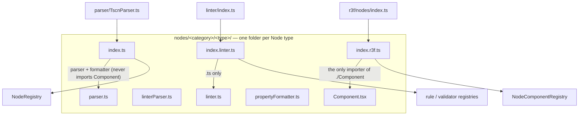
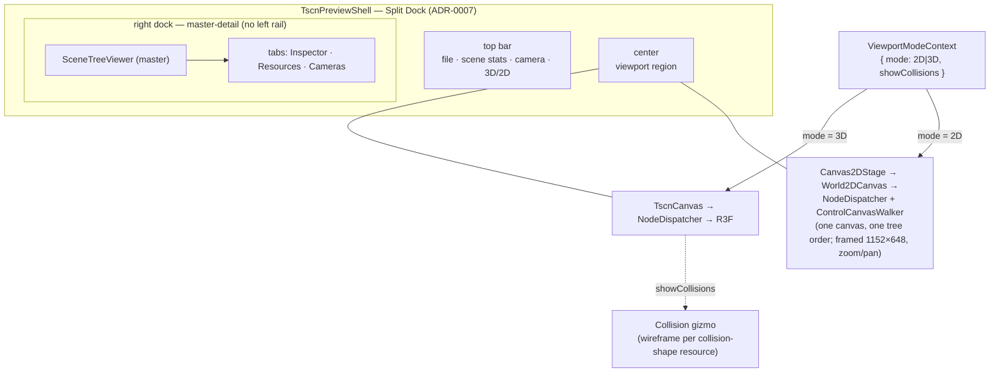

# Architecture

## Technology Stack

- TypeScript in strict mode
- pnpm workspaces. Every shared dependency version lives in the `pnpm-workspace.yaml` catalog, and each package references it as `"catalog:"`. Read the catalog for versions, never a copy.
- Vitest, with `@react-three/test-renderer` and `@testing-library/react`. DOM-needing packages run under happy-dom. Node-only packages (the CLI linter, the VS Code extension host) run under `environment: 'node'`.
- React, react-three-fiber and `@react-three/drei` over three.js
- Vite for the web previewer, esbuild for the VS Code extension

## Domain language & decisions

- **[CONTEXT.md](./CONTEXT.md)** — the shared glossary (Node, SceneGraph, vertical slice, viewport mode, Control rect solve, collision gizmo, …). Use these terms exactly.
- **[docs/adr/](./docs/adr/)** — architecture decision records, one per load-bearing decision, sequentially numbered with self-describing filenames (the directory is the source of truth — read it rather than a list mirrored here). Start with [0001 unified slice + React-free linter](./docs/adr/0001-unified-slice-react-free-linter.md) and [0002 three registries](./docs/adr/0002-three-separate-registries.md), which fix the overall shape; the rest record feature-level decisions (viewport-mode seam, render intent, animation drivers, instance-root merge, …) Numbers 0032 and 0033 are each used by two files, so cite those by filename.

## System Overview

### Render pipeline (lenient parser → R3F)



### Linter pipeline (strict parser, React/THREE-free bundle)



The render and linter pipelines are **separately bundleable**. The parse, lint and render domains use three distinct registries keyed by the same `typeName` (see [ADR-0002](./docs/adr/0002-three-separate-registries.md)). The linter never transitively imports a `Component.tsx` (see [ADR-0001](./docs/adr/0001-unified-slice-react-free-linter.md)).

## Project Structure

```
/
├── packages/
│   └── textscene-core/          # Core library: parser, linter, R3F components
│       └── src/
│           ├── parser/          # Lenient TSCN parser used for rendering
│           ├── linter/          # Strict parser + lint rule registry
│           ├── nodes/           # UNIFIED vertical slices — one folder per node type,
│           │   │                #   each holding parser + linter + formatter + Component
│           │   │                #   + 3 entry points (index.ts / index.linter.ts / index.r3f.ts)
│           │   ├── node/
│           │   ├── base/{node2d,node3d}/
│           │   ├── 2d/
│           │   │   ├── ui/                  # 23 Control slices (control, label, button, containers, ...) — native canvas painters (ADR-0037)
│           │   │   ├── tiles/{tilemap,tilemaplayer}/    # + shared/ — TileSet/atlas decoding
│           │   │   ├── cpuparticles2d/      # frozen pose at `preprocess` — no clock (ADR-0008)
│           │   │   └── {sprite2d,camera2d,animatedsprite2d,polygon2d,line2d,
│           │   │        marker2d,path2d,pathfollow2d,navigationregion2d,
│           │   │        pointlight2d,lightoccluder2d,canvasmodulate,
│           │   │        remotetransform2d}/
│           │   ├── 3d/
│           │   │   ├── meshinstance3d/      # parser.ts, linter.ts, Component.tsx, index{,.linter,.r3f}.ts
│           │   │   ├── camera3d/
│           │   │   ├── csg/{csgbox3d,csgcylinder3d,csgsphere3d,     # real booleans (ADR-0027)
│           │   │   │        csgtorus3d,csgmesh3d,csgpolygon3d,
│           │   │   │        csgcombiner3d}/
│           │   │   ├── lights/{directional,omni,spot,area}light3d/  (+ shared/ — parser, formatter, lint checks, lightShared/lightHelpers render code)
│           │   │   ├── {sprite3d,skeleton3d,particles/gpuparticles3d,marker3d,
│           │   │   │     gridmap,navigationregion3d,decal}/
│           │   │   ├── worldenvironment/
│           │   │   └── label3d/
│           │   ├── audio/audiostreamplayer{,2d,3d}/
│           │   ├── animation/{animationplayer,animationtree}/
│           │   ├── paths/{path3d,pathfollow3d}/
│           │   ├── physics/2d/{staticbody2d,rigidbody2d,characterbody2d,area2d,collisionshape2d}/
│           │   └── physics/3d/{staticbody3d,area3d,collisionshape3d,...}/  # transform-only render + collision gizmo (ADR-0005/0008)
│           ├── core/            # SceneGraph + immutable resolution helpers
│           │   ├── NodeRegistry.ts        # Parser + formatter registry
│           │   ├── SceneGraph.ts          # Immutable resolved scene + buildSceneGraph()
│           │   └── createTypeRegistry.ts  # Shared Map-backed registry factory (ADR-0002)
│           ├── r3f/             # react-three-fiber UI surface (render infrastructure)
│           │   ├── TscnCanvas.tsx         # <Canvas> + NodeDispatcher
│           │   ├── NodeDispatcher.tsx     # SceneGraph -> React tree
│           │   ├── NodeComponentRegistry.ts
│           │   ├── nodeTransform.ts        # Node3D properties -> THREE transform
│           │   ├── nodes/index.ts          # barrel: imports every slice's index.r3f
│           │   ├── internal/{generic-node-fallback,glb-scene-root}/  # synthetic render-only types
│           │   ├── contexts/{Selection,Hierarchy,CameraControl,NodePath}Context.tsx,
│           │   │             {AnimationTransport,AnimationDriver,AnimatedValue}Context.tsx
│           │   ├── controls/               # Native 2D-UI Control canvas (ADR-0037, supersedes ADR-0003):
│           │   │                           #   ControlComponentRegistry, native/ControlCanvasWalker,
│           │   │                           #   native/ControlCanvasLayer, native/controlRectSolver
│           │   │                           #   (rect solve), native/text/ (vendored MSDF atlas + layout)
│           │   ├── lighting2d/             # Godot's canvas light pass (see below):
│           │   │                           #   CanvasLighting2D (accumulator + pre-pass),
│           │   │                           #   lightQuad (producer), canvasItemLighting (consumer)
│           │   ├── components/{TscnPreviewShell,Canvas2DStage,
│           │   │               SceneTreeViewer,NodeDetailsPanel,ViewportSelector,...}/
│           │   │   # TscnPreviewShell is a thin composition root; ViewportArea,
│           │   │   # CamerasPanel, and DockChrome are files inside TscnPreviewShell/;
│           │   │   # the 2D stage and viewport switch are sibling focused units
│           │   └── hooks/{useViewportSelection.tsx,useParsedScene.ts}
│           └── resources/       # Async resource loading + RESOURCE SLICES (ADR-0031):
│               │                #   one folder per resource type — index.ts (registration,
│               │                #   THREE-free) · decode.ts (pure bag → Data) · build.ts
│               │                #   (Data + deps → THREE, only where THREE construction
│               │                #   exists) · types.ts · co-located tests. Foreign formats
│               │                #   (formats/{glb,image,packedscene}) declare their real
│               │                #   parser instead of a decode/build split. Routing derives
│               │                #   from sliceRegistrations.ts + sliceRegistration.ts;
│               │                #   guards: resourceSlice{Conformance,Isolation}.test.ts
│               ├── FileEventBus.ts        # request(path) -> loaded/failed
│               ├── ResourceEventBus.ts    # typed processor events
│               ├── ResourceLoader.ts      # one processor per ResourceBusType
│               ├── useResource.ts         # React hook over the event bus
│               ├── ResourceLoaderContext.tsx
│               ├── meshes/                # Primitive mesh parsers
│               ├── curve/                 # Godot's 1D Curve — cubic Bezier sample()
│               └── materials/standardmaterial3d/  # Material parser + renderer
└── apps/
    ├── textscene-vscode/         # VS Code extension (esbuild)
    ├── textscene-web/            # Web previewer (Vite) — owns the Source pane (ADR-0020)
    └── textscene-linter/         # CLI linter (Node)
```

## Key Concepts

### React-Three-Fiber Rendering

`<TscnCanvas>` owns rendering. It mounts an R3F `<Canvas>`, reads the active
`SceneGraph` from `HierarchyContext`, and hands the node tree to
`<NodeDispatcher>`. The dispatcher walks the scene recursively. For each
`TscnNode` it looks up the component in `nodeComponentRegistry` and renders it
with the node's pre-walked children. `PlainNode.tsx` wraps each non-instance
node in its own unnamed `<group>` and a `<NodePathProvider>`, so descendants
can read their own TSCN path. `InstancedNode.tsx` takes the
`instance = ExtResource("id")` branch and composes the referenced PackedScene
into the tree. Pointer handling is delegated. One root `<group>` carries the
handlers from `useViewportSelection`, so R3F raycasts the subtree once per
pointer move instead of once per ancestor. `resolvePathFromObject` walks the hit
object's THREE parent chain to find the owning node.

Each node type owns one unified vertical slice under
`packages/textscene-core/src/nodes/<category>/<type>/`. The slice holds
`parser.ts`, `linterParser.ts`, `linter.ts`, `propertyFormatter.ts`,
`types.ts`, `Component.tsx`, co-located tests, and three registration
entry points: `index.ts` (parser/formatter → `NodeRegistry`),
`index.linter.ts` (validators + rules → linter registries), and
`index.r3f.ts` (render component → `nodeComponentRegistry`). The
`r3f/nodes/index.ts` barrel imports each slice's `index.r3f` for its
side effect. Unknown types render as `<GenericNodeFallback>` (a labeled
placeholder cube) from `r3f/internal/`. Not every slice carries every
file: `propertyFormatter.ts` is present only for types with non-default
Inspector formatting, and linter entry points exist only for types with
validators/rules (most 2D UI slices carry no validators/rules beyond
`Control`'s own base-type chain, so they have no `index.linter.ts`).
Registration granularity also varies deliberately: the five 2D physics bodies share
one loop-based registration (`nodes/physics/2d/`) because they are
five identical transform-only slices, while the 3D physics types keep
per-type folders because each carries real per-type lint rules. See
[ADR-0001](./docs/adr/0001-unified-slice-react-free-linter.md).

### Two-Parser Architecture

Two parsers serve different use cases, but they share ONE scanning loop:
`packages/textscene-core/src/parser/TscnParserCore.ts`. The core loop takes an
optional `ParseObserver` (`onError`, `onSectionStart` and `onProperty` hooks).
Strict behaviour is an observer adapter. Lenient behaviour is the bare loop.

- **`packages/textscene-core/src/parser/TscnParser.ts`**: the lenient parser
  the renderer uses. It runs the core loop with NO observer. It recovers from
  errors, logs warnings, and keeps rendering whatever it can.
- **`packages/textscene-core/src/linter/StrictTscnParser.ts`**: the strict
  parser the CLI linter and the language-feature providers use. It is a thin
  adapter that runs the SAME core loop with an observer. The observer collects
  every syntax and format error with line and column, performs strict heading
  checks (missing node name or identifier), and runs the `validatorRegistry`
  property validators.

The observer is purely additive. It never changes what the lenient loop parses
or recovers, so renderer behaviour is identical with or without it.
`TscnParserCore` stays three.js-free, which preserves the React-free linter
boundary (ADR-0001). `linter/reactFree.test.ts` walks the module graph of both
`linter/index.ts` and `parser/TscnParser.ts` and fails on any `react` or
`three` value import. An ESLint `no-restricted-imports` rule backs it: no
slice `index.ts` or `index.linter.ts` may import `three`, `react`, a `.tsx`
file, `./Component` or `./index.r3f`.

They differ in exactly one place: the `NodeCreator` the core loop calls per
node. The lenient one runs the slice registry, so `TscnNode.properties` holds
the typed shape a slice parsed out. The strict one keeps the raw string bag
there. Both publish that raw bag in `rawProperties`. That makes it the only
property field whose meaning does not depend on which parser produced the node.
Code shared by the linter and the render path reads it, and
`parser/rawPropertyParity.test.ts` pins the agreement.

The lenient parser uses `NodeRegistry` to convert raw TSCN body properties
(snake_case strings) into the strongly-typed shape each node type's `parser.ts`
declares. Each node type's `index.ts` registers its parser and property
formatter on module load, through side-effect imports declared in
`parser/TscnParser.ts`.

### Godot → three.js orientation conversions

Godot and three.js disagree on three axis conventions. Each is converted at the
boundary where Godot data becomes a three.js object. The parsers and decoders
never convert. They stay faithful readers of what the file says:

- **Texture V.** Godot's UV origin is the image's **top**-left. Textures load
  with three's default `flipY=true` (only the alpha-border replacement below
  sets it, and only by carrying the decoded texture's own value forward), which
  uploads the image bottom-up, so a Godot V must be mirrored: `v → 1 - v`.
  Textures are shared **by identity** between 2D and 3D consumers, so this is
  converted per consumer, never by flipping the texture:
  `resources/meshes/arraymesh/build.ts` (mesh UV attribute),
  `resources/tileset/tileGeometry.ts` (`pxRectToUv`) and `r3f/spriteFrame.ts`
  (region and frame windowing through texture offset and repeat). The shapes
  differ enough that the shared part is only the `1 -`, so there is
  deliberately no helper. The material UV transform (`uv1_scale` and
  `uv1_offset`) does **not** convert. See the `uv1` rows in the
  StandardMaterial3D comparison sheet
  ([packages/textscene-core/src/resources/materials/standardmaterial3d/comparison.md](./packages/textscene-core/src/resources/materials/standardmaterial3d/comparison.md)).
- **Triangle winding.** Godot fronts triangles clockwise and three.js expects
  counter-clockwise, so every decoded index triple is reversed
  (`meshes/arraymesh/build.ts`). Without it, flat meshes vanish and closed
  meshes render inside-out.
- **2D Y.** Godot's 2D Y grows downward. The Y negation lives in
  `r3f/node2dTransform.ts`.

A regression here is invisible to most fixtures: an untextured mesh, or a
vertically symmetric texture, cannot show a V error at all.
`unit-arraymesh-uv.tscn` exists to pin it: a four-band atlas whose green band
must read at the TOP.

### The 2D canvas light pass

`r3f/lighting2d/` ports Godot's `drivers/gles3/shaders/canvas.glsl`. A Godot 2D
light paints nothing on the canvas. It is multiplied into every lit CanvasItem
beneath it. The shader captures each item's albedo BEFORE the canvas tint and
folds it into every light term. That collapses the whole pass to

    colour.rgb = albedo × S

where `S` starts at the CanvasModulate. Each light applies one blend to it
(`+= light·a` for ADD, `-= light·a` for SUB, `mix(S, light, a)` for MIX). `S`
depends on the item only through WHICH LIGHTS REACH IT. It is therefore
accumulated once per distinct light set, and the three modules split along
that seam:

- **`CanvasLighting2D`** owns the accumulators and the pre-pass. Lights live on
  camera layers, so collecting them needs no second scene graph: each pass
  points the camera at one layer. A full-NDC quad seeds `S` rather than a clear
  colour. That keeps the seed out of any colour-management path and leaves the
  renderer's global clear state untouched.
- **`lightQuad`** is the producer: one PointLight2D's cookie. It emits the light
  term in rgb and the cookie coverage in alpha, with one fixed-function blend
  per `Light2D.BlendMode`.
- **`canvasItemLighting`** is the consumer: an `onBeforeCompile` injection that
  makes an ordinary `meshBasicMaterial` read the accumulator.

Shadows are a separate stage in the same directory (the `shadow*` files,
[ADR 0030, 2D shadow penumbra](./docs/adr/0030-2d-shadow-penumbra-polar-map.md)).

Three properties are load-bearing and easy to undo by accident:

- **The accumulator is half-float and unclamped.** Godot clamps only after the
  light is multiplied into the albedo. A light blended straight onto the canvas
  is clamped to [0, 1] BEFORE that multiply. That flattens any `energy > 1`
  light into a saturated disc with no falloff.
- **The light path compiles unconditionally**, gated by the
  `uLightClassWeight` uniform rather than by whether the scene has lights. A
  light registers only once its cookie resolves, which is always after the
  items around it have compiled. R3F never bumps `material.needsUpdate` when
  `onBeforeCompile` changes, so an item compiled without the path would never
  get it. Godot's own shader is shaped the same way: zero lights is data, not a
  different program.
- **The buffer is read in DEVICE pixels** (`gl.getDrawingBufferSize`), because
  the lookup is `gl_FragCoord / resolution`. Sizing from the CSS size is
  correct only at `devicePixelRatio` 1. The capture harness runs at exactly
  that ratio, so the goldens cannot see that mistake.

Two things make an item read a DIFFERENT accumulation. Both are one more
target and one more seeded pass over the same quads:

- `light_mode = Light Only` skips the canvas tint, so it needs the same lights
  over an unmodulated seed. It is allocated only when such an item exists.
- **The cull tuple.** Godot applies a light to an item only when three tests
  pass (`lightCullKey`). The item's `light_mask` must share a bit with the
  light's `range_item_cull_mask`. The item's accumulated `z_final` must be
  inside `range_z_min..max`. The item's CANVAS layer must be inside
  `range_layer_min..max`. Those five light-side values are the whole test.
  Lights that agree on all five are indistinguishable to every item, so the
  lights partition into CLASSES by that TUPLE. Each class gets one accumulation
  on its own camera layer. The seed quad sits on a layer of its own that every
  pass enables. The partition can be no finer, because the buffer is
  a screen-space sum no fragment can subtract one light back out of. It is no
  coarser in practice, because every light that leaves the range windows at
  their Godot defaults carries the same tail. An item reads the classes it is
  not culled from, summed over one shared seed. That is exact for a single
  class (the ordinary canvas) and for any number of ADD/SUB classes. The
  item-side lookup unrolls one sampler per class, because GLSL ES 1.00 (what
  three compiles an `onBeforeCompile` injection as) cannot index a sampler by a
  runtime value. That also caps the count (`MAX_LIGHT_CLASSES`). The cull test
  itself runs on the CPU (`lightReachesItem`), because that GLSL has no bitwise
  operators at all. `canvasItemPlacement` threads the item's two non-mask
  operands down the tree: `z_index` accumulates through `CanvasItem2D`, and a
  `CanvasLayer` publishes its own `layer` (Godot default 1) to its subtree.
  That is why an untouched light lights the world canvas and never a HUD.

Parity is measured, not derived: `pnpm ref:godot <scene> --probe x,y` prints
the engine's exact pixels, and the PointLight2D comparison sheet
(`nodes/2d/pointlight2d/comparison.md`) carries the resulting numbers.

### The native Control canvas (2D UI)

`r3f/controls/native/` renders Godot `Control`/`CanvasLayer` subtrees as ordinary
three.js objects inside the same `World2DCanvas` the 2D world draws into
([ADR-0037](./docs/adr/0037-control-nodes-render-natively-in-the-canvas.md),
superseding ADR-0003's DOM overlay) — no `<div>`, no CSS, no second rendering
technology.

**The Control rect solve** (`controlRectSolver.ts`) replaces the browser's layout
engine with a pure-TS port of Godot 4.6.3's own two phases: bottom-up
`get_combined_minimum_size` (a widget's minimum, `custom_minimum_size`-floored,
merged upward through nested containers), then top-down `fit_child_in_rect` (a
free/anchored Control resolves against its parent's rect — the viewport for a
root — a container child through that parent's registered `ContainerLayoutFn` in
`controlSolverRegistry`). `ControlCanvasWalker` runs the solve once per
generation over `buildSolveTree`'s live-tree walk, then emits one `<group>` per
Control at its solved rect; a registered `Native` painter draws that node's own
chrome, `ControlFallback` an outline when none is registered.

**Draw order is ONE integer per canvas item, shared by every 2D node**
(`canvasPaintOrder.ts`). Godot draws a canvas in a single pre-order walk that
appends each item to a list indexed by its `z_final`, then draws those lists in
z order (`renderer_canvas_cull.cpp`), so the key is `(canvas layer, z_final,
position in the walk)` — and the item's node TYPE is in none of it. A `Control`
and a `Sprite2D` interleave purely by that key; "UI draws over the world" is a
convention of how scenes are authored, not a rule of the renderer.

That key is packed into `THREE.Object3D.renderOrder` on each canvas item's
wrapper group. Every 2D material here is `transparent` + `depthWrite={false}`,
so three's transparent sort decides paint order outright, and it compares
`groupOrder` — the nearest enclosing group's `renderOrder` — before anything
else. The meshes INSIDE an item keep their own small `renderOrder` for the
item's private layering (an atlas batch's source index, a ScrollContainer's
bars). Two ordinal levels, which is exactly what the two rules need. A group
that sits between an item and its pixels must therefore carry the item's key
too, or it resets those pixels to the front of the canvas.

Draw sequence is handed out as contiguous RANGES: a node owns
`[base, base + size)` and its descendants are allocated inside it, which is what
lets the y-sort pass re-order the items it collected by re-packing its own range
alone. `buildSolveTree` allocates the same ranges over the same live tree for
Controls, so the two walks agree without talking to each other.

This replaced a fractional `+Z` scheme (`z_index × 0.1`, with y-sort ranks and
tile sub-steps dividing what was left of each step). That scheme could only
approximate the order — the budget shrank with every level of nesting, so the
machinery rationing it grew alongside, and the plain un-y-sorted case had no
draw sequence at all, falling back to `Object3D.id` mount order. That is why a
Control mounted in its own pass could never interleave with the world.

**Clipping is clip planes, not the stencil buffer** (`controlClipping.tsx`). The
on-screen 2D `<Canvas>` requests no stencil buffer at all (`World2DCanvas.tsx`'s
`gl` props never ask for one, and three defaults it off), so a stencil-based clip
would be a silent no-op everywhere — a spike measured 81/81 boundary samples
exact across 4 nesting levels using planes instead. `ScrollContainer` builds its
own subtree's 4 axis-aligned planes from its full rect, transforms them into
world space via its own group's `matrixWorld`, and merges them onto whatever it
inherited; every leaf material (`controlQuad.tsx`, `StyleBoxQuad.tsx`) spreads
the accumulated list, since three's clip planes are per-material state.

**Text is a vendored MSDF atlas plus this engine's own layout** (`native/text/`),
not troika-three-text (already in the dependency tree via drei's lazy `<Text>`).
A spike found troika impossible under the VS Code webview's CSP twice over:
`worker-src` blocks its blob-URL SDF worker, and `connect-src` blocks its font
*fetch* — for `data:` and `blob:` alike, so inlining the font bytes cannot help
either. Godot's own default-theme font (`OpenSans_SemiBold.woff2`) is vendored
and baked at build time into a PNG atlas + glyph table
(`scripts/fonts/bake-metrics.mjs`, `--check` mode so the artifacts cannot drift
from the font); line pitch ceiling-rounds ascent and descent to whole pixels
independently before summing, matching Godot's FreeType-quantized metrics rather
than a raw float scale.

A scene may also author **its own** font (a `Theme` `.tres` `default_font`, or a
node's `font` / `theme_override_fonts/*`), whose bytes do not exist until a scene
opens — so no build-time bake can cover them, and runtime MSDF generation needs
the same worker the CSP blocks. Those render through a **second painter**:
`new FontFace(name, bytes)` + `document.fonts.add`, rasterised via canvas-2D, with
no fetch, worker or blob URL anywhere on the path. Dispatch is internal to
`TextRun.tsx`, on a `kind: 'atlas' | 'canvas'` discriminant, so no per-slice
component knows a second path exists. Which painter draws a run follows the path
Godot's OWN text server takes for it rather than where the font came from:
`Label3D` paints the bundled font through the same canvas raster, because its
outline is a stroked `FT_Stroker` contour a distance field cannot encode
([ADR-0040](./docs/adr/0040-the-painter-follows-godots-own-glyph-path.md)).

**The split is in the painter only — shaping is never duplicated.** `textLayout.ts`
is parameterised over a `FontMetrics` contract and shapes both paths; an
implementation supplies only raw design-unit data, and every conversion to pixels
(the line-pitch quantization above included) lives once in `fontMetrics.ts`, where a
second font cannot silently reimplement and drop it. See
[ADR-0040](./docs/adr/0040-the-painter-follows-godots-own-glyph-path.md) for the
rule in force, and the superseded
[ADR-0034](./docs/adr/0034-two-text-painters-one-shaping-engine.md) for the measured
CSP findings and the `.woff2` limitation.

**One ordered pass driver, not per-publisher `useFrame`s**
(`r3f/contexts/ViewportPassRegistryContext.tsx`). A `SubViewport`'s offscreen
render and the native Control-only offscreen pass (the `ViewportTextureRegistry`
publisher a `ViewportTexture` samples) each register `{ dependsOn, render }`
instead of driving their own per-frame hook; `<ViewportPassOrchestrator>`
topologically sorts every registered pass and runs them in that order from a
single `useFrame`, so a pass nested inside another never renders a frame stale
the way per-publisher mount-order driving did. A pass whose dependencies form a
cycle is simply never driven — its target keeps whatever it last held,
deterministic rather than flickering — `logger.warn` names it once, and
`useViewportPassCycle` lets the sampling surface fall back to a placeholder.

### Resource Loading

Every resource type is a **Resource slice**
([ADR-0031](./docs/adr/0031-resource-slices.md), CONTEXT.md):
`resources/<category>/<type>/` with a THREE-free `index.ts`. That file
registers the slice's claims (TSCN type names, extensions, bus type, failure
label) into `sliceRegistration.ts`'s registry through the
`sliceRegistrations.ts` barrel. Routing derives from those claims. Nothing
sniffs a type name by substring. Godot-text slices carry a pure `decode.ts` (a
**ParsedResource** section → typed Data) and, only where THREE construction
exists, a `build.ts`. Foreign-format slices (`formats/{glb,image,packedscene}`)
declare their real parser openly. `resourceSliceConformance.test.ts` and
`resourceSliceIsolation.test.ts` enforce the shape.

A texture is not simply the file's bytes: Godot's editor **imports** every image
before its renderer ever samples one, and reading `res://foo.png` off disk skips
that. `resources/processing/fixAlphaEdges.ts` reproduces the one import step that
changes pixels for an unattended texture — `process/fix_alpha_border`, on by
default, which rewrites each transparent texel's RGB with its nearest opaque
neighbour's so a magnified bilinear sample cannot bleed a hidden key colour into
the visible fringe. `applyAlphaBorderFix` runs it once at decode, on images whose
alpha the canvas readback carries losslessly, and returns the original texture
untouched otherwise.

External resources (textures, materials, GLB meshes, packed scenes) flow through
a **two-bus, event-driven pipeline** — *not* promises/Suspense at the component
boundary. `request(path)` is fire-and-forget (returns `void`); a component learns
a resource loaded by **receiving an event**, not by awaiting a promise. (Promises
do the async I/O underneath — see the note below.)

**The layers, host → component:**

1. **`ResourceProvider`** (app layer): the host's file access.
   `WebResourceProvider` uses HTTP `fetch`. `VSCodeResourceProvider` uses the
   extension's `res://` bridge and honours the CSP. `loadResource(path)`
   returns `string | ArrayBuffer | null` (async).
2. **`FileEventBus`**: type-agnostic raw bytes. `request(path) →`
   `loaded(path, bytes) | failed(path, err)`. It calls the provider, caches
   bytes, and dedupes in-flight requests. `tryLoad(path)` is the same fetch for
   a file found by CONVENTION rather than declared by a scene: the **Import
   sidecar** ([ADR-0028](./docs/adr/0028-honour-import-sidecars-for-source-assets.md))
   and `project.godot` (**Project settings**). It answers the caller alone and
   fires neither handler set, so a miss is an ordinary "use Godot's defaults"
   instead of a **Missing resource**.
3. **Per-type processors** (`createResourceProcessor`): one cache + in-flight
   + emit machine per type. On raw bytes it runs `process()` (async), caches
   the result, and emits. **Failures are cached as `null`** so they do not
   retry. One documented edge: a path that **no** processor's `shouldProcess`
   claims stays pending forever. That is by design, since sibling processors
   share one `FileEventBus`, and `createResourceProcessor.test.ts` pins it.
4. **`ResourceEventBus`** (core layer): typed events namespaced by
   `ResourceBusType` × `requested|loading|loaded|failed|invalidated`, carrying
   the processed payload. Scenes load "directly" (the parser needs path and
   content together) but emit the same events. `invalidated` fires per
   formerly-cached path on `ResourceLoader.clearCaches()` (corpus switch).
   Mounted hooks hold their value in React state, so without it they would
   keep serving the cleared corpus's resource forever. On receiving it they
   re-request under whatever provider state the HOST has arranged. The host
   must repoint the provider or URL modifier before clearing, **and must clear
   only with the outgoing corpus's scene already torn down**. Otherwise every
   consumer still mounted answers the announcement by re-requesting its own
   `res://` paths out of the incoming corpus, downloading an unrelated
   fixture's files. The LOADER owns the announcement. It emits only after every
   cache layer is reset and before metadata clears (scene loads validate
   registration synchronously). A processor's own full clear is silent. The
   `FileEventBus` and each processor also key every flight by a per-path
   token. A clear removes the token. A fetch that departed before the clear
   finds its token gone on completion, and drops its result (success or
   failure) without caching or announcing.
5. **`ResourceLoader`**: owns the `MetadataStore` and one processor per
   `ResourceBusType` (`resources/sliceRegistration.ts`): `texture`,
   `material`, `scene`, `glb`, `resource`, `arraymesh`. `register()` records
   `ExtResource` id↔path. `provideFile(path)` drives the late-arrival flow
   below.
6. **`useResource(path, type)`**: the only thing R3F components see. It
   **never suspends**. It returns `{ value, status, error? }` with
   `status ∈ 'pending' | 'loaded' | 'unavailable'`. On mount it does a
   synchronous cache check and then **subscribes** to the bus. It fires
   `request()` *after* subscribing, so a synchronous cache-hit emit is not
   missed. Object3D values (`GLBMesh`) are cloned per consumer (three.js
   single-parent rule, AGENTS.md). Components branch on `status` and render
   placeholders for unavailable resources. The subtree never suspends.

**A resource path is not always a file path.** A `.tres` can declare the resources it
uses as its own `[sub_resource]` blocks — a mesh's per-surface materials, a
MeshLibrary's embedded item meshes — and those are addressed with Godot's own
`res://file.tres::SubId` notation (**Sub-resource path**, ADR-0032). The layers above
split on that: the **whole address is the resource identity** (processor cache key,
in-flight key, what `useResource` pins and subscribes to), while layer 3 normalises it
to its `filePath` before touching layer 2. So the `FileEventBus`, the
`ResourceProvider`s and the hot-reload watcher only ever see real files — a
sub-resource's bytes *are* its owning file's bytes — and one arrival settles every
address waiting on that file. `shouldProcess` is asked about the file, so extension
checks read unchanged.

That containment holds **downward**. Coming back up it needs help. A failed
load is reported under the address, so a missing-resources row can carry one.
The panel hands its host the `filePath` for both upload and remove
([ADR-0022](./docs/adr/0022-uploads-are-frontend-only.md)), and `provideFile`
normalises whatever it is given. Because the normalisation sits in
`createResourceProcessor`, every processor type gains the fetch, cache and
dedupe **plumbing**, but not the semantics. A `process()` that ignored its path
would hand back the whole file's resource under the address. So
`addressesSubResources` is opt-in, and the factory refuses an address without
it. Only the material and ArrayMesh processors declare it. So the third kind of
reference is invisible to any **consumer** holding a path string. A
**producer** minting addresses for a new resource type must honour the id in
its own `process()`. The `resources/subResourcePath.ts` grammar is the only
place `::` is written.

**Late arrival, and why it is events rather than a one-shot promise.** When a
load fails the hook flips to `unavailable` and reports the path to
`MissingResourcesContext`, which lists it in the Inspector's **Resources** tab.
**The hook keeps its subscription while `unavailable`.** When the user supplies
the file, the host calls `provider.addUploadedFile(path, file)` and then
**`loader.provideFile(path)`**. That clears the file and processor caches for
that path and **re-requests** it. The fresh bytes go through `process()` and
produce a new `loaded` event. The still-subscribed hook flips
`unavailable → loaded` and the component re-renders **with no remount**. A
promise resolves once. A live subscription lets a node that was unavailable
for minutes wake up the instant its file appears.

**Where promises live (supporting role only):** the actual fetch and parse are
async (`loadResource`, `process()`, the scene `loadDirectly`), and
`finishLoad` awaits them and then emits. There is one deliberate
event→promise *adapter*. When a material needs an inline texture,
`ResourceLoader` does `await eventBus.once('texture', 'loaded', path)`: a
linear `await` over a single event. The component contract stays a pure
`(status, value)` reacting to events.



### Linter Bundle Isolation

The linter package stays React-free. `packages/textscene-core/src/linter/index.ts`
imports each slice's `index.linter.ts` entry point (which pulls only
`linterParser.ts` and `linter.ts`) plus the resource-level
`linterValidators.ts` files. It never imports the `r3f/` tree or
`nodes/**/Component.tsx`. This keeps the linter CLI bundle small, and
`linter/reactFree.test.ts` pins the boundary.

### Self-Registration Patterns

Three parallel registries
([ADR-0002](./docs/adr/0002-three-separate-registries.md)):

- `nodeRegistry` (`core/NodeRegistry.ts`): node-type parser and formatter.
  `TscnParser` uses it to convert TSCN body properties.
- `nodeComponentRegistry` (`r3f/NodeComponentRegistry.ts`): node-type React
  component. `NodeDispatcher` uses it to render the SceneGraph.
- `controlComponentRegistry` (`r3f/controls/ControlComponentRegistry.ts`):
  Control-type DOM component. `ControlDispatcher` uses it
  ([ADR-0003](./docs/adr/0003-2d-ui-dom-overlay.md)).

Each slice registers itself through side-effect imports. `parser/TscnParser.ts`
imports every slice's `index.ts`. `r3f/nodes/index.ts`, which `r3f/index.ts`
pulls in, imports every slice's `index.r3f.ts`. The linter's `ruleRegistry`
and `validatorRegistry` are fed the same way by `index.linter.ts` (see Linter
Bundle Isolation).

### Multi-Panel State Isolation

Each `<TscnPreviewShell>` instance creates its own React contexts.
`TscnPreviewShell/previewShellProviders.tsx` composes every provider
(hierarchy, selection, camera control, missing resources, viewport mode,
animation transport and drivers, and the rest) around the shell's children.
Two panels open in the same VS Code window cannot corrupt each other's
selection state, because the contexts are scoped per shell. The `panelId`
prop is the stable key for log correlation and is stamped on the shell as
`data-panel-id`.

The shell is the **Split Dock**
([ADR-0007](./docs/adr/0007-adopt-split-dock-shell.md)), shared by both apps.
A slim top bar (brand, the host's `toolbar` slot, scene stats) sits over two
columns: a large centre viewport with `<ViewportToolbar>` floated over it, and
a single right dock. There is no left rail, because a VS Code webview already
sits right of VS Code's own activity bar and Explorer. The dock is a vertical
master-detail: `SceneTreeViewer` on top over a tabbed detail (Inspector,
Resources, Cameras, and Animation while a driver is registered with the
transport). `<Splitter>` resizes the dock width, `MasterDetailHandle`
(`DockChrome.tsx`) resizes master against detail, and the dock collapses to a
full-width viewport.

`ViewportModeContext` ([ADR-0006](./docs/adr/0006-viewport-mode-seam.md))
chooses what the centre shows. In 3D mode `<ViewportArea>` renders
`<TscnCanvas>`. In 2D mode it renders `<Canvas2DStage>`, a pannable, zoomable
stage around the lazy-loaded `<ControlOverlay>`: a sibling DOM layer, never
inside `<Canvas>` (ADR-0003). The same context carries the collision-gizmo
toggle. Mode, grid and frame-on-open persist under the `tsi.*` keys declared
in `ViewportModeContext.tsx`, through the `localStorage`-backed
`usePersistedState` hook in both hosts.

The 2D overlay maps `layout_mode = 2` (container-managed) to CSS flex and
grid, the LayoutPreset table to absolute positioning, and StyleBox resources
to CSS (`controlLayout.ts`, `styleBoxToCss.ts`, `resolveStyleBox.ts`). It
loads images through the host file provider (`useResource`), so the VS Code
webview CSP is honoured.

### Camera Switching

`CameraControlContext` exposes `activeCameraPath` plus the `switchToCamera`
and `returnToFreeView` actions. `<NodeDetailsPanel>` renders a "Use This
Camera" or "Reset Camera" button when the selected node is a Camera3D. The
Cameras tab lists every Camera3D with the same one-click action.
`<TscnCanvas>` houses an `ActiveCameraSwitcher` that swaps the R3F active
camera through `useThree(state => state.set)`. It matches on the
`userData.tscnPath` tag the Camera3D component writes to its three.js camera.

### Animation

Godot's animation system drives *other* nodes' properties, which deliberately
breaks the "each component renders itself" invariant
([ADR-0011](./docs/adr/0011-animationplayer-drives-siblings-via-mixer.md)). An
`AnimationPlayer` renders as an invisible transform-only group but is also an
**animation driver**. Each `[sub_resource type="Animation"]` is a
**GodotAnimation**: `length`, `loop_mode` and `step` plus **Track**s targeting
`NodePath("Node:property")`. It is parsed render-side and built into a
`THREE.AnimationClip`. Two paths carry values, split by what a
`THREE.AnimationMixer` can bind:

- **Transform tracks** (`position`, `rotation`, `rotation_degrees`, `scale`)
  drive a mixer rooted at the player's **Animation root** (`root_node`, default
  `..`). `THREE.PropertyBinding` resolves each target by name through the
  dispatcher's unnamed wrapper groups (ADR-0011).
- **Non-transform tracks** (a discrete `Sprite2D:frame`, a continuous
  `Decal:modulate` or `Decal:size`) cannot go through the mixer. The player
  samples the live mixer playhead and pushes values through the
  **AnimatedValue push registry** (`r3f/contexts/AnimatedValueContext.tsx`): a
  ref-backed registry keyed by `${nodePath}:${property}`. The target component
  subscribes to it and overrides its authored value while a value is pushed
  ([ADR-0016](./docs/adr/0016-frame-tracks-via-push-registry.md),
  [ADR-0017](./docs/adr/0017-continuous-value-tracks-via-interpolating-push-sampler.md)).

One **Animation transport** (`AnimationTransportContext`) owns playback. It
follows the **currently selected node**, so one driver plays at a time,
mirroring the Godot editor's Animation panel
([ADR-0012](./docs/adr/0012-animation-transport-is-selection-driven.md)). These
drivers sit behind the same transport and `usePlaybackLoop`:

- **`AnimationPlayer`**: the GodotAnimation path above.
- **`GLBSceneRoot`** acting as a **GLB animation driver**
  ([ADR-0014](./docs/adr/0014-glb-animation-driver.md)). A GLB's own
  **GLB-embedded clip**s are ready-made `THREE.AnimationClip`s straight from
  the glTF loader, never parsed as a GodotAnimation. They surface on a
  synthesised, tree-only `GLBAnimationPlayer` row. Selecting that row runs a
  mixer rooted on the GLB object itself (no `root_node`).
- **`AnimatedSprite2D`**
  ([ADR-0015](./docs/adr/0015-animatedsprite2d-is-a-transport-driver.md)): no
  mixer. The transport advances a displayed frame directly through
  `frameAtTime`.
- **`AnimationTree`**
  ([ADR-0019](./docs/adr/0019-animationtree-drives-via-driver-registry.md))
  owns no clips itself. It resolves its `tree_root` `AnimNode` graph at the
  authored `parameters/*` state into a **blend program**
  (`{clip, weight, timeScale}[]`). It looks up the driver its `anim_player`
  NodePath names in the **AnimationDriverRegistry** (`AnimationDriverContext`,
  the `nodePath → {object, clips}` map every AnimationPlayer and GLB driver
  publishes on load) and drives that object with weighted actions. It
  evaluates only while `active = true` (Godot parity) AND selected, and
  exposes a single read-only transport entry with no clip picker.

Playback starts **stopped**, with the authored pose or frame preserved. Play is
user-initiated. `RESET` (Godot's conventional rest-pose animation) lists like
any clip. The transport's default-clip heuristic prefers the `autoplay` clip,
else the first non-`RESET` clip, and falls back to `RESET` only when it is the
only clip. Because playback is non-deterministic over time, playback fixtures
are excluded from the visual-regression manifest. The default (stopped) render
stays byte-stable.

### VS Code Editor Features

- `TscnDefinitionProvider`: Go to Definition on a `SubResource("id")` or
  `ExtResource("id")` reference jumps to that id's `[sub_resource]` or
  `[ext_resource]` heading **within the same file**. It is a text-layer
  feature, unaffected by R3F. It does not follow a `res://` path.
- `TscnDocumentLinkProvider`: every `res://` reference is a clickable link that
  opens the referenced file. The target resolves from the Godot project root
  (`findGodotProjectRoot`, shared with `VSCodeResourceProvider`), never
  relative to the current file.
- `TscnDocumentSymbolProvider`: the scene tree appears in the VS Code Outline
  panel.
- `TscnDiagnostics`: the linter's diagnostics for open `.tscn` and `.tres`
  documents appear in the Problems panel, re-linted on save and debounced on
  change. It imports the React-free `@textscene/core/linter` subpath.
- Preview refresh is save-driven
  ([ADR-0021](./docs/adr/0021-vscode-preview-save-driven-refresh.md)).
  `onDidSaveTextDocument` re-reads the saved `.tscn` and posts a fresh
  `loadTscn` message to the webview, which re-parses and re-renders. Unsaved
  keystrokes never render. A resource watcher over
  `**/*.{tres,png,jpg,jpeg,webp,svg,glb,gltf,tscn}` catches external edits
  (a git pull, a branch switch). For a panel's own scene it re-reads the file,
  deduped against the save by a content-diff guard. For a dependency it posts
  `resourceChanged`, and the webview calls `loader.provideFile(path)` so the
  subscribed `useResource` hooks flip to `loaded` with no remount. The R3F
  canvas DOM node is preserved across content changes, so the viewport camera
  state survives a reload.

### Web Source Pane

The web app, and only the web app (VS Code has its own real text editor),
mounts an editable **Source pane**
([ADR-0020](./docs/adr/0020-web-source-pane.md)). It is a left sibling of
`<TscnPreviewShell>`, wired entirely through the shell's existing `toolbar`
slot and `content` prop. The shared shell's API and VS Code parity stay
untouched. A bare, forced-monospace `<textarea>`
(`apps/textscene-web/src/r3f-main.tsx`) holds the buffer. There is no Monaco
or CodeMirror. Fixture selection, file upload, or direct paste and typing feed
it.

Edits reach the shell only through a debounced gate (`DEBOUNCE_MS` in
`useSceneSource.ts`, `sourceGate.ts` → `resolveForwardedContent`). The buffer
is forwarded when it still parses under the **Lenient parser** (the same
`parseTscnContent` the shell renders with, so gate and render can never drift
apart). Otherwise the shell keeps its last-good content, so a mid-edit file
that transiently breaks holds the viewport on its last valid render instead of
blanking. Pane visibility and width persist in `localStorage`, and a draggable
splitter resizes it. Edits are ephemeral: switching scene or reloading resets
the buffer to the file's content, and nothing is written back to disk.

The web app is the first browser consumer of `@textscene/core/linter`
(`useSourceDiagnostics.ts`). The buffer is linted continuously, debounced
independently of the render-forward gate above, so a buffer that fails to
render can still be linted. The gutter is what explains why. A pure helper
(`lineDiagnostics.ts`) groups `Diagnostic[]` by line, keeping the highest
severity per line and every message. It feeds a `<SourceGutter>` column
(`SourceGutter.tsx`) that renders an error, warning or info dot per offending
line, scroll-synced with the textarea. A hover or focus popover lists that
line's messages. The pane's toggle carries a compact problem-count badge
(`✖ 1 / ⚠ 2`), so a collapsed pane still nudges. A "Download .tscn" button
(Blob and anchor, no write-back to disk) sits in a small pane header. The
textarea carries a native placeholder for the empty state. When a
from-scratch paste never produces a valid render (`forwardedContent` never
leaves `''`), the web app shows its own "nothing has rendered yet" notice
layered over the viewport. The shared shell has no such state to expose, so
this lives entirely in the web app's own layer.

The web app also surfaces a missing-resource count badge in the toolbar.
`<R3FToolbar>` is rendered through the shell's `toolbar` prop, so it is a
descendant of the shell's own `<MissingResourcesProvider>`. Calling
`useMissingResources()` inside it reads the same live `missingPaths` set the
Resources tab's `<MissingResourcesPanel>` aggregates, with no new plumbing. A
loading overlay covers the viewport while a fixture's `fetch()` is in flight.
`?fixture=` is written back to the URL through `history.replaceState` on every
scene switch (never `pushState`), so reloading or sharing the URL reopens the
same scene (`useFixtureSelection.ts`). The app root accepts a dropped `.tscn`,
with a drop-zone hint while dragging, and the toolbar's file input accepts
multiple files at once. A shared `handleFilesUpload` (`fileIngest.ts`, backed
by the pure `multiFileUpload.ts`) picks the first `.tscn` as the scene. It
matches every other file to one of the scene's external-resource `res://`
paths by basename. A scene and its textures can therefore open in one gesture.
The scene
picker is a Ctrl/Cmd+K command palette in the web toolbar.

### Bundle Size Target

**Extension HOST bundles** (`dist/extension.js` and `dist/extension.web.js`)
are separate from the webview budget below. The extension-host import graph
uses only React-free core subpaths (`@textscene/core/parser`, `/linter`,
`/logger`, `/godot`, plus targeted resource utils). It never imports the root
barrel, whose React and CSS side effects defeat tree-shaking. The host bundles carry zero `react`
or `three` occurrences. If a host file imports the root `@textscene/core`
barrel again, the host bundle balloons, so check sizes after touching host
imports. `scripts/check-bundle-size/hostBundles.mjs` guards it. It scans both
built host files for a word-boundaried `react` or `three` token and hard-fails
unconditionally, never gated behind `--enforce`.

**Webview budget.** `scripts/check-bundle-size/webviewBudget.mjs` walks the
static-import closure starting at `dist/webview/webview.js`, gzips the
concatenation, and compares it against `BUDGET_GZ`, an absolute ceiling.
Dynamic `import()` chunks are excluded, because they load on demand. The
ceiling exists to catch an accidental import dragging in a library, not to cap
growth the project chose. `pnpm check:bundle-size` runs both guards with
`--enforce`. `pnpm validate`, the pre-push hook and CI
(`.github/workflows/ci.yml`) all run it, so a breach is a hard failure
everywhere the script runs. Run `pnpm check:bundle-size` for the current
closure and headroom. Do not copy its numbers into this file.

Three build decisions keep the closure small:

1. **The webview build is `esm` with `splitting`**
   (`apps/textscene-vscode/esbuild.config.mjs`). An iife build cannot
   code-split, so every transitive import landed in one bundle. ESM with
   splitting emits `dist/webview/webview.js` (entry) plus
   `dist/webview/chunks/*.js` (shared and lazy chunks).
2. **DOM panels and heavy optional paths load through `React.lazy` +
   `<Suspense>`**: `SceneTreeViewer` (`SceneTreePane.tsx`), `NodeDetailsPanel`
   (`DetailTabs.tsx`), `ControlOverlay` (`Canvas2DStage.tsx`),
   `ControlRasterHosts` (`ViewportArea.tsx`) and drei's `<Text>`
   (`internalTextLabel.tsx`, which carries troika-three-text and its worker).
   `formats/glb/glbProcessing.ts` loads `GLTFLoader` and `SkeletonUtils`
   through dynamic `import()` on the first GLB request, so a scene without a
   GLB never pays for the loader chain.
3. **CSP and html template allow ESM**: `<script type="module">` and
   `script-src ${cspSource}` in addition to the nonce'd entry
   (`webview/webviewHtml.ts`), so the webview can fetch chunk URIs.

The node component registry is part of the initial closure by design. It
registers every node type on import, so each slice adds its registration to
the entry chunk.

### Known limitations

**Web app: content-only hot-reload from disk is not implemented.** When a
fixture's TSCN content changes out-of-band on disk (e.g. via the dev server
filesystem, or an external editor touching the file the browser fetched it
from) the web app does not detect the change — it only re-fetches a fixture
on an explicit dropdown re-selection. The **Source pane** (ADR-0020,
above) does not close this gap: it holds an in-memory buffer, not a
filesystem watch, so it re-renders on every keystroke made *inside the pane*
but is blind to edits made anywhere else. What the pane does change is the
workaround available to a user: rather than re-selecting the fixture, they
can paste the updated `.tscn` text straight into the pane and see it render
immediately (gated on the lenient parser, same as any other pane edit). The
VS Code extension does NOT share the disk-level limitation — there the
editor's `onDidSaveTextDocument` fires `loadTscn` and the React shell
reconciles cleanly on save, from any editor or external tool.

Actually watching disk from the browser would mean either:
1. Subscribing to the Vite HMR `import.meta.hot.on('update')` event
   when in dev mode, then re-fetching the active fixture, or
2. Polling the fixture URL with `ETag` / `Last-Modified` and
   re-fetching on change.

Neither is implemented; deferred to a follow-up WI. The v1 flow expects
users who need true filesystem hot-reload to use the VS Code extension;
the web app's Source pane covers the "I have new text, show me the result"
case without it.

## Planned Evolution — real-world scene corpus breadth

This section is **forward-looking** and is updated phase-by-phase as the work lands. Goal: render a full real-world Godot project — not just isolated per-feature fixtures — end to end in both apps, exercising the mesh/CSG/physics/lighting/2D-UI breadth an actual shipped game touches rather than a synthetic sampler. See [CONTEXT.md](./CONTEXT.md) and [docs/adr/](./docs/adr/).

### Unified vertical slice (P1 — [ADR-0001](./docs/adr/0001-unified-slice-react-free-linter.md))

Each Node type collapses from the current **split slice** (parser/linter in `nodes/`, component in `r3f/nodes/`) into one folder with three registration entry points — one per registry domain — so the linter stays React/THREE-free by construction:



A module-graph guard test (over both `linter/index.ts` and `parser/TscnParser.ts`) plus an ESLint `no-restricted-imports` rule turn the React-free invariant from discipline into a red/green signal. Synthetic render-only types (`GenericNodeFallback`, `GLBSceneRoot`) move to `r3f/internal/` — they are not Node types.

### Viewport mode + app chrome (P3/P4/P6 — [ADR-0037](./docs/adr/0037-control-nodes-render-natively-in-the-canvas.md) (supersedes [ADR-0003](./docs/adr/0003-2d-ui-dom-overlay.md)), [ADR-0006](./docs/adr/0006-viewport-mode-seam.md), [ADR-0007](./docs/adr/0007-adopt-split-dock-shell.md))

**Status:** the 2D-UI Control set, the viewport toggle, and the **Split Dock** chrome (which replaced the 3-column DCC layout — ADR-0007) are all **shipped**.

- **P3 — Control set (done, superseded by native rendering — [ADR-0037](./docs/adr/0037-control-nodes-render-natively-in-the-canvas.md)).** All 23 Control types the target real-world corpus uses are registered as native (WebGL canvas) painters: `Control`, `ColorRect`, `Label`, `VBoxContainer`, `HBoxContainer`, `GridContainer`, `CenterContainer`, `MarginContainer`, `ScrollContainer`, `Panel`, `PanelContainer`, `Button`, `TextureRect`, `RichTextLabel`, `CheckBox`, `OptionButton`, `LineEdit`, `HSlider`/`VSlider`, `HSplitContainer`/`VSplitContainer`, `SubViewportContainer`, and the passthrough `CanvasLayer`. Each is a unified slice whose `index.r3f.ts` registers a `Native` painter into `ControlComponentRegistry`; `ControlCanvasWalker` walks the live subtree and runs the **Control rect solve** (`native/controlRectSolver.ts`, a two-phase port of Godot 4.6.3's `Control::get_combined_minimum_size` + `fit_child_in_rect`) to place every node before a painter draws its own chrome — StyleBoxes as tessellated, vertex-coloured meshes (`StyleBoxQuad`) and text as vendored MSDF glyph geometry (`native/text/`), never CSS. `TextureRect` loads images host-agnostically via `useResource`.
- **P4 — viewport toggle (done).** `TscnPreviewShell` is wrapped in `<ViewportModeProvider>`; a shared `<ViewportToolbar>` (3D/2D switch + Collisions checkbox) writes through `useViewportMode()`, and `<ViewportArea>` renders `TscnCanvas` (3D) or `Canvas2DStage` (2D). The native Control canvas (`ControlCanvasLayer`, mounted inside `Canvas2DStage`'s `World2DCanvas`) is lazy-loaded through the same barrel that registers all 23 painters, so that registration weight — and the vendored MSDF atlas — stay out of the initial canvas-paint bundle until a 2D scene actually needs them.
- **P5 — 3-column DCC chrome (superseded by P6).** The first chrome was a full-width top bar over three columns: a left **Scene** dock (SceneInfoCard + tree), the center viewport, and a right **Inspector** dock. Resizable + collapsible docks, stacked vertically under 768px. Replaced by the Split Dock (P6).
- **P6 — Split Dock chrome (done, [ADR-0007](./docs/adr/0007-adopt-split-dock-shell.md)).** A prototype exploration (5 fresh-eyes designs → A+B hybrids → "Split Dock") landed the user-chosen layout: a slim top bar (file/brand + host toolbar + scene-stat chips) over **two** columns — a large center viewport (with the `ViewportToolbar` floated over its top-right corner) and a single right dock. **No left rail** (a VS Code webview sits right of VS Code's own activity bar + Explorer, so a left rail clashes + wastes width). The dock is a vertical **master-detail**: `SceneTreeViewer` on top over a tabbed detail (**Inspector / Resources / Cameras**) — selecting a node updates the inspector with no tab hop; the on-pane tab strip switches only the lower section; the Cameras tab lists `Camera3D` nodes with a one-click "use". `SceneInfoCard` was removed (node count moved to the top bar + tree header). Resizable width (`<Splitter>`) + a draggable master/detail handle; collapsible to a full-width viewport; stacks under 768px. In 2D mode the viewport becomes a framed pan/zoom `Canvas2DStage` compositing the 2D world and the native Control canvas in one draw. The web app's scene picker is a Ctrl/Cmd+K command palette in the web toolbar (`apps/textscene-web/src/r3f-main.tsx`; "Open .tscn" primary — the built-in fixtures it lists are dev-only scaffolding). Restyled via the shared `--tsi-*` tokens (VS Code-theme-aware).

A single `ViewportModeContext` chooses between the 3D canvas and the 2D stage's own canvas (native Controls draw inside it, never a sibling DOM layer), and drives the collision gizmo. The Split Dock shell is shared by both apps:



The native Control canvas resolves `layout_mode = 2` (container-managed, the majority case) through the parent's registered `ContainerLayoutFn`, the LayoutPreset 0..15 table into a solved `Rect2`, and StyleBox resources into tessellated mesh geometry — see [ADR-0037](./docs/adr/0037-control-nodes-render-natively-in-the-canvas.md) and CONTEXT.md's **Control rect solve** entry. Text draws from a vendored Open Sans MSDF atlas rather than the host's system fonts, so it renders identically under the VS Code webview and the web app; text whose Godot path a distance field cannot carry — a scene-authored font, or a `Label3D`'s stroked outline — is rasterised at runtime through a second painter instead, sharing the one shaping engine ([ADR-0040](./docs/adr/0040-the-painter-follows-godots-own-glyph-path.md)); images load via the host file provider (`useResource`, so VS Code webview CSP is honored) straight into a GL texture, with no `data:`-URL laundering step. Per-app mode persistence behind a `usePersistedMode()` hook (`localStorage` web / webview state API) is **deferred** — the switch is per-session today.

### Scope (P2 — [ADR-0004](./docs/adr/0004-csg-as-primitive.md), [ADR-0005](./docs/adr/0005-physics-bodies-transform-only.md))

Scoped to exactly the types the target real-world corpus uses: CSGBox3D/CSGCylinder3D (since extended to all seven CSG types with real boolean evaluation, ADR-0027), StaticBody3D/Area3D (transform-only groups), CollisionShape3D + BoxShape3D/ConvexPolygonShape3D/ConcavePolygonShape3D (toggleable wireframe gizmos), plain AudioStreamPlayer (zero-geometry node), and a ShaderMaterial fallback (since replaced by Godot's own default 3D surface, [ADR-0041](./docs/adr/0041-an-uncompiled-shader-draws-godots-default-surface.md)).

### Tracked deepening candidates (not yet scheduled)

None currently tracked. (The lenient parser's transform decomposition — `nodes/node/parser.ts` → `utils/transform.ts` — used to depend on `THREE.Matrix4`/`Euler`; it was rewritten as pure math, so `parser/TscnParser.ts` value-imports no `three`/`react` end to end. `three` now enters the picture only through the `r3f/` render layer, pinned by `reactFree.test.ts`; `transform.threeEquivalence.test.ts` keeps a THREE-based cross-check purely as a test-only bit-equivalence oracle.)
