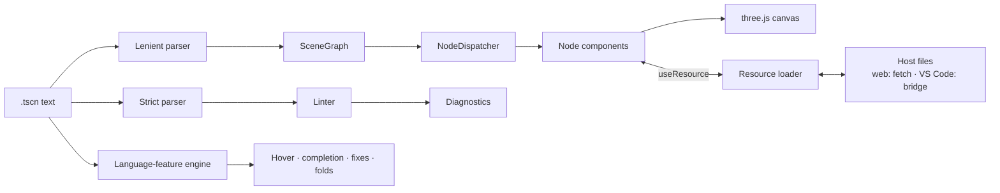
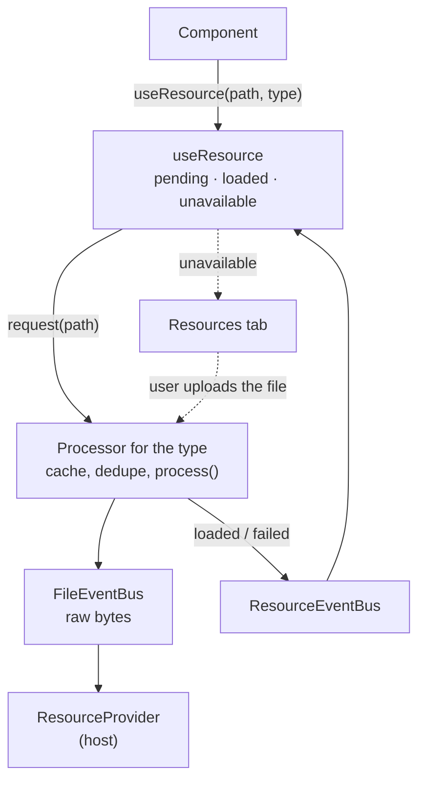

# Architecture

TextScene Inspector is one core library, `@textscene/core`, with four thin hosts. The core
parses, lints and renders `.tscn` text, and answers language-feature questions about it. A host
supplies files and a place to draw or edit.

- [GLOSSARY.md](./GLOSSARY.md) defines the terms. Use them exactly.
- [docs/adr/](./docs/adr/) records each decision. ADR-0001 and ADR-0002 set the slice and
  registry design. ADR numbers 0032, 0033 and 0042 each name two files, so cite those by
  filename.

## Packages

| Package | Does | Built with |
| --- | --- | --- |
| `packages/textscene-core` | Parser, linter, renderer, preview shell | tsc |
| `apps/textscene-web` | Web previewer and the Source pane (ADR-0020) | Vite |
| `apps/textscene-vscode` | VS Code extension: preview webview and language features | esbuild |
| `apps/textscene-lsp` | `tscn-lsp` language server for any LSP client | esbuild |
| `apps/textscene-linter` | `tscn-lint` CLI | esbuild |

Stack: TypeScript (strict), React, react-three-fiber and drei over three.js, Vitest. The
`pnpm-workspace.yaml` catalog holds every shared dependency version.

| Core directory | Holds |
| --- | --- |
| `parser/` | The lenient parser and the scanning loop both parsers share |
| `linter/` | The strict parser, the rule and validator registries, the `Linter` |
| `core/` | `SceneGraph`, `NodeRegistry` and the registry factory |
| `godot/` | Engine facts: constants and pure functions. It imports nothing. |
| `languageFeatures/` | Hover, completion, quick fixes, folding and highlights over the parser |
| `nodes/` | One vertical slice per Godot node type |
| `resources/` | The resource loader, and one slice per resource type |
| `r3f/` | The renderer, the 2D canvas, the Control canvas, the preview shell |

## The pipelines

```mermaid
flowchart LR
  TSCN[".tscn text"] --> LP["Lenient parser"]
  LP --> SG["SceneGraph"]
  SG --> ND["NodeDispatcher"]
  ND --> COMP["Node components"]
  COMP --> CANVAS["three.js canvas"]
  COMP <-->|"useResource"| RL["Resource loader"]
  RL <--> HOST["Host files<br/>web: fetch · VS Code: bridge"]

  TSCN --> SP["Strict parser"]
  SP --> LINT["Linter"]
  LINT --> DIAG["Diagnostics"]

  TSCN --> LANG["Language-feature engine"]
  LANG --> HOVER["Hover · completion · fixes · folds"]
```

**Render.** `NodeDispatcher` walks the lenient parser's `SceneGraph` and renders each node's
registered component.

**Lint.** The strict parser reports each syntax and format error with its line, and the
`Linter` runs the semantic rules. This path imports no React and no three.js, so the CLI and
the VS Code extension host bundle it alone.

**Language features.** `languageFeatures/` (`createLanguageDocument`) parses the text through
the same scanning loop with a `ParseObserver`, then answers hover, completion, quick fixes,
folding and document highlights. It reads the same `godot/` ClassDB captures and the same
deprecated-alias table as the linter, so no editor states an engine fact twice. It is
React- and THREE-free, and every result is host-neutral with zero-based ranges (ADR-0046).

**Cross-file lint.** `Linter.lint` reads only the scene. A `LintSession` (`Linter.session()`)
also reads the used `.glb` and `.gltf` files through the host's `ResourceProvider`. It reports
a glTF extension that Godot's importer does not support:

- A use that fails the load of its file (a sub-resource, a `.tres` body, a `binds=` or the
  root node heading) is an error only when no code in the project can register a
  `GLTFDocumentExtension`. Otherwise it is a warning (`linter/usedExtResources.ts`, ADR-0043).
- A use only in other node headings and node bodies leaves the scene loadable, and warns.

`session.lint` returns `now`, from the reads it keeps, and `later`, the full list after new
reads. `later` is null when no read is necessary, and resolves to null when a newer lint
overtakes it. `Linter.lintComplete` gives the full list in one answer. The `Linter` keeps
each read under the provider's `stamp` (`linter/stampedReads.ts`). The CLI and VS Code root their providers at the nearest
`project.godot` (`resources/resPath.ts`), and the web previewer at its corpus root.

## Vertical slices and registries

Each node type is one folder, `nodes/<category>/<type>/`. AGENTS.md lists its files. A slice
registers itself on import through three entry points, each into one registry keyed by the
Godot type name (ADR-0002):

| Entry point | Registry |
| --- | --- |
| `index.ts` | `NodeRegistry`: parser and formatter |
| `index.linter.ts` | The rule and validator registries |
| `index.r3f.ts` | `NodeComponentRegistry`: React component |

- Only `index.r3f.ts` imports `Component.tsx`, so the linter imports each slice without React.
- `parser/TscnParser.ts`, `linter/index.ts` and `r3f/nodes/index.ts` import every slice's
  entry point. A new type changes no other central file.
- A type with no component renders `GenericNodeFallback`, an invisible group (ADR-0008).
- Control nodes have a fourth registry, `controlComponentRegistry`, for their canvas painters.

Resource types use the same pattern under `resources/<category>/<type>/` (ADR-0031).

## Two parsers, one loop

`parser/TscnParserCore.ts` is the only scanning loop. It takes an optional `ParseObserver`.

| Parser | Used by | Behaviour |
| --- | --- | --- |
| `TscnParser` (lenient) | The renderer | Runs the bare loop. Recovers from errors. |
| `StrictTscnParser` | The linter, the VS Code language features | Adds an observer that records every error and runs the property validators |

The observer only adds, so the render is the same with or without it. The lenient
`NodeCreator` stores typed values in `properties`, and the strict one stores raw strings.
Both store raw strings in `rawProperties`, so shared code reads that field. The strict parser
also returns `SourceLines`, which puts each diagnostic on its line.

## Rendering

- **Scene tree.** `TscnCanvas` mounts the R3F `<Canvas>`. Each node gets its own `<group>`.
- **Parent space.** A node follows its parent's transform only where Godot does
  (`godot/parentSpace.ts`). Any other node attaches to the world root (`ParentSpaceScope`).
- **3D and 2D.** `ViewportModeContext` picks `TscnCanvas` or `Canvas2DStage` (ADR-0006).
- **2D draw order.** One sort key for every canvas item becomes `renderOrder`
  (`canvasPaintOrder.ts`, ADR-0036).
- **Control nodes.** They draw natively in the canvas, with no DOM (ADR-0037). Text follows
  ADR-0040.
- **2D lights.** `r3f/lighting2d/` ports Godot's canvas light shader (ADR-0030).
- **Offscreen passes.** One orchestrator runs them in dependency order
  (`ViewportPassRegistryContext.tsx`).
- **Shadows.** `<SceneShadowFitter>` fits each declared shadow
  (`r3f/directionalShadow/directionalShadow.md`, `r3f/positionalShadow/positionalShadow.md`).

**Axis conventions.** Convert each axis where Godot data becomes a three.js object, never in a
parser:

- Texture V: Godot's origin is the top. Each consumer mirrors `v → 1 - v`.
  `unit-arraymesh-uv.tscn` pins it.
- Triangle winding: Godot is clockwise. `meshes/arraymesh/build.ts` reverses each triangle.
- 2D Y: Godot's Y grows down. `r3f/node2dTransform.ts` negates it.

## Resource loading

A component never waits for a file. It re-renders when the file arrives.

```mermaid
flowchart TD
  COMP["Component"] -->|"useResource(path, type)"| HOOK["useResource<br/>pending · loaded · unavailable"]
  HOOK -->|"request(path)"| PROC["Processor for the type<br/>cache, dedupe, process()"]
  PROC --> FEB["FileEventBus<br/>raw bytes"]
  FEB --> PROV["ResourceProvider<br/>(host)"]
  PROC -->|"loaded / failed"| REB["ResourceEventBus"]
  REB --> HOOK
  HOOK -. "unavailable" .-> MISS["Resources tab"]
  MISS -. "user uploads the file" .-> PROC
```

| Layer | Job |
| --- | --- |
| `ResourceProvider` | The host's file access |
| `FileEventBus` | Fetches, caches and dedupes bytes |
| Processor | One per resource type. Turns bytes into a cached resource. |
| `ResourceEventBus` | Typed events: `requested`, `loading`, `loaded`, `failed`, `invalidated` |
| `ResourceLoader` | Owns the processors and the `ExtResource` table |
| `useResource` | The only API a component sees. It never suspends. |

- **Late arrival.** `loader.provideFile(path)` announces every resource built from or reading
  the file as `invalidated`, and each hook loads it again with no remount.
- **Sub-resource paths.** `res://file.tres::SubId` addresses a resource inside a `.tres`.
  Only `resources/subResourcePath.ts` writes `::`.
- **Imports.** `.import` sidecars and `project.godot` load through `tryLoad` (ADR-0028).
- **Clones.** A cached Object3D is cloned per consumer. Textures and materials are shared.
- **Materials.** `resolveMaterialSource`, `useMaterial` and `SurfaceMaterialSlot` give every
  material one path to a surface (ADR-0041).
- **Procedural textures.** A NoiseTexture2D builds as a job in a worker (`workers/jobs.ts`,
  ADR-0042). A large texture uploads in bands (`r3f/tiledUpload/`).

## The preview shell

`TscnPreviewShell` is the Split Dock both hosts use (ADR-0007). Each shell creates its own
React contexts (`previewShellProviders.tsx`), so two previews share no state.

Animation drivers move other nodes' properties (ADR-0011). One transport plays the driver of
the selected node (ADR-0012). Playback starts stopped.

## Hosts

- **VS Code.** The extension host runs the language features as native providers, so they work
  in vscode.dev as well as on the desktop. It also registers agent tools through `vscode.lm`.
  The webview refreshes on save and keeps its camera (ADR-0021).
- **LSP.** `apps/textscene-lsp` serves the same language features to any editor over stdio
  (`tscn-lsp`), with no VS Code API. It reads the project from the nearest `project.godot`.
- **Web.** The Source pane renders only a buffer the lenient parser accepts, and lints every
  buffer (ADR-0020).
- **Job workers.** Each host starts one script built from `@textscene/core/worker`. VS Code
  starts it from a `blob:` URL (`apps/textscene-vscode/src/bundler/textureWorkerPlugin.mjs`).

## Enforced boundaries

A test or a script fails when one of these rules breaks.

| Rule | Enforced by |
| --- | --- |
| The linter and the lenient parser import no React or three.js | `linter/reactFree.test.ts`, an ESLint `no-restricted-imports` rule |
| The language-feature engine and the LSP server import no React or three.js | `languageFeatures/reactFree.test.ts`, an ESLint `no-restricted-imports` rule, `apps/textscene-lsp/src/reactFree.test.ts` |
| `godot/` imports nothing | `noDependencies.test.ts` |
| Every slice is wired into its barrels | `barrelCompleteness`, `parserBarrelCompleteness` |
| Every registered type has a Godot base chain | `baseChainCompleteness.test.ts` |
| A rule reports only through its declared arms, and derives `emits` from them | the ESLint rule-arm guard, `ruleCoverage.emits.test.ts`, `ruleArms.test.ts` |
| A resource slice has the slice shape | `resourceSliceConformance`, `resourceSliceIsolation` |
| The raw properties agree between parsers | `parser/rawPropertyParity.test.ts` |
| The worker's import closure holds no React, three.js or `.tsx` | `workers/workerClosure.test.ts` |
| Every drawn texture clone goes through the tiled upload | `r3f/tiledUpload/drawnCloneGuard.test.ts` |
| The VS Code host bundles hold no React or three.js | `scripts/check-bundle-size/hostBundles.mjs` |
| The webview's initial bundle stays under its budget | `scripts/check-bundle-size/webviewBudget.mjs` |

## Bundle size

The VS Code extension host imports only the React-free core subpaths
(`@textscene/core/parser`, `/linter`, `/godot`, `/languageFeatures`). The root barrel has React
and CSS side effects, and grows the host bundle about four times. The `languageFeatures` subpath
carries the generated ClassDB property tables, which the webview never loads.

The webview builds ESM with code splitting (`apps/textscene-vscode/esbuild.config.mjs`), and
loads the dock panels, the Control canvas, drei's `<Text>` and the GLB loader on demand.
`pnpm check:bundle-size` prints the current sizes.
