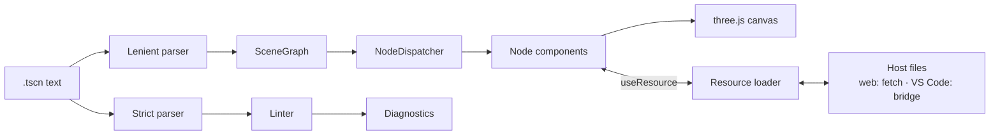
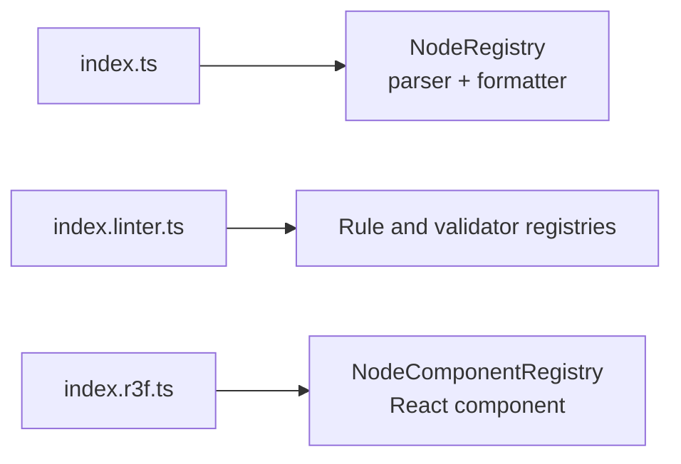
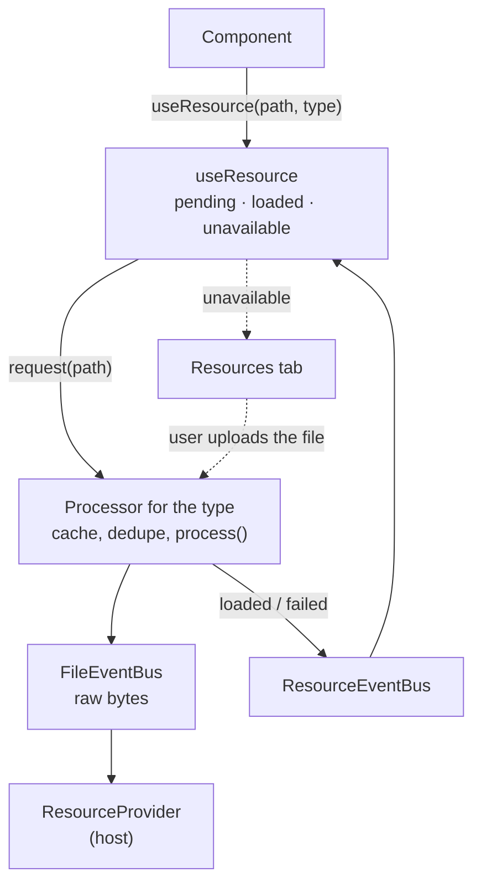

# Architecture

TextScene Inspector is one core library, `@textscene/core`, with three thin hosts. The core
parses `.tscn` text, lints it and renders it. A host only supplies files and a place to draw.

- [GLOSSARY.md](./GLOSSARY.md) defines the terms. Use them exactly.
- [docs/adr/](./docs/adr/) records each decision. Start with ADR-0001 (the vertical slice and
  the React-free linter) and ADR-0002 (three registries). ADR numbers 0032 and 0033 each name
  two files, so cite those by filename.

## Packages

| Package | Does | Built with |
| --- | --- | --- |
| `packages/textscene-core` | Parser, linter, renderer, preview shell | tsc |
| `apps/textscene-web` | Web previewer, and the Source pane (ADR-0020) | Vite |
| `apps/textscene-vscode` | VS Code extension: preview webview and language features | esbuild |
| `apps/textscene-linter` | `tscn-lint` CLI | esbuild |

Stack: TypeScript (strict), React, react-three-fiber and drei over three.js, Vitest. The
`pnpm-workspace.yaml` catalog holds every shared dependency version.

Inside the core:

| Directory | Holds |
| --- | --- |
| `parser/` | The lenient parser and the scanning loop both parsers share |
| `linter/` | The strict parser, the rule and validator registries, the `Linter` |
| `core/` | `SceneGraph`, `NodeRegistry` and the registry factory |
| `godot/` | Engine facts: constants and pure functions. It imports nothing. |
| `nodes/` | One vertical slice per Godot node type |
| `resources/` | The resource loader, and one slice per resource type |
| `r3f/` | The renderer, the 2D canvas, the Control canvas, the preview shell |

## The two pipelines

```mermaid
flowchart LR
  TSCN[".tscn text"] --> LP["Lenient parser"]
  LP --> SG["SceneGraph"]
  SG --> ND["NodeDispatcher"]
  ND --> COMP["Node components"]
  COMP --> CANVAS["three.js canvas"]
  COMP <-->|"useResource"| RL["Resource loader"]
  RL <--> HOST["Host files<br/>web: fetch · VS Code: bridge"]

  TSCN --> SP["Strict parser"]
  SP --> LINT["Linter"]
  LINT --> DIAG["Diagnostics"]
```

**Render.** The lenient parser builds a `SceneGraph`. `NodeDispatcher` walks it and renders
each node's registered component. Components load files through `useResource`.

**Lint.** The strict parser reports every syntax and format error with its line. The
`Linter` then runs the semantic rules over the tree. The whole path imports no React and no
three.js, so the CLI and the VS Code extension host can bundle it alone.

## Vertical slices and registries

Each node type is one folder, `nodes/<category>/<type>/`. The folder holds the parser, the
linter checks, the component, the comparison sheet and the tests. AGENTS.md lists the files.

A slice registers itself on import, through three entry points. Each feeds one registry, keyed
by the Godot type name (ADR-0002):

```mermaid
flowchart LR
  I["index.ts"] --> NR["NodeRegistry<br/>parser + formatter"]
  L["index.linter.ts"] --> RR["Rule and validator registries"]
  R["index.r3f.ts"] --> CR["NodeComponentRegistry<br/>React component"]
```

- Only `index.r3f.ts` imports `Component.tsx`. This keeps React out of the parser and the
  linter.
- `parser/TscnParser.ts`, `linter/index.ts` and `r3f/nodes/index.ts` import every slice's
  entry point. Adding a type changes no other central file.
- A type with no component renders `GenericNodeFallback`: an invisible group that positions its
  children (ADR-0008).
- Control nodes have a fourth registry, `controlComponentRegistry`, for their canvas painters.

Resource types follow the same pattern under `resources/<category>/<type>/` (ADR-0031). A
THREE-free `index.ts` declares which type names and extensions the slice claims.
`decode.ts` turns properties into typed data. `build.ts` makes the three.js object.

## Two parsers, one loop

`parser/TscnParserCore.ts` is the only scanning loop. It takes an optional `ParseObserver`.

| Parser | Used by | Behaviour |
| --- | --- | --- |
| `TscnParser` (lenient) | The renderer | Runs the bare loop. Recovers from errors and keeps what it can. |
| `StrictTscnParser` | The linter, the VS Code language features | Adds an observer that records every error and runs the property validators |

The observer only adds. It never changes what the loop parses, so rendering is the same with
or without it.

The parsers differ in one place, the `NodeCreator`. The lenient one stores each slice's typed
properties in `properties`. The strict one stores the raw strings there. Both store the raw
strings in `rawProperties`, so code shared by both paths reads that field.

The strict parser also returns `SourceLines`: the line of each heading and property. The
`Linter` uses it to put a rule's diagnostic on the right line.

## Rendering

**Scene tree to three.js.** `TscnCanvas` mounts the R3F `<Canvas>` and `NodeDispatcher`.
Each node gets its own `<group>`, so a child inherits its parent's transform. An
`instance = ExtResource(...)` node composes the referenced PackedScene in place.

**Where a node attaches.** A node follows its parent's transform only where Godot does:
a Node3D under a Node3D, a CanvasItem under a CanvasItem (`godot/parentSpace.ts`). Any other
node moves its three.js object to the viewport's world root, while its React subtree and
contexts stay in place (`ParentSpaceScope`).

**3D and 2D.** `ViewportModeContext` picks the view (ADR-0006). 3D mounts `TscnCanvas`. 2D
mounts `Canvas2DStage`, which draws the 2D world and the Control nodes in one canvas.

**2D draw order.** Every canvas item gets one sort key: canvas layer, then `z_final`, then its
position in the tree walk (`canvasPaintOrder.ts`, ADR-0036). The node type is not part of the
key, so a Control and a Sprite2D interleave as they do in Godot. The key goes into three.js
`renderOrder`.

**Control nodes** draw natively in the canvas, with no DOM (ADR-0037):

- `controlRectSolver.ts` ports Godot's two-phase layout: minimum sizes bottom-up, then rects
  top-down.
- A painter per Control type draws its StyleBoxes and content as meshes.
- A `ScrollContainer` clips with clip planes, because the canvas has no stencil buffer.
- Text uses a vendored, build-time MSDF atlas of Godot's default font. A font a scene brings
  itself renders through canvas 2D. Both share one layout engine (ADR-0040).

**2D lights.** `r3f/lighting2d/` ports Godot's canvas light shader. Lights are accumulated
into an offscreen buffer, and each lit item multiplies its colour by it. Shadows are a
separate pass (ADR-0030).

**Offscreen passes.** A SubViewport and the Control offscreen pass register with one
orchestrator, which runs them in dependency order from a single `useFrame`
(`ViewportPassRegistryContext.tsx`).

**Directional shadows.** As in Godot, the renderer owns a directional light's shadow box, and
the light does not. A light only declares its shadow parameters on `userData`.
`<DirectionalShadowFitter>` hooks each render of the scene (`scene.onBeforeRender`) and fits
each declared light's shadow camera to that render's camera. The shadowed lights share Godot's
one directional shadow atlas, so each light's map is its share of it. A light with Godot's two
or four splits shades through a child sun light that draws one fitted box per split into its
share, and a patched shader chunk picks the split by view depth. Every directional shadow
fades out over the far end of its last split, through a patched lighting chunk that reads one
shared buffer the fitter writes before each render. A SubViewport with its own world hooks that
world the same way (`r3f/directionalShadow/directionalShadow.md`).

**Axis conventions.** Godot and three.js disagree in three places. Each is converted where
Godot data becomes a three.js object, never in a parser:

- Texture V: Godot's origin is the top. Each consumer mirrors `v → 1 - v`, because textures are
  shared between 2D and 3D. `unit-arraymesh-uv.tscn` pins it.
- Triangle winding: Godot is clockwise. `meshes/arraymesh/build.ts` reverses each triangle.
- 2D Y: Godot's Y grows down. `r3f/node2dTransform.ts` negates it.

## Resource loading

A component never waits for a file. It subscribes to events, and re-renders when the file
arrives.

```mermaid
flowchart TD
  COMP["Component"] -->|"useResource(path, type)"| HOOK["useResource<br/>pending · loaded · unavailable"]
  HOOK -->|"request(path)"| PROC["Processor for the type<br/>cache, dedupe, process()"]
  PROC --> FEB["FileEventBus<br/>raw bytes"]
  FEB --> PROV["ResourceProvider<br/>(host)"]
  PROC -->|"loaded / failed"| REB["ResourceEventBus"]
  REB --> HOOK
  HOOK -. "unavailable" .-> MISS["Resources tab"]
  MISS -. "user uploads the file" .-> PROC
```

| Layer | Job |
| --- | --- |
| `ResourceProvider` | The host's file access: `fetch` on the web, the extension bridge in VS Code |
| `FileEventBus` | Fetches and caches bytes, and dedupes requests |
| Processor | One per resource type. Turns bytes into a resource, caches it, emits an event. A failure is cached as `null`. |
| `ResourceEventBus` | Typed events: `requested`, `loading`, `loaded`, `failed`, `invalidated` |
| `ResourceLoader` | Owns the processors and the `ExtResource` table |
| `useResource` | The only API a component sees. It never suspends. |

**Late arrival.** A failed load leaves the hook subscribed. When the user uploads the file,
`loader.provideFile(path)` clears that path and loads it again. The hook flips to `loaded`
and the component updates without a remount. A promise resolves once, so it cannot do this.

**Sub-resource paths.** `res://file.tres::SubId` addresses a resource inside a `.tres`
(ADR-0032). The whole address is the cache key. The processor reads the owning file, so the
file bus and the hosts see only real files. `resources/subResourcePath.ts` is the only place
that writes `::`.

**Imports.** A texture gets Godot's `fix_alpha_border` import step (`fixAlphaEdges.ts`). An
`.import` sidecar and `project.godot` load through `tryLoad`, which treats a missing file as
"use Godot's defaults" (ADR-0028).

**Clones.** A three.js object has one parent, so a cached Object3D is cloned for each consumer.
Textures and materials are shared.

### Materials

A material reaches a surface through one path, whatever file it is in.

- `resolveMaterialSource` names where the material is: one the scene holds, or a `.tres`
  address, either a whole file or `file.tres::SubId`.
- `useMaterial` loads either into the material body and the resource tables its references
  resolve in, which are its own file's. A `.tres` comes through the cached `.tres` parse on
  the resource bus. A ShaderMaterial or an unsupported type is declined as Godot's default
  surface (ADR-0041).
- `SurfaceMaterialSlot` renders the result for MeshInstance3D surfaces, CSG and GridMap
  tiles. A GLB surface override takes the same result through `materialFromBag`, since a
  GLB mesh has no R3F element. Each map resolves in the material's own tables and draws
  through the tiled upload.
- **Stand-in maps.** While a map loads, builds or uploads, its slot binds a neutral 1x1
  texture (`pendingMapStandIn.ts`). three bakes each slot's presence into the program, so
  the map then swaps in on the program already linked, with no relink.
- A GLB **Import sidecar** remap tags the surface with its `.tres` address, and the scene
  root draws that material through the same path.

### Procedural textures

A NoiseTexture2D builds as a job, off the main thread (ADR-0042).

- **Jobs.** A job is a pure function in `workers/jobs.ts`, with its input and its output
  typed. The pixels return as a transferred buffer. `WorkerJobRunner` runs each job in one
  lazy worker, in order. When a host gives no worker, or the worker fails to start, the
  runner logs one warning and runs the same job on the main thread, with the same bytes.
- **The runner.** The host passes `createWorker` to `createResourcePipeline`, and the
  `ResourceLoader` owns the runner. A hook reads it through `useResourceLoader()`.
- **Pending and declined.** `resolveProceduralTexture` answers `ready`, `pending` or null.
  Null means the previewer draws nothing, as Godot draws nothing past the size limits.
  `pending` carries a `start(runner)`.
- **Content keys.** A build is keyed on its input, so an edit that leaves the texture
  unchanged reuses it. Two slots with one key share one build. The last holder that lets
  go aborts the build in a microtask, so a StrictMode remount does not cancel it.
- **Keep-old.** `useProceduralTextures` keeps a slot's previous texture until the new one
  lands, as Godot keeps the old image while `noise_thread` runs.
- **Tiled upload.** A texture larger than one 2 MiB band reaches the GPU in bands, a few
  each frame (`r3f/tiledUpload/`). The upload wraps the exact texture a consumer draws,
  because three uploads each clone with its own sampler settings separately. Every
  component that clones a texture to draw it goes through `useUploadedClone`.
  - Each band is one `texSubImage2D` over its own rows, and it reads no GPU state back
    (`webglUploadRenderer.ts`). A read waits for every command already queued.
  - At most 8 MiB of bands are on their way to the GPU at once. Each frame's bands wait
    behind a fence, and leave that window once the GPU has passed it (`gpuPacer.ts`).
- **Status.** `textureWork.ts` counts the builds and uploads in flight. The shell shows
  "Building textures…" while the count is above zero, and a capture waits for it to clear.

## The preview shell

`TscnPreviewShell` is the UI both hosts use. It is the Split Dock (ADR-0007): the viewport,
and a right dock with the scene tree above the Inspector, Resources, Cameras and Animation
tabs.

Each shell creates its own React contexts (`previewShellProviders.tsx`). Two previews in one
VS Code window therefore share no selection or camera state.

**Cameras.** `CameraControlContext` holds the active camera. `ActiveCameraSwitcher` finds the
three.js camera by the node path the Camera3D component writes to its `userData`.

**Animation.** A driver moves other nodes' properties (ADR-0011). One transport plays the
driver of the selected node (ADR-0012).

| Driver | How it plays |
| --- | --- |
| AnimationPlayer | Transform tracks through a `THREE.AnimationMixer`. Other tracks through the `AnimatedValue` push registry (ADR-0016, ADR-0017). |
| GLB scene | The file's own clips through a mixer (ADR-0014) |
| AnimatedSprite2D | The transport sets the frame directly (ADR-0015) |
| AnimationTree | Blends the clips of the AnimationPlayer it names (ADR-0019) |

Playback starts stopped, so a capture shows the authored pose.

## Hosts

**VS Code.** The extension host runs the language features: Go to Definition, `res://` links,
the Outline and the Problems panel. The preview is a webview running the shared shell. It
refreshes on save, and a file watcher sends dependency changes to `provideFile` (ADR-0021).
The canvas is not remounted, so the camera stays where it is.

**Job workers.** Each host starts its job worker from one self-contained script, built
from `@textscene/core/worker`. The web app imports it with Vite's `?worker&inline`. The VS
Code webview gets it as a string from an esbuild plugin (`apps/textscene-vscode/src/bundler/textureWorkerPlugin.mjs`)
and starts it from a `blob:` URL, the only worker source its CSP allows (`worker-src blob:`).

**Web.** The web app adds the Source pane (ADR-0020). An edit reaches the shell only when the
lenient parser accepts it, so a half-typed file keeps the last good render. The pane lints the
buffer separately, so a file that does not render still shows its problems.

## Enforced boundaries

These rules keep the design in shape. A test or a script fails when one breaks.

| Rule | Enforced by |
| --- | --- |
| The linter and the lenient parser import no React or three.js | `linter/reactFree.test.ts`, an ESLint `no-restricted-imports` rule |
| `godot/` imports nothing | `noDependencies.test.ts` |
| Every slice is wired into its barrels | `barrelCompleteness`, `parserBarrelCompleteness` |
| Every registered type has a Godot base chain | `baseChainCompleteness.test.ts` |
| A resource slice has the slice shape | `resourceSliceConformance`, `resourceSliceIsolation` |
| The raw properties agree between parsers | `parser/rawPropertyParity.test.ts` |
| The worker's import closure holds no React, three.js or `.tsx` | `workers/workerClosure.test.ts` |
| Every drawn texture clone goes through the tiled upload | `r3f/tiledUpload/drawnCloneGuard.test.ts` |
| The VS Code host bundles hold no React or three.js | `scripts/check-bundle-size/hostBundles.mjs` |
| The webview's initial bundle stays under its budget | `scripts/check-bundle-size/webviewBudget.mjs` |

## Bundle size

The VS Code extension host imports only React-free core subpaths (`@textscene/core/parser`,
`/linter`, `/logger`, `/godot`). The root barrel has React and CSS side effects, and
importing it grows the host bundle about four times.

The webview keeps its first load small in three ways:

- The build is ESM with code splitting (`apps/textscene-vscode/esbuild.config.mjs`).
- The dock panels, the Control canvas, drei's `<Text>` and the GLB loader load on demand.
- The webview CSP allows module scripts, so the chunks can load.

`pnpm check:bundle-size` prints the current sizes. Do not copy them here.
