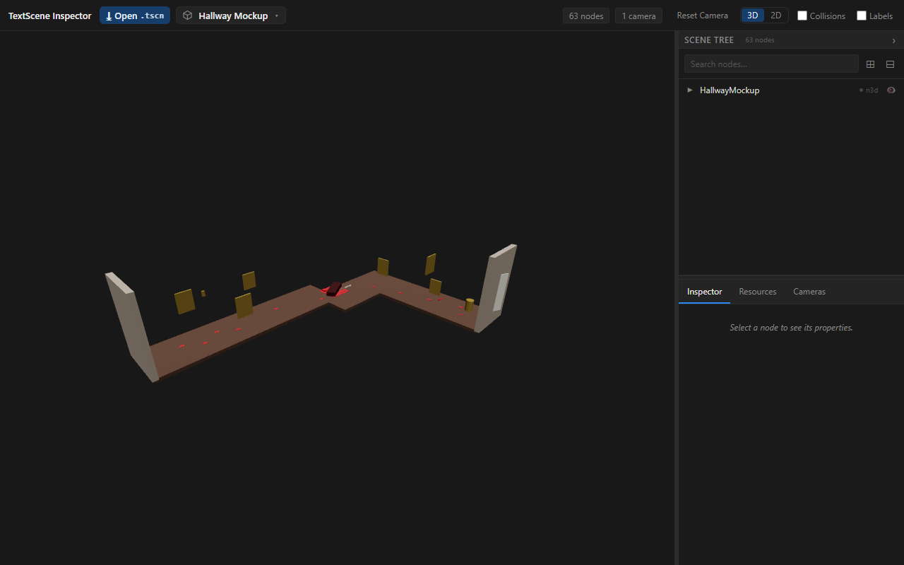

# TextScene Inspector

[](https://github.com/Vortiago/textscene-inspector/actions/workflows/ci.yml)
[](./LICENSE)

Renders Godot `.tscn` scenes in 3D, without Godot.

TextScene Inspector parses the `.tscn` text directly and draws it with
react-three-fiber over three.js — meshes, PBR materials, lights, cameras,
environments, and instanced sub-scenes. There is no Godot install, no editor
cache, and no import step. It ships as a VS Code extension (desktop and
vscode.dev), a standalone web previewer, and a `.tscn` linter that runs both as
a CLI and as in-editor diagnostics.

Try it without installing anything: **[textscene-inspector.pages.dev](https://textscene-inspector.pages.dev/)**.



*The web previewer's Split Dock chrome — scene tree on the left, Inspector /
Resources / Cameras tabs on the right — rendering a self-contained CSG corridor:
floor, walls, ceiling, portrait frames, and Label3D name plates, all built from
primitive nodes.*

## What it renders

Around 171 node types, each a self-registering vertical slice.

Coverage is broader than what draws: some node types are parsed and fully
lint-checked while drawing nothing — either because that is correct (a Timer, a
skeleton modifier, an XR tracker) or because rendering has not landed yet. The
parity gallery distinguishes the two, so "not implemented" never gets quietly
attached to a node that is finished.

| Category | Types |
|---|---|
| Meshes | Box, Sphere, Cylinder, Plane, Capsule, Torus, Prism, Quad |
| CSG | CSGBox3D, CSGCylinder3D, CSGSphere3D, CSGTorus3D, CSGMesh3D, CSGPolygon3D, CSGCombiner3D — with real union / intersection / subtraction |
| Lights & camera | Spot, Directional, Omni, Area (with shadows), Camera3D, Camera2D, WorldEnvironment |
| Physics | Bodies plus collision-shape gizmos; casts, spring arms, ragdoll bones, vehicle bodies and joints are lint-checked |
| 2D | Sprite2D, AnimatedSprite2D, Polygon2D, Line2D, TileMap, TileMapLayer, NavigationRegion2D, Marker2D, Path2D, PathFollow2D, ParallaxBackground, ParallaxLayer |
| 3D scene | Sprite3D, Label3D, Decal, GridMap, NavigationRegion3D, Marker3D, Path3D, PathFollow3D |
| Viewports | SubViewport, SubViewportContainer — nested viewports, with `ViewportTexture` composited onto 3D surfaces |
| UI | 23 Control types, rendered as a DOM overlay |

Beyond the node set:

- **Materials.** StandardMaterial3D PBR — albedo, metallic, roughness, normal,
  emission, AO, heightmap, clearcoat, rim, and UV transforms, with external
  textures.
- **External resources.** PackedScene instancing, textures, materials, and GLB
  meshes flow through a typed event bus that recovers when a file arrives after
  the scene that references it. A resource a `.tres` declares inside itself —
  a mesh's own surface materials, a MeshLibrary's embedded meshes — is addressed
  the same way, by Godot's `res://file.tres::SubId` path.
- **Animation.** AnimationPlayer (transform tracks via `THREE.AnimationMixer`,
  plus value tracks like sprite frames and Decal modulate/size), AnimationTree
  blend trees and state machines, GLB-embedded clips, and AnimatedSprite2D
  frames — all behind one selection-driven play/pause/scrub transport.
- **Linting.** A React- and THREE-free bundle powers both `tscn-lint` on the
  command line and the VS Code Problems panel.

## Surfaces

**VS Code extension** — desktop and web (vscode.dev) entry points, scene
outline, go-to-definition on node and resource paths, and hot reload on save.
Not yet published to the Marketplace; build it from source (below).

**Web previewer** — a fixture browser, an "Open .tscn" picker with a
<kbd>Ctrl/Cmd+K</kbd> scene palette, drag-and-drop multi-file upload (drop a
scene and its textures in one gesture), and shareable `?fixture=` deep links
(add `&camera=<node path>`, e.g. `&camera=Root/Camera3D`, to open looking through
a scene's own Camera3D).
An editable Source pane renders `.tscn` text as you type, with a linter gutter
(error/warning dots, hover popover, problem-count badge) and a
"Download .tscn" export.

**CLI linter** — `pnpm lint:tscn <files>`, after `pnpm build:linter`.

## Quick start

Requires Node.js 20+ and pnpm 9+.

```bash
pnpm install
pnpm build
pnpm dev:web          # web previewer on localhost
```

For the VS Code extension:

```bash
pnpm --filter textscene-inspector build     # dist/extension.js (desktop),
                                            # dist/extension.web.js (vscode.dev),
                                            # plus the webview bundles
pnpm --filter textscene-inspector package   # .vsix
```

Install the `.vsix` with **Extensions: Install from VSIX…** in the command
palette, then open any `.tscn` file.

<details>
<summary>Windows: installing Node and pnpm with WinGet</summary>

```bash
winget configure scripts/winget-dev-setup.yaml
```

Installs the required versions from the official package sources. Needs WinGet
v1.6.2631 or later (`winget --version`).
</details>

## Tests

```bash
pnpm test                # full vitest suite
pnpm test:watch          # watch mode
pnpm test:visual         # golden images, headless chromium + pixelmatch
pnpm test:visual:update  # rewrite baselines after an intentional change — eyeball, then commit
```

The VS Code extension carries its own integration suite, run in a real VS Code
instance and separate from the vitest run:

```bash
pnpm --filter textscene-inspector test:integration
```

CI runs that suite on Ubuntu, macOS, and Windows — `xvfb-run` for headless
Linux — and verifies VSIX installation on each.

<details>
<summary>Debugging the integration tests</summary>

Add to `.vscode/launch.json`:

```json
{
  "version": "0.2.0",
  "configurations": [
    {
      "name": "Debug Integration Tests",
      "type": "node",
      "request": "launch",
      "program": "${workspaceFolder}/apps/textscene-vscode/dist/test/integration/runTests.js",
      "cwd": "${workspaceFolder}/apps/textscene-vscode",
      "preLaunchTask": "npm: build",
      "outFiles": ["${workspaceFolder}/apps/textscene-vscode/dist/**/*.js"]
    }
  ]
}
```
</details>

## Scripts

| Command | Does |
|---|---|
| `pnpm build` | Build all packages |
| `pnpm build:site` | Deployable web build — vendors the games and ld-58 corpora (script-stripped, never committed) into `apps/textscene-web/dist` |
| `pnpm build:linter` | Build the standalone linter bundle |
| `pnpm test` | Full unit suite |
| `pnpm lint` | ESLint |
| `pnpm lint:tscn <files>` | Lint `.tscn` scene files |
| `pnpm type-check` | Type check |
| `pnpm clean` | Remove build artifacts |

## Architecture

Two parsers share one scanning loop. A lenient parser renders whatever it can
salvage; a strict parser lints and reports everything. Node types self-register
on import, so adding one touches its own directory and three aggregation
imports — never a central parser or renderer file. The web previewer and the
VS Code extension are thin shells over the same `@textscene/core` library, which
keeps them at feature parity by construction.

[ARCHITECTURE.md](./ARCHITECTURE.md) has the details.

## Documentation

- [docs/user-guide-web.md](./docs/user-guide-web.md) — viewport controls, scene tree, inspector
- [docs/user-guide-vscode.md](./docs/user-guide-vscode.md) — VS Code extension guide
- [ARCHITECTURE.md](./ARCHITECTURE.md) — project structure and patterns
- [REFERENCES.md](./REFERENCES.md) — Godot and three.js documentation links
- [GitHub issues](https://github.com/Vortiago/textscene-inspector/issues) — roadmap and open work

## License

MIT
