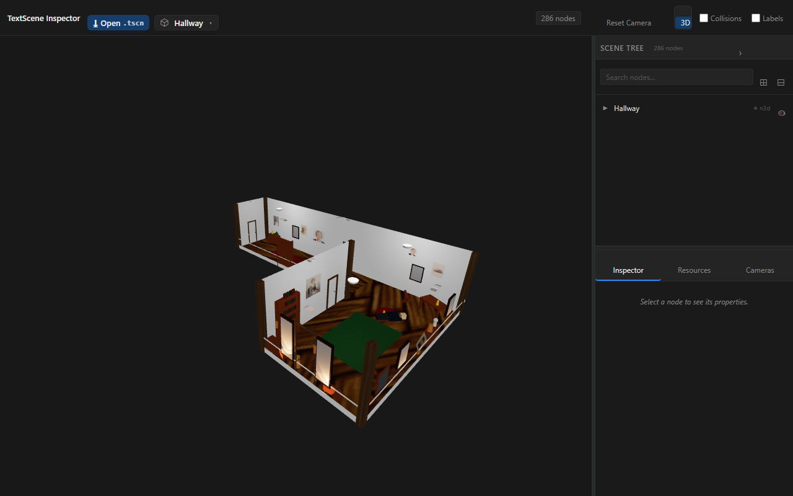
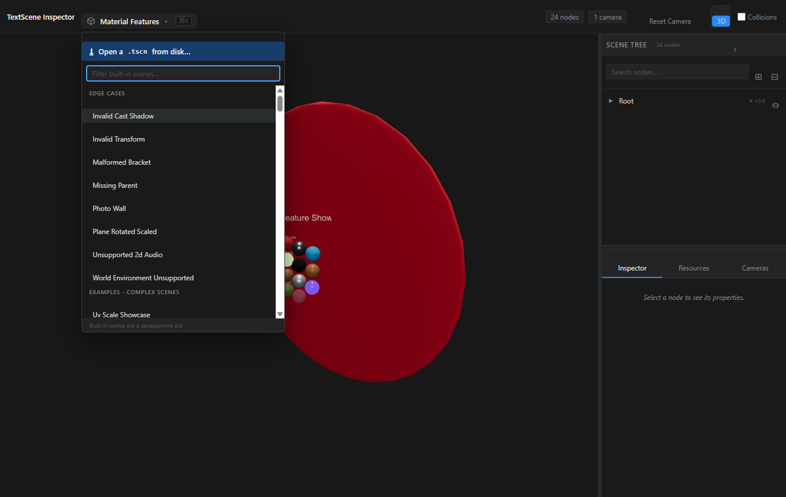
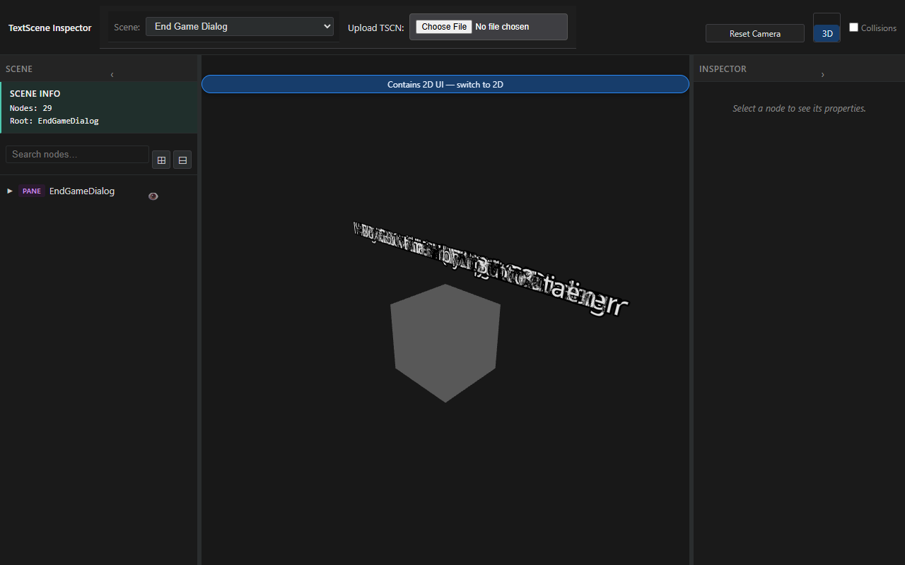
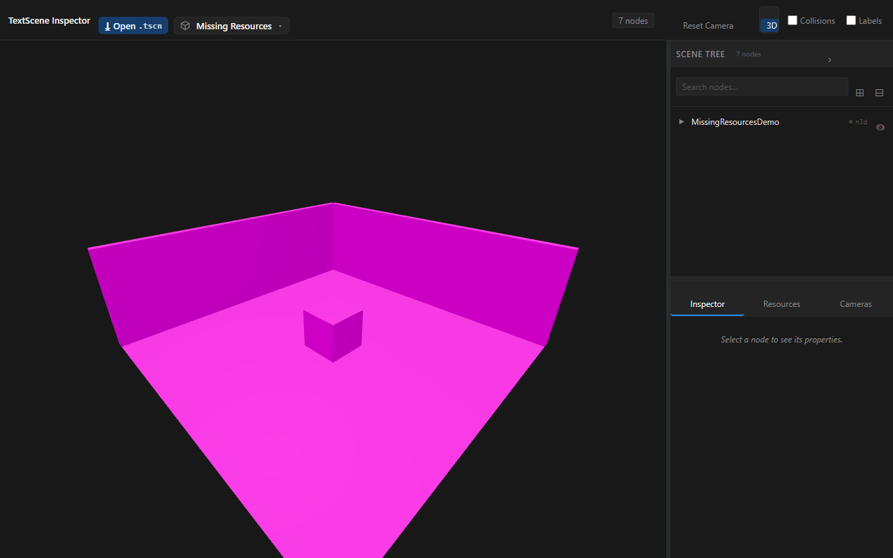
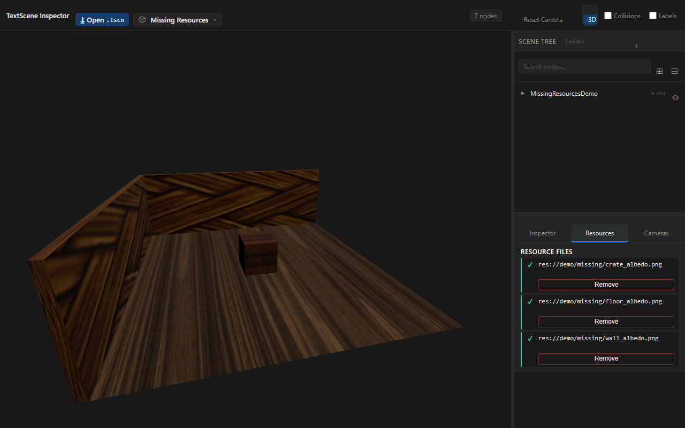
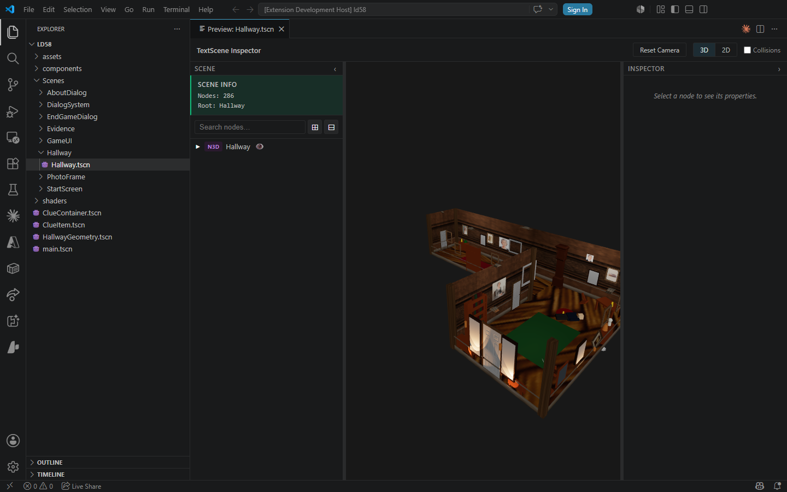
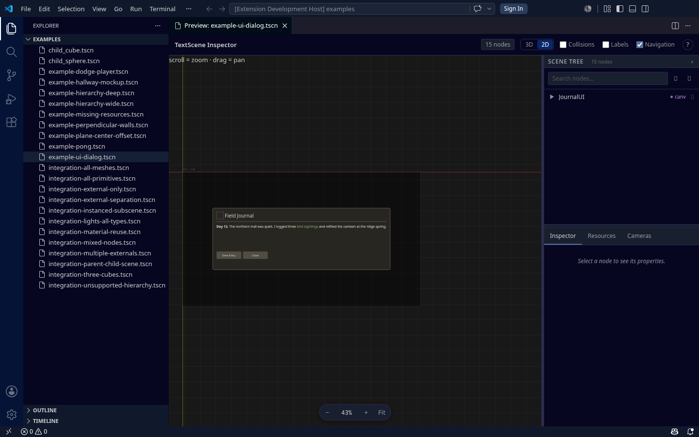

# Feature Showcase

The showcase is the visual record of what TextScene Inspector renders. Each clip is a `.webm` screen recording of the real renderer with a `.png` poster frame. Each recording opens on its own scene, so the feature is framed and lit from the first frame.

When the renderer or the chrome changes, run **`pnpm showcase:regen`** (see [Regenerate](#regenerate)). Commit the new `.webm` and `.png` files with the code.

## Hallway progress

A self-contained hallway scene tests whether the renderer draws a full scene. Triplanar (`uv1_world_triplanar`) tiling matches Godot's world-unit density on planar meshes: the floor, walls and ceiling tile `size × uv1_scale` instead of stretching one copy. Non-planar triplanar geometry is approximate.

### CSG hallway mockup


[▶ web/hallway.webm](web/hallway.webm)

The hallway mockup: a CSG corridor (floor, walls, ceiling), portrait frames and Label3D name plates.

## Split Dock chrome + 2D UI

### dcc-layout



[▶ web/dcc-layout.webm](web/dcc-layout.webm)

The chrome is a 2-column **Split Dock** (ADR-0007): the viewport beside one right dock, with the scene tree on top and the tabbed detail panel (**Inspector**, **Resources**, **Cameras**) below it. There is no left rail. The top bar holds the brand, the scene chip with the Ctrl/Cmd+K palette, and the Reset Camera, 3D/2D and Collisions controls. The clip orbits the textured hallway mockup, then opens a 2D-UI example scene in **2D** mode, where the native Control canvas renders the dialog.

The clip shows the earlier 3-column layout. Run `pnpm showcase:regen` to record it with the Split Dock. This still shows the current toolbar:



### ui-hint



[▶ web/ui-hint.webm](web/ui-hint.webm)

ADR-0006 discoverability: a Control-only scene (`example-ui-dialog`) opens in the default 3D viewport, so the shell floats a hint over the canvas that offers **switch to 2D**. Clicking it flips to 2D mode, which renders the dialog.

## Feature clips

One clip per implemented feature.

### all-primitives


[▶ web/all-primitives.webm](web/all-primitives.webm)

A green ground plane holds primitive meshes (prism, torus, capsule), each with its own material, orbited as solid 3D geometry.

### all-meshes


[▶ web/all-meshes.webm](web/all-meshes.webm)

Every primitive mesh type (cube, sphere, cylinder, capsule, plane, torus, prism) rendered together with distinct materials.

### csg-box


[▶ web/csg-box.webm](web/csg-box.webm)

CSGBox3D shapes render as solid lit geometry with materials (not placeholders).

### csg-cylinder


[▶ web/csg-cylinder.webm](web/csg-cylinder.webm)

CSGCylinder3D renders as a solid cylinder, including the tapered cone form.

### material-metallic


[▶ web/material-metallic.webm](web/material-metallic.webm)

A high-metallic, low-roughness StandardMaterial3D sphere with a tight specular highlight under the directional light.

### material-emissive


[▶ web/material-emissive.webm](web/material-emissive.webm)

An emissive material lights itself uniformly, whatever the light direction.

### world-environment


[▶ web/world-environment.webm](web/world-environment.webm)

WorldEnvironment fills the background with its color and ambient-lights the scene.

### label3d


[▶ web/label3d.webm](web/label3d.webm)

Label3D billboarded 3D text nodes with color and outline variations, facing the camera.

### mixed-nodes


[▶ web/mixed-nodes.webm](web/mixed-nodes.webm)

A mixed node hierarchy of multiple mesh instances rendered together with correct lighting.

### physics-bodies


[▶ web/physics-bodies.webm](web/physics-bodies.webm)

StaticBody3D and Area3D render as transform groups that position their child meshes. AudioStreamPlayer draws nothing.

### multi-camera


[▶ web/multi-camera.webm](web/multi-camera.webm)

Selecting each Camera3D node and clicking "Use This Camera" switches the viewport between the cameras' points of view (perspective, top-down, side, orthographic), then resets to free orbit.

### missing-upload





[▶ web/missing-upload.webm](web/missing-upload.webm)

The clip requests the missing resources, uploads them and shows the renderer use them. A small room whose floor, walls, and crate reference textures that are **not** bundled loads flat-shaded in **magenta** (the missing-texture marker), and the shell's **Resources** tab lists all three `res://demo/missing/*` paths as missing (⚠). Uploading a file for each path drives the late-arrival pipeline (`provideFile` → `useResource` `'loaded'` → re-render): the rows flip to uploaded (✓) and the surfaces gain their textures **live, on camera**. The two posters above are the before (missing/magenta) and after (uploaded/textured) frames.

## VS Code extension

The web previewer and the extension render through the same `@textscene/core` library, so every clip above is also what VS Code draws. VS Code adds a `.tscn` Preview panel with the scene tree and inspector, opened with **TextScene: Open Preview to the Side** from the command palette or the editor-title button. The screenshots below show the preview inside the full VS Code UI: title bar, activity bar, editor tabs, the `.tscn` text editor, the Preview panel and the status bar.



The **TextScene: Open Preview to the Side** webview fills the editor area, rendering `example-hallway-mockup.tscn` in 3D (floor, walls, portrait frames) with the searchable scene tree, the Inspector/Resources/Cameras panel and the viewport toolbar (Reset Camera, 2D/3D toggle, Collisions/Labels/Navigation/Grid), inside the standard VS Code layout.



The same preview in 2D mode renders `example-ui-dialog.tscn`: a Godot `Control` UI tree (panel, body copy, Save Entry / Close buttons) drawn in the pan/zoom viewport, with the `JournalUI` node tree in the inspector.


`unit-box-mesh.tscn` with its source closed, so the webview owns the editor area: the expanded scene tree (Root → Box / Title / Description), the Inspector/Resources/Cameras tabs and the viewport toolbar, beside the Explorer.


`integration-lights-all-types.tscn` holds a DirectionalLight3D, an OmniLight3D and a SpotLight3D and no geometry, so the tree carries what the viewport cannot.


`example-hierarchy-deep.tscn` with the Outline expanded beside the source and the preview. The document symbols mirror the scene's own `[node name=…]` nesting, so an outline click jumps the editor to that declaration.

Every VS Code screenshot in this repo, including those in
[docs/user-guide-vscode.md](../user-guide-vscode.md), is regenerated by
`node scripts/showcase/vscode/capture.mjs`. It drives the extension
dev-host headless under `xvfb-run` on Linux (software GL), or an installed or `$VSCODE_BIN` build
elsewhere. It drives the workbench into each shot's state before it captures the shot.

## Regenerate

Run the whole pipeline after any UI change:

```bash
pnpm showcase:regen
```

It builds the web previewer, starts a preview server, records every scenario in `scripts/showcase/scenarios.mjs` to `web/*.webm` with a poster `.png`, and stops the server. Add a scenario to `scenarios.mjs` for each new feature, so it gets its own clip.

To capture one clip while a preview server runs, use `node scripts/showcase/run.mjs <name>`.
