# Feature Showcase

A living visual record of what TextScene Inspector renders today. Every clip below is a real `.webm` screen recording of the web previewer driving an actual `.tscn` fixture, paired with a `.png` poster frame. Regenerate the whole set (or any single clip) with the feature-showcase workflow via `scripts/showcase/run.mjs` whenever the renderer changes, so this page always reflects the current state.

## Hallway progress

[](web/hallway.webm)

[▶ web/hallway.webm](web/hallway.webm)

The ld-58 hallway mockup: CSG corridor geometry (floor / walls / ceiling), portrait frames, and Label3D name plates — a self-contained scene that tracks 3D-rendering progress toward the full hallway. This is the featured clip: it is captured on every re-run so you can watch the 3D rendering advance toward the full **textured** hallway, which still depends on the P5 asset commit (see Coming soon). For now it stays self-contained — pure CSG geometry plus text, no external textures required.

## Feature clips

One clip per implemented feature. Each poster links to its full `.webm` recording.

### All Primitives

[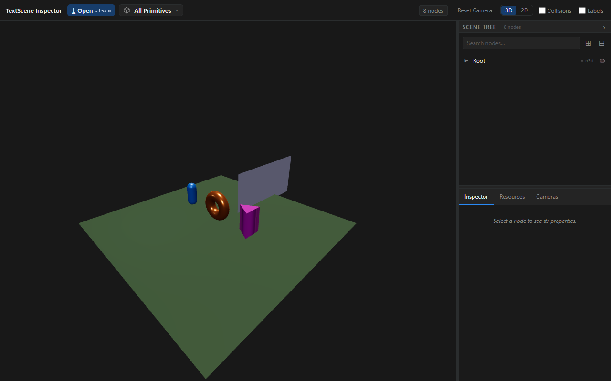](web/all-primitives.webm)

[▶ web/all-primitives.webm](web/all-primitives.webm)

A green ground plane holds a cluster of primitive meshes (prism, torus, capsule), each with its own material, orbited to show them as solid 3D geometry.

### All Meshes

[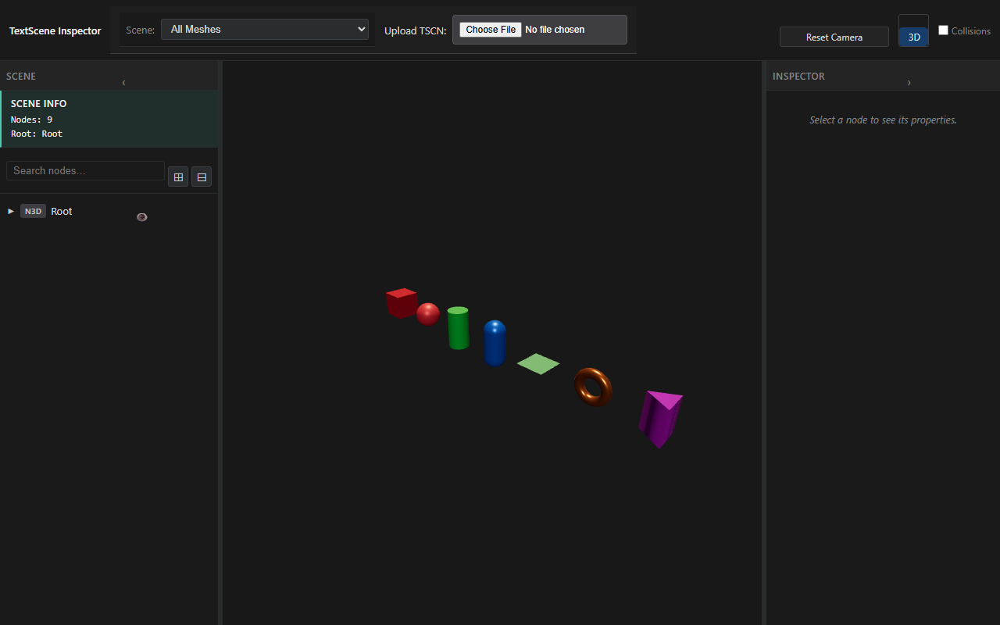](web/all-meshes.webm)

[▶ web/all-meshes.webm](web/all-meshes.webm)

Every primitive mesh type — cube, sphere, cylinder, capsule, plane, torus, prism — rendered together in a row with distinct materials.

### CSG Box

[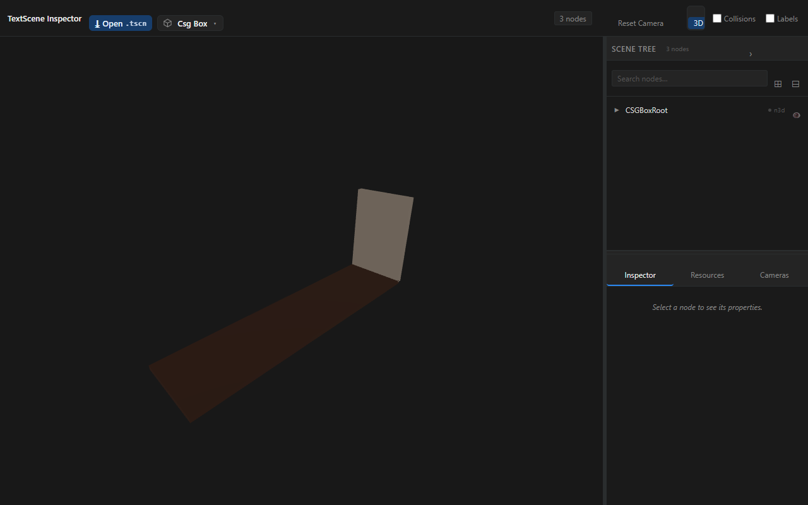](web/csg-box.webm)

[▶ web/csg-box.webm](web/csg-box.webm)

CSGBox3D shapes render as solid lit geometry with materials (not placeholders).

### CSG Cylinder

[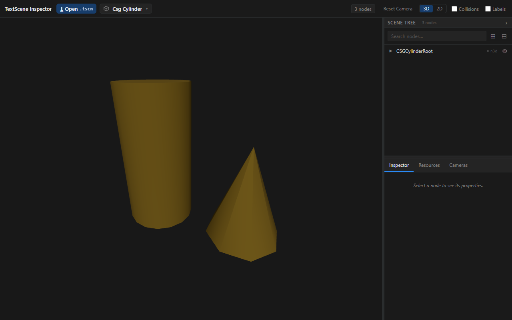](web/csg-cylinder.webm)

[▶ web/csg-cylinder.webm](web/csg-cylinder.webm)

CSGCylinder3D renders as a solid cylinder, including the tapered cone form.

### Material — Metallic

[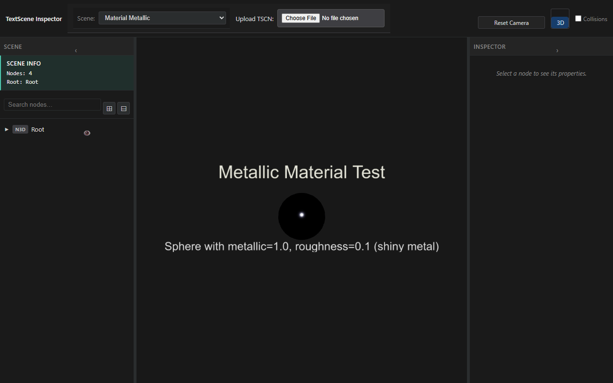](web/material-metallic.webm)

[▶ web/material-metallic.webm](web/material-metallic.webm)

A high-metallic, low-roughness StandardMaterial3D sphere with a tight specular highlight, orbited under the directional light.

### Material — Emissive

[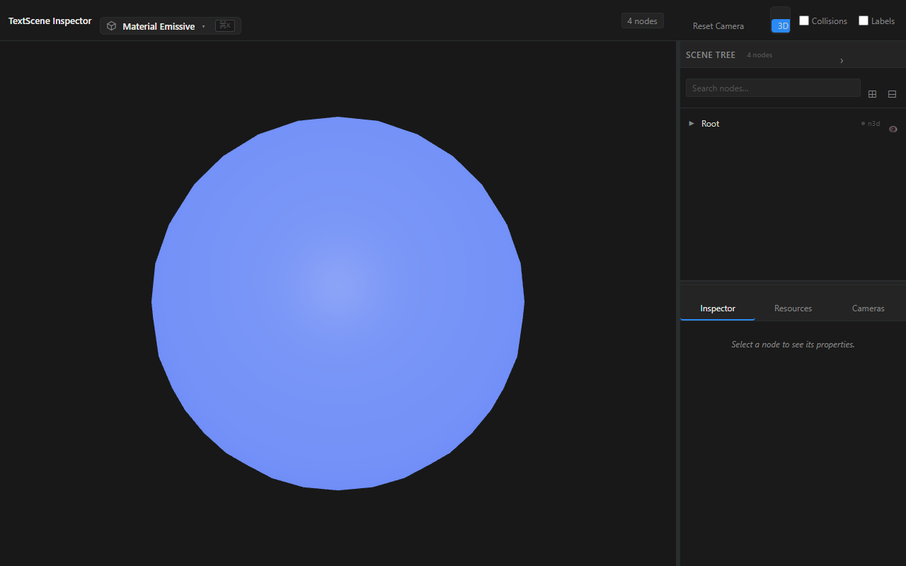](web/material-emissive.webm)

[▶ web/material-emissive.webm](web/material-emissive.webm)

An emissive material self-illuminates uniformly regardless of light direction.

### World Environment

[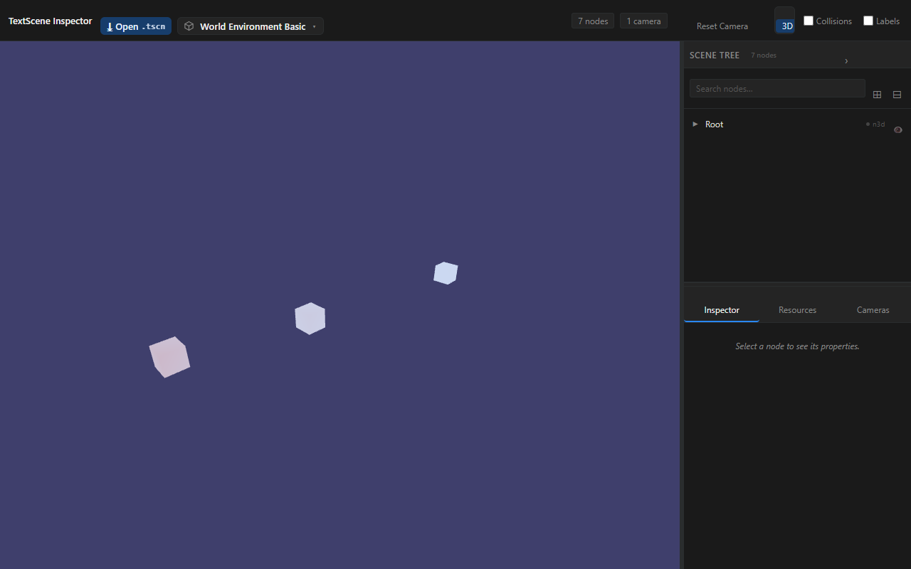](web/world-environment.webm)

[▶ web/world-environment.webm](web/world-environment.webm)

WorldEnvironment fills the background with its color and ambient-lights the scene.

### Label3D

[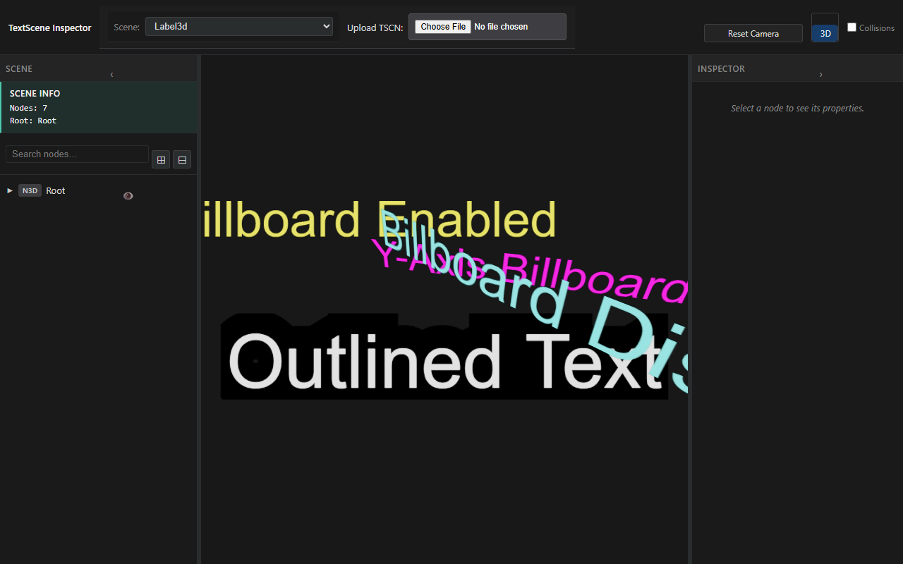](web/label3d.webm)

[▶ web/label3d.webm](web/label3d.webm)

Label3D billboarded 3D text nodes with color and outline variations, facing the camera.

### Mixed Nodes

[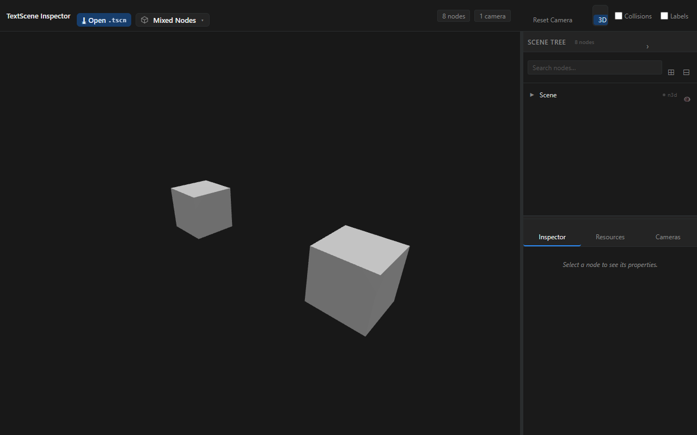](web/mixed-nodes.webm)

[▶ web/mixed-nodes.webm](web/mixed-nodes.webm)

A mixed node hierarchy of multiple mesh instances rendered together with correct lighting.

### Physics Bodies

[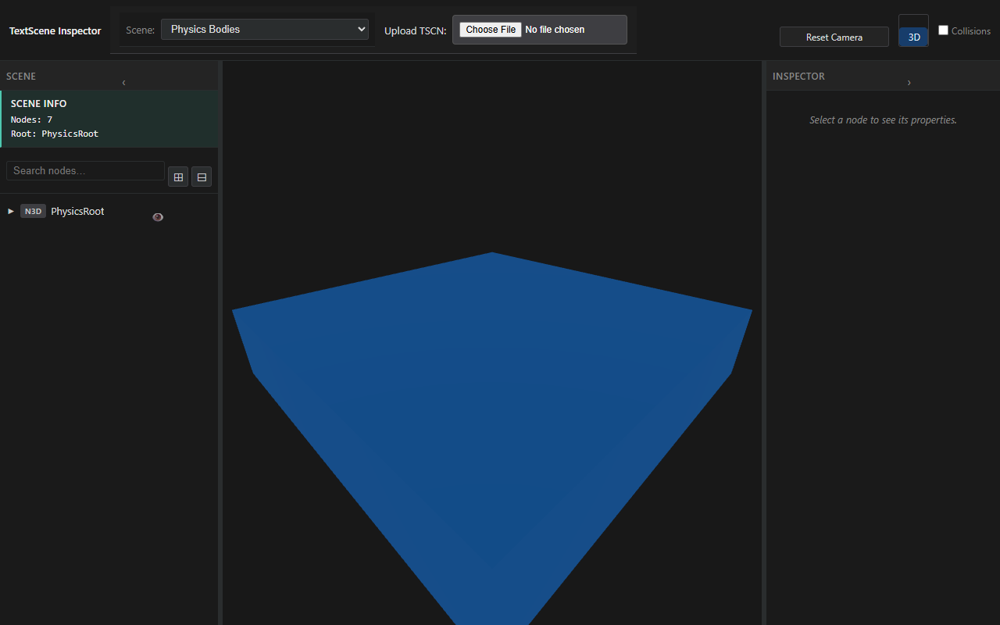](web/physics-bodies.webm)

[▶ web/physics-bodies.webm](web/physics-bodies.webm)

StaticBody3D / Area3D render as transform groups positioning their child meshes; AudioStreamPlayer renders nothing visible (no fallback cube).

### Multi-Camera

[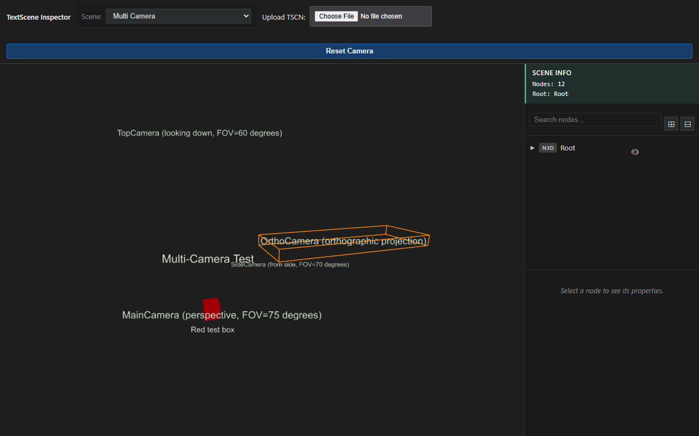](web/multi-camera.webm)

[▶ web/multi-camera.webm](web/multi-camera.webm)

Selecting each Camera3D node and clicking "Use This Camera" switches the viewport to that camera's point of view (perspective, top-down, side, orthographic), then resets to free orbit. The video actively switches the active camera between the Camera3D nodes — watch the viewport jump from one camera's framing to the next.

## Web vs VS Code

Both editions render through the shared `@textscene/core` library, so every clip on this page represents VS Code's 3D rendering output just as faithfully as the web previewer's — the pixels come from the same renderer.

VS Code adds editor-native capabilities on top of that shared rendering:

- A custom `.tscn` editor (open a scene file and it renders in-panel)
- A scene-tree Outline view
- Ctrl-click go-to-definition for node and resource references
- Save hot-reload (edit the text, save, the preview updates)
- Multi-panel layout (text and preview side by side)

VS Code screenshots live in [docs/screenshots/vscode/](../screenshots/vscode/).

## Coming soon (re-run to capture)

These features are planned or in flight; re-run the showcase to capture them once they land:

- 2D-UI overlay rendering plus a 2D/3D viewport toggle
- A collision-shape wireframe toggle
- Three-column DCC-style chrome (tree / viewport / inspector)
- A dedicated lit-scene lighting demo
- The full **textured** hallway, once the ld-58 assets are committed in P5

## Regenerate

1. Make sure the web previewer is built and running locally:

   ```bash
   pnpm --filter @textscene/web-previewer build
   pnpm --filter @textscene/web-previewer preview
   ```

2. Capture every clip:

   ```bash
   node scripts/showcase/run.mjs all
   ```

   Or capture a single clip by name:

   ```bash
   node scripts/showcase/run.mjs <name>
   ```

   For example: `node scripts/showcase/run.mjs hallway`
