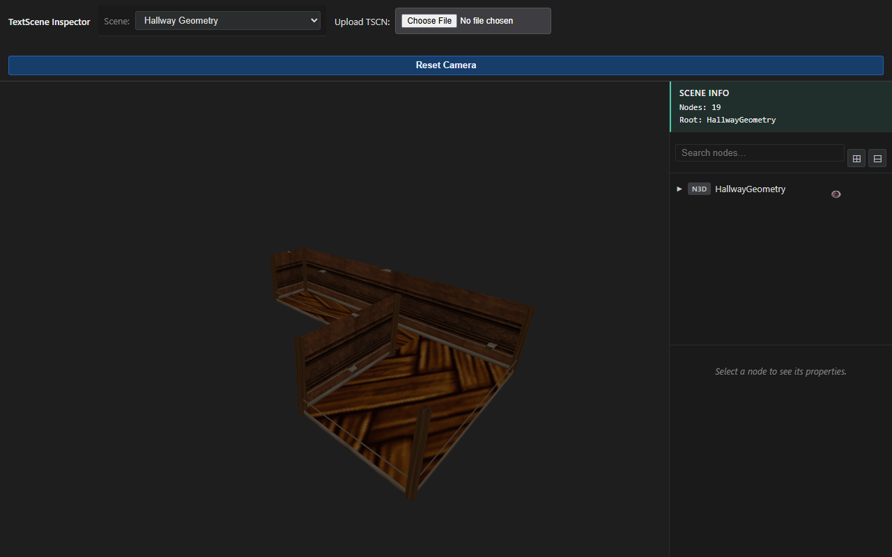
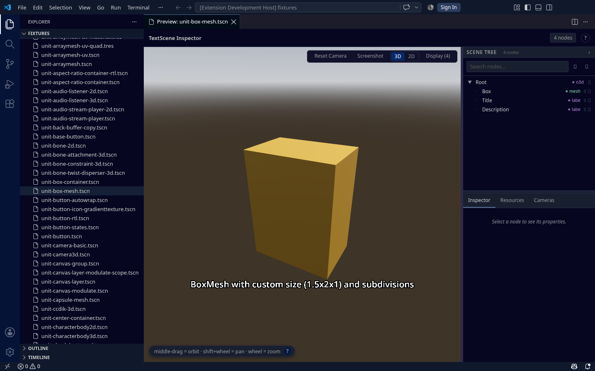

# Feature Showcase

A living visual record of what TextScene Inspector renders today. Every clip below is a real `.webm` screen recording of the actual renderer — not a mockup — paired with a `.png` poster frame. Each recording opens directly on its own scene, so the feature is framed and lit from the first frame.

Regenerate the whole set, or any single clip, through the feature-showcase workflow: `node scripts/showcase/run.mjs <name|all>`. Re-run it whenever the renderer changes so this page always reflects the current state.

## Hallway progress

The ld-58 hallway is the yardstick for "can it render a full scene". Two views track that progress.

### Full ld-58 hallway geometry



[▶ web/hallway-ld58.webm](web/hallway-ld58.webm)

The real ld-58 hallway geometry with its actual wall and wood textures (PlaneMesh walls plus instanced `WallSection` / `CornerColumn` components, resolved through the `res://` dependency closure with OpenGameArt textures). This is the yardstick for supporting the full hallway. Triplanar tiling is still approximate for now, and the furnished hallway — photo frames, props, evidence — arrives as more P5 assets land.

### CSG hallway mockup


[▶ web/hallway.webm](web/hallway.webm)

The ld-58 hallway mockup: CSG corridor (floor / walls / ceiling), portrait frames, and Label3D name plates — self-contained, tracks 3D-rendering progress.

## Feature clips

One clip per implemented feature.

### all-primitives


[▶ web/all-primitives.webm](web/all-primitives.webm)

A green ground plane holds primitive meshes (prism, torus, capsule), each with its own material, orbited as solid 3D geometry.

### all-meshes


[▶ web/all-meshes.webm](web/all-meshes.webm)

Every primitive mesh type — cube, sphere, cylinder, capsule, plane, torus, prism — rendered together with distinct materials.

### csg-box


[▶ web/csg-box.webm](web/csg-box.webm)

CSGBox3D shapes render as solid lit geometry with materials (not placeholders).

### csg-cylinder


[▶ web/csg-cylinder.webm](web/csg-cylinder.webm)

CSGCylinder3D renders as a solid cylinder, including the tapered cone form.

### material-metallic


[▶ web/material-metallic.webm](web/material-metallic.webm)

A high-metallic, low-roughness StandardMaterial3D sphere with a tight specular highlight under the directional light.

### material-emissive


[▶ web/material-emissive.webm](web/material-emissive.webm)

An emissive material self-illuminates uniformly regardless of light direction.

### world-environment


[▶ web/world-environment.webm](web/world-environment.webm)

WorldEnvironment fills the background with its color and ambient-lights the scene.

### label3d


[▶ web/label3d.webm](web/label3d.webm)

Label3D billboarded 3D text nodes with color and outline variations, facing the camera.

### mixed-nodes


[▶ web/mixed-nodes.webm](web/mixed-nodes.webm)

A mixed node hierarchy of multiple mesh instances rendered together with correct lighting.

### physics-bodies


[▶ web/physics-bodies.webm](web/physics-bodies.webm)

StaticBody3D / Area3D render as transform groups positioning their child meshes; AudioStreamPlayer renders nothing visible.

### multi-camera


[▶ web/multi-camera.webm](web/multi-camera.webm)

Selecting each Camera3D node and clicking "Use This Camera" switches the viewport between the cameras' points of view (perspective, top-down, side, orthographic), then resets to free orbit. The video actively switches the active camera between the Camera3D nodes.

## VS Code extension

Both editions render through the same `@textscene/core` library, so every clip above is also the VS Code 3D rendering output — the web previewer and the extension share one renderer. On top of that shared rendering, VS Code adds a custom `.tscn` editor and a scene-tree Preview panel. The screenshots below prove the integration runs inside the full VS Code UI: title bar, activity bar, editor tabs, the `.tscn` text editor, the Preview panel, and the status bar.



Several `.tscn` files open as text alongside the custom editor's Preview panel — searchable scene tree (Root → Description / Title / Box) and the node-details inspector — all inside the Extension Development Host window.


A grid of fixture `.tscn` files (box, sphere, plane, cylinder, capsule) open at once, with the activity bar, editor tabs, and status bar visible — the extension handles the format across the whole workspace.


The file explorer, raw `.tscn` source, and the Preview panel with its node tree side by side, showing the custom editor wired into the standard VS Code layout.

Fresh captures against the latest renderer need a desktop session.

## Coming soon (re-run to capture)

Planned or in flight; re-run the showcase to capture them once they land:

- 2D-UI overlay rendering plus the 2D/3D viewport toggle.
- A collision-shape wireframe toggle.
- The three-column DCC-style chrome (tree / viewport / inspector).
- The furnished full hallway — photo frames, props, evidence — once more ld-58 assets are committed.
- A dedicated lit-scene lighting demo.

## Regenerate

1. Make sure the web previewer is built and running locally:

   ```bash
   pnpm --filter @textscene/web-previewer build && pnpm --filter @textscene/web-previewer preview
   ```

2. Capture every clip:

   ```bash
   node scripts/showcase/run.mjs all
   ```

   Or capture a single clip by name: `node scripts/showcase/run.mjs <name>`.
