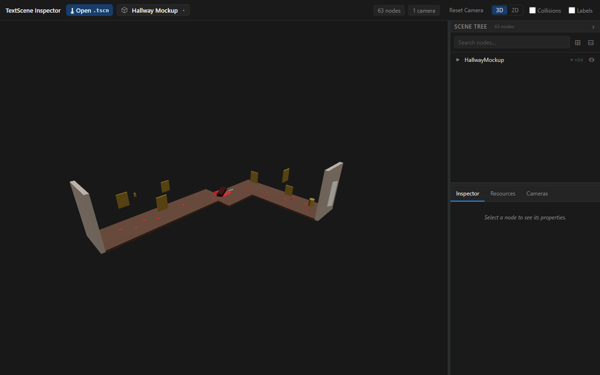
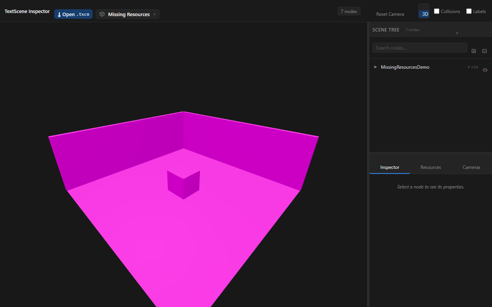
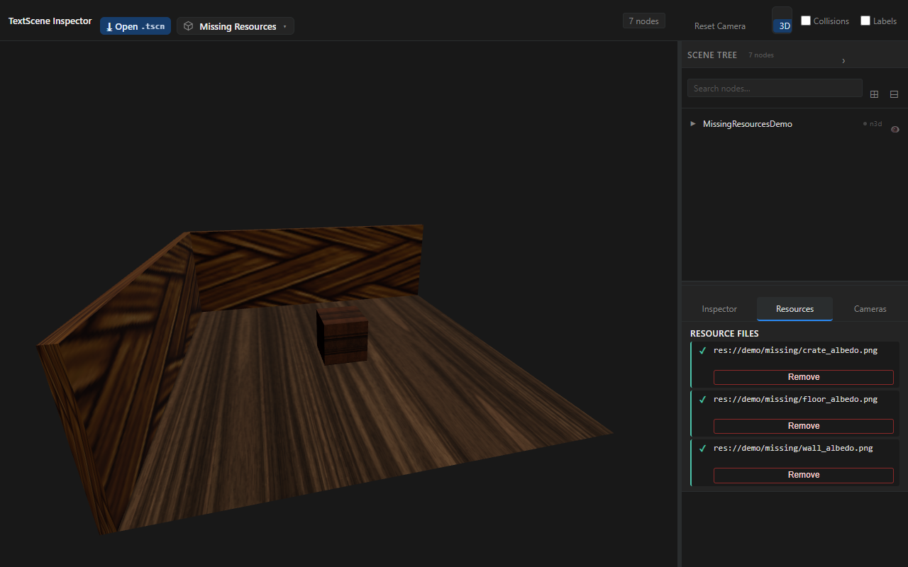
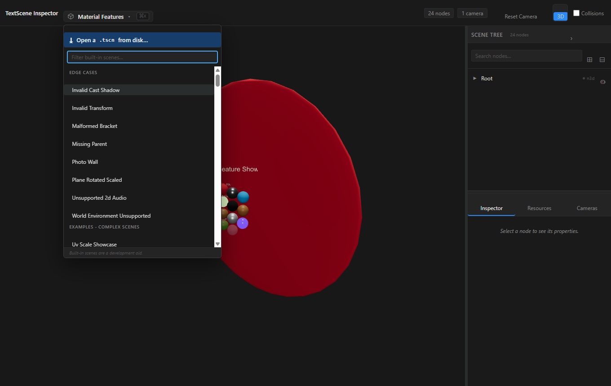
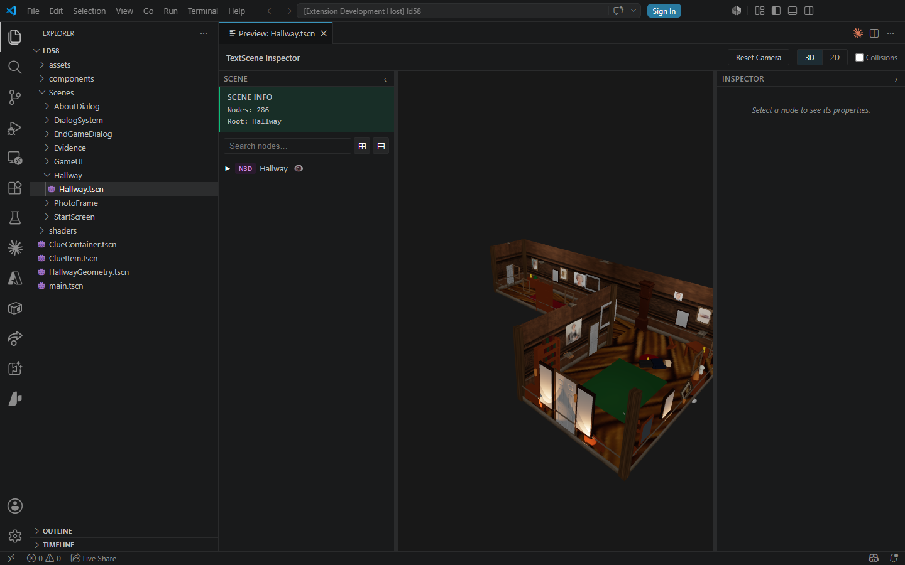
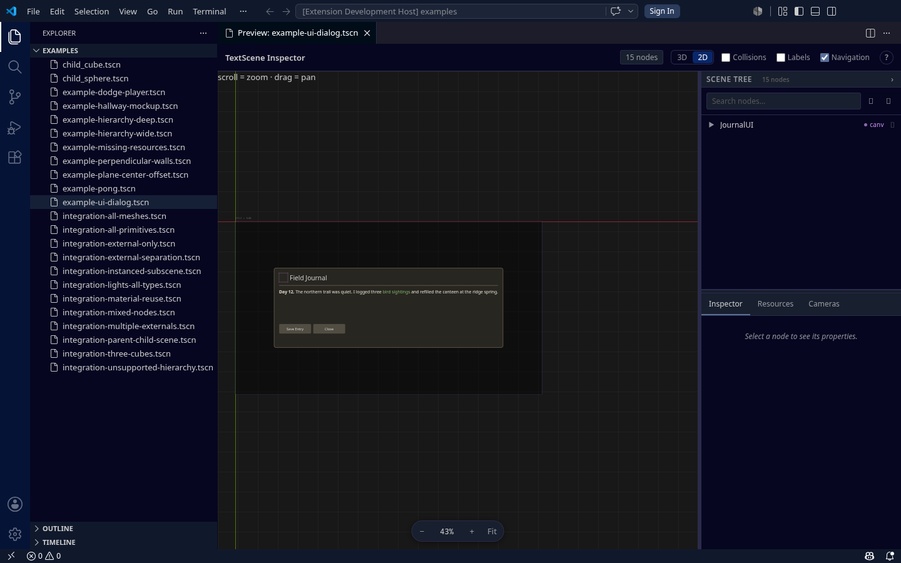
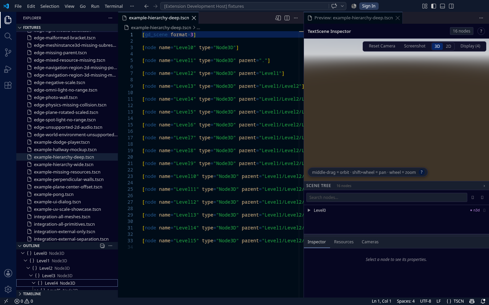

# Showcase

Screen recordings of the real renderer. Each clip is a `.webm` with a `.png` poster. The VS Code extension draws the same pictures, because both hosts use `@textscene/core`.

## Web previewer

| Clip | Shows |
| --- | --- |
| [hallway](web/hallway.webm) | A CSG corridor with portrait frames and Label3D name plates. Triplanar tiling matches Godot on flat surfaces. |
| [dcc-layout](web/dcc-layout.webm) | The viewport and the right dock, then a 2D UI scene. The clip shows an older 3-column layout. |
| [ui-hint](web/ui-hint.webm) | A Control-only scene offers a switch to 2D (ADR-0006). |
| [all-primitives](web/all-primitives.webm) | Prism, torus and capsule on a ground plane |
| [all-meshes](web/all-meshes.webm) | Every primitive mesh type |
| [csg-box](web/csg-box.webm) | CSGBox3D with materials |
| [csg-cylinder](web/csg-cylinder.webm) | CSGCylinder3D, including the cone form |
| [material-metallic](web/material-metallic.webm) | A metallic, smooth StandardMaterial3D |
| [material-emissive](web/material-emissive.webm) | An emissive material |
| [world-environment](web/world-environment.webm) | WorldEnvironment background and ambient light |
| [label3d](web/label3d.webm) | Label3D colours and outlines |
| [mixed-nodes](web/mixed-nodes.webm) | Several meshes under one light |
| [physics-bodies](web/physics-bodies.webm) | StaticBody3D and Area3D position their child meshes |
| [multi-camera](web/multi-camera.webm) | **Use This Camera** switches between Camera3D views |
| [pong](web/pong.webm) | Godot's Pong demo in 2D |
| [dodge-player](web/dodge-player.webm) | The player scene from Godot's Dodge the Creeps demo, in 2D |
| [missing-upload](web/missing-upload.webm) | Missing textures render magenta. An upload in the Resources tab fixes them live. |







The current toolbar, with the scene palette open:



## VS Code







## Regenerate

Run this after a change to the renderer or the chrome, and commit the new files with the code:

```bash
pnpm showcase:regen
```

It builds the web previewer and records every scenario in `scripts/showcase/scenarios.mjs`. Add a scenario for each new feature.

| Command | Does |
| --- | --- |
| `node scripts/showcase/run.mjs <name>` | Record one clip. A preview server must run. |
| `node scripts/showcase/vscode/capture.mjs` | Capture every VS Code screenshot. It uses `xvfb-run` on Linux, and an installed or `$VSCODE_BIN` VS Code elsewhere. |
