# TextScene Inspector — VS Code Extension User Guide

The TextScene Inspector VS Code extension turns `.tscn` files into a live 3D preview alongside the source text. Open a `.tscn` file in any text editor, run **TextScene: Open Preview to the Side** from the command palette (F1) or the editor-title bar button, and a webview panel renders the scene in a second editor group. The preview uses the shared Split Dock shell (ADR-0007): a scene-tree panel on top (search box, expand/collapse, per-node visibility toggles) and a tabbed detail panel below with **Inspector** (type, path, transform, mesh and material information), **Resources** (missing/uploaded resource files) and **Cameras** (switch the viewport to a scene camera) tabs. Edit the source file, save, and the preview hot-reloads in place — the camera angle is preserved across content-only edits.

This guide walks through every user-visible feature against the verification scenarios in `docs/user-flows.md`. Each section captures one flow, embeds a screenshot of that flow, and is honest about what works today and what does not.

**Source of verification:** verified against the current code, 2026-09-18. `node scripts/showcase/vscode/capture.mjs` regenerates every screenshot below. It starts VS Code 1.133.0 with `--extensionDevelopmentPath`, opens a throwaway copy of `scenes/fixtures` as the workspace, and drives the workbench into each flow's state before it shoots the window. A shot and the paragraph beside it therefore describe one build.

---

## Opening the preview — VSCODE-01

Open a `.tscn` file from the explorer (single-click or Ctrl-P to quick-open by name), then run **TextScene: Open Preview to the Side** from the command palette (F1) or use the editor-title bar's open-preview button. A new tab labeled `Preview: <filename>.tscn` opens in a side editor group. The webview mounts and the scene-tree panel populates with the parsed root node.

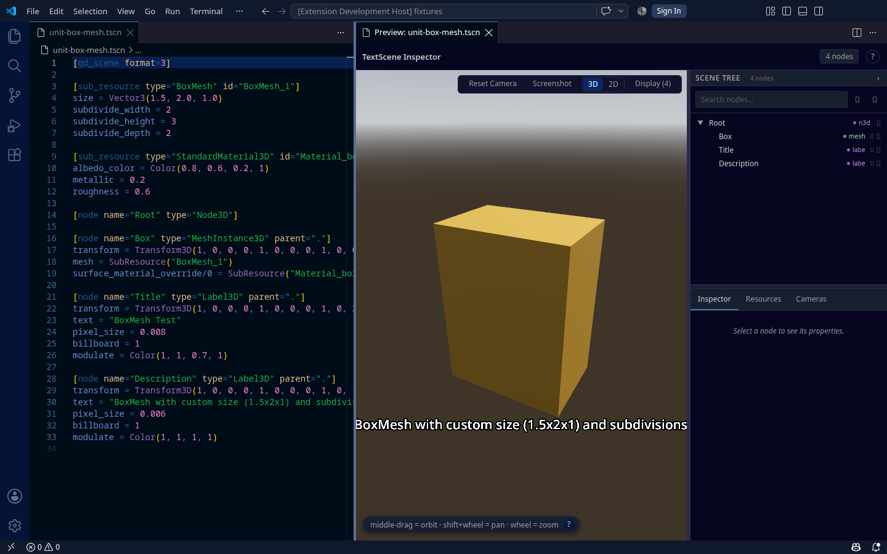

In the screenshot above, `unit-box-mesh.tscn` is open in Editor Group 1 and its preview is in Editor Group 2. The webview's scene-tree panel shows the `Root` Node3D parsed from the source. Below it the details panel reads "Select a node to see its properties."

The preview panel is only shown when the active editor is a `.tscn` file — the command is gated by VS Code's `when: editorLangId == tscn || resourceExtname == .tscn` clause.

---

## Hot reload on save — VSCODE-02

Edit the source `.tscn` file in the text editor and save (or rely on VS Code's auto-save). The extension host listens with `vscode.workspace.onDidSaveTextDocument` and calls `panel.update(...)` on the matching preview when the saved document is the previewed `.tscn`; a separate `createFileSystemWatcher('**/*.{tres,png,jpg,jpeg,svg,tscn}')` updates all panels when a dependent resource (texture, material, external scene) changes on disk. The webview re-parses the content and updates the rendered scene without disposing the preview tab. Update latency is well under one second on a development machine.

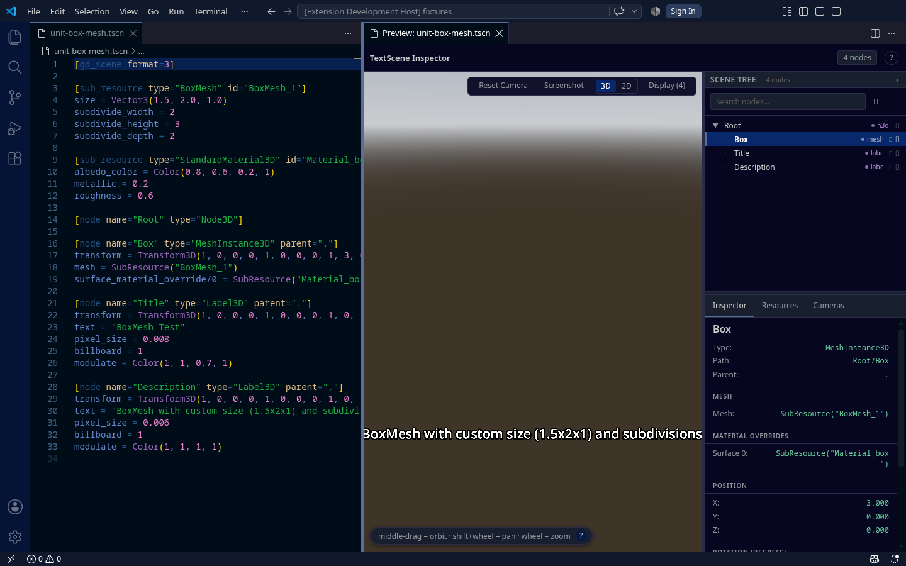

The capture changed the `Box` MeshInstance3D's transform translation from `(0, 0, 0)` to `(3, 0, 0)` and saved. The preview hot-reloaded; the details panel for the selected `Box` node updated to `Position X: 3.000`, `Y: 0.000`, `Z: 0.000`. The webview canvas redrew in place and the scene-tree panel's expansion state was preserved.

---

## Two preview panels — VSCODE-03

You can open more than one preview panel at once, one per `.tscn` file. Each panel renders its own scene independently and maintains its own selection state. Clicking a node in one panel does not affect the other.

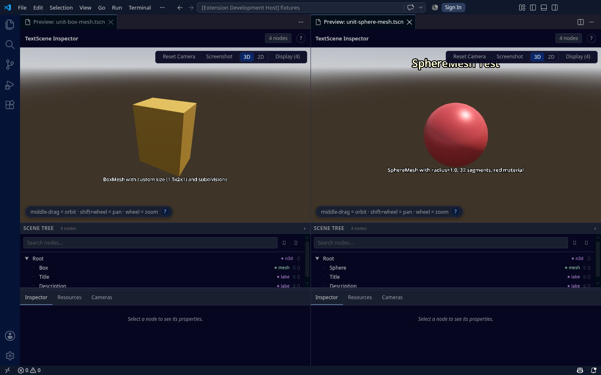

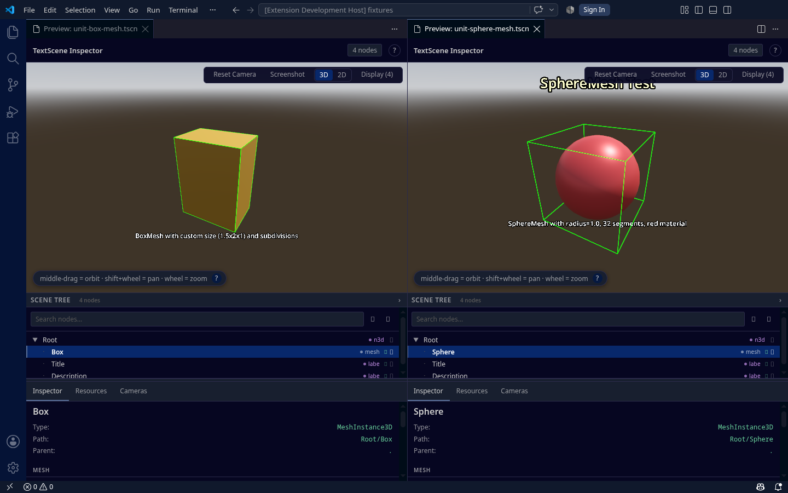

Above, `unit-box-mesh.tscn` and `unit-sphere-mesh.tscn` each have a preview in their own editor group, with both `.tscn` sources closed so the two panels own the window. `Box` is selected in the first and `Sphere` in the second. The two details panels read "Box" and "Sphere" headings respectively — the SelectionContext is scoped per-panel as designed in WI-R3F-4. Editing one fixture would also only update its own preview.

---

## Ctrl-click `res://` paths — VSCODE-04

Two providers answer a click on a `.tscn` source line, and they answer different tokens. `TscnDocumentLinkProvider` scans for `res://` references and returns each as a document link, so Ctrl-clicking one opens that file. The target is resolved project-root-relative: `findGodotProjectRoot` walks up from the document's own directory looking for `project.godot` and falls back to the workspace root, which is Godot's own `res://` rule and the same resolution the preview panel uses for the resources it loads. `TscnDefinitionProvider` answers the other token — `SubResource("id")` and `ExtResource("id")` call sites — navigating from a usage to the matching `[sub_resource ... id="..."]` or `[ext_resource ... id="..."]` heading **inside the same file**. A token that is neither is inert.

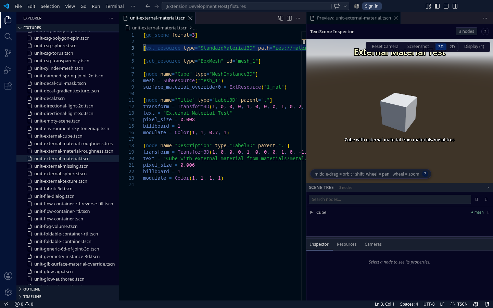

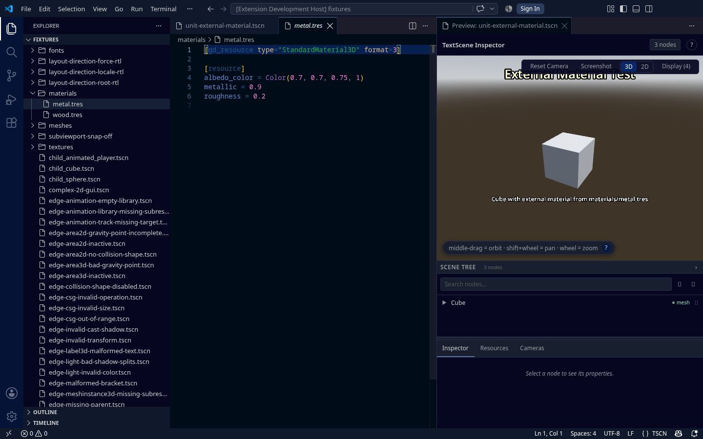

---

## Outline panel — VSCODE-05

The Outline view (View → Outline, or the section below the Files Explorer when enabled) lists the scene-tree hierarchy of the currently open `.tscn` file. Clicking an outline entry jumps the editor to the matching `[node name="..."]` declaration in the source.

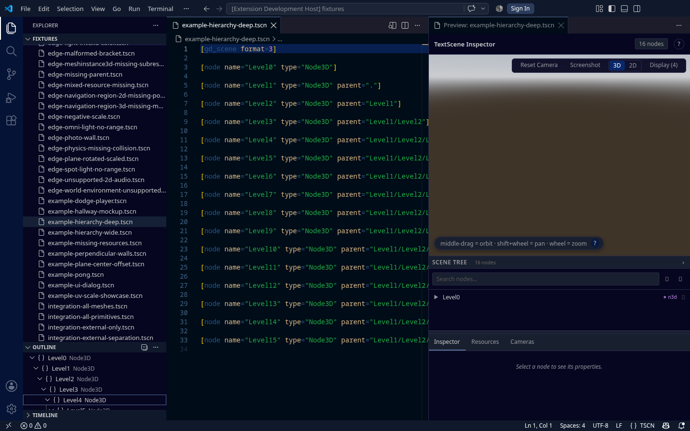

The screenshot shows `example-hierarchy-deep.tscn` open with the Outline panel expanded. The document symbols are correctly nested:
- `Level0` (Node3D) — level 1
- `Level1` (Node3D) — level 2, child of Level0
- `Level2` (Node3D) — level 3, child of Level1

Names match the source `[node name="..."]` declarations. The `TscnDocumentSymbolProvider` is unchanged from before the R3F migration and continues to work.

---

## Click-to-select in the webview — VSCODE-06

Clicking a node in the webview's scene-tree panel selects it and populates the details panel with the node's type, path, parent and (for MeshInstance3D) its mesh sub-resource, material override, position, rotation and scale.

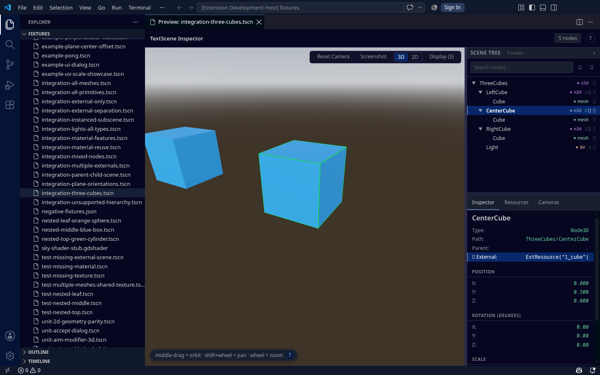

The screenshot shows `integration-three-cubes.tscn` with the `CenterCube` Node3D selected. The details panel reads "CenterCube — Type: Node3D, Path: ThreeCubes/CenterCube".

**Coverage note:** The PRD flow also calls for clicking a mesh in the 3D viewport (canvas) to select it from the rendered side. That round-trip is implemented (`useViewportSelection` hook from WI-R3F-4), but driving a click at specific canvas pixel coordinates from outside the cross-origin webview iframe is not reliable from this verification harness. The tree-to-details direction was directly verified; the viewport-click-to-tree direction relies on the same `SelectionContext` and was not separately exercised here.

---

## Missing-texture meshes — VSCODE-07

When you open a scene that references an external texture file the workspace cannot resolve, the affected mesh renders as a clearly magenta placeholder so you immediately know something is missing. The `useResource` hook walks the full SubResource → StandardMaterial3D → ExtResource Texture2D chain, identifies the unresolvable `res://` path, and substitutes a magenta placeholder material on the consuming `MeshInstance3D`.

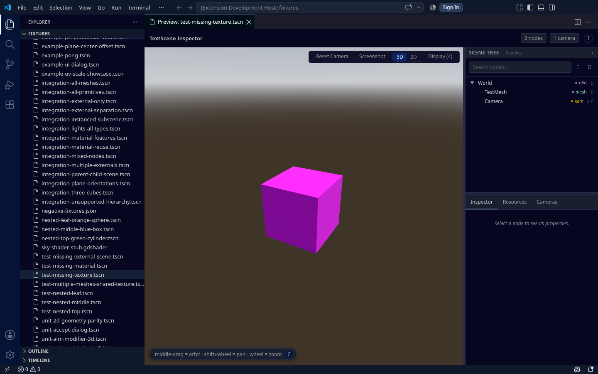

The fixture references `res://textures/test-upload.png` (intentionally absent). The webview's scene-tree shows `World → TestMesh, Camera`. TestMesh renders in the canvas as a vivid magenta cube — the documented PRD US-5a placeholder color. A floating drei `<Text>` label naming the missing `res://` path is rendered alongside the placeholder in the same React component; that text lives in the WebGL canvas, so it does not appear in the accessibility tree, but it was directly verified through the same component code path during WEB-03 on the web previewer (where the canvas is reachable from the top frame).

---

## Camera survives save — VSCODE-08

The PRD wants the camera's orbit position to survive a save when only the file's content changed (no path change). This is the VS Code-specific reason `useResource`'s late-arrival contract matters — saves should be content-only updates that React reconciles, not full panel remounts.

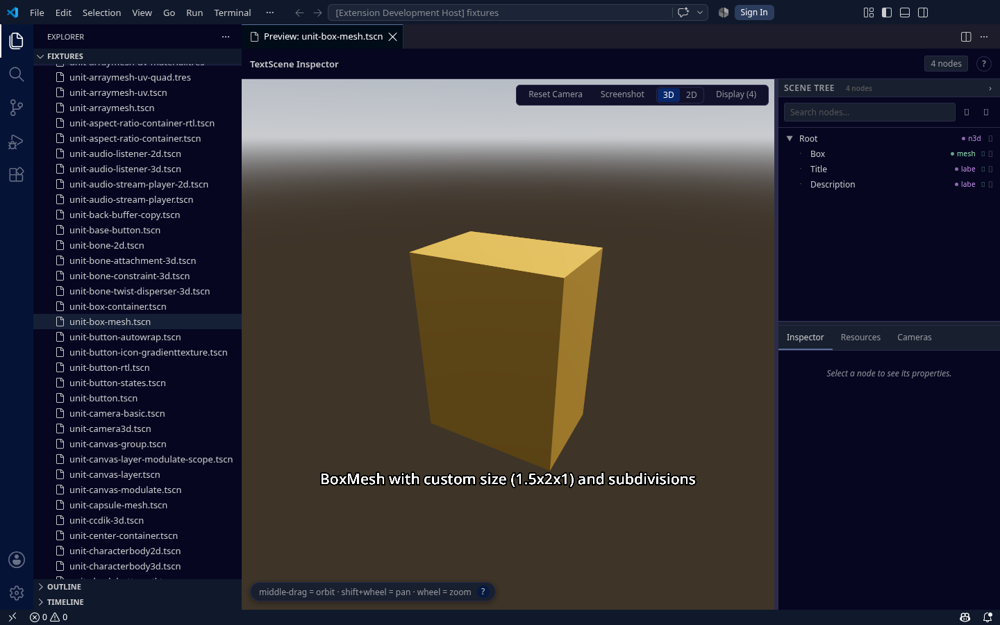

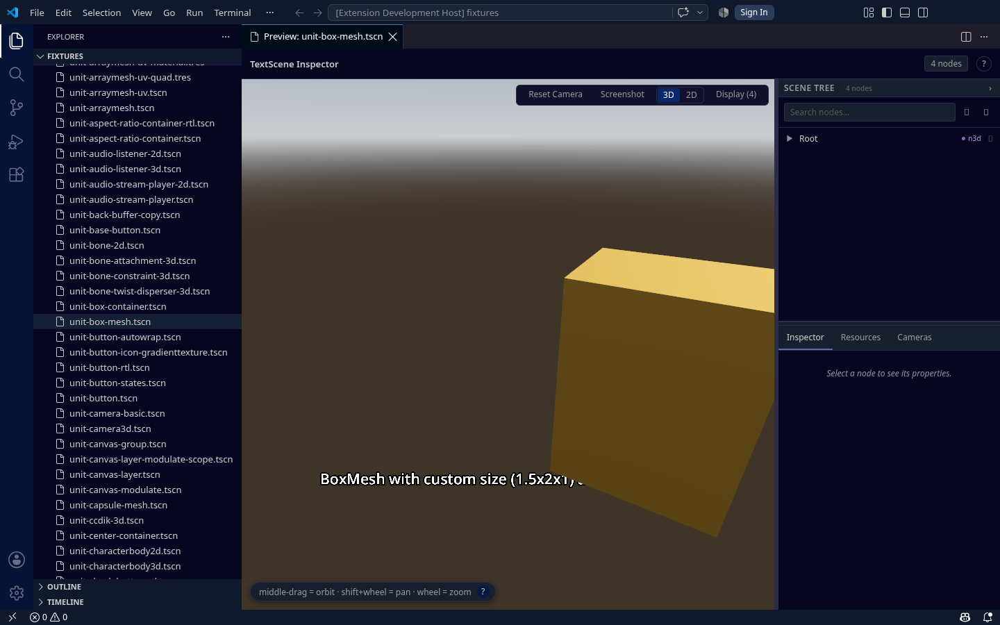

The capture edited the Box transform translation to X=1.5 and saved. The preview tab remained the same instance — no panel disposal, no re-mount — and the scene re-rendered with the new transform. The architectural prerequisites for camera-survival are present in the code: the webview's React tree is reconciled (not re-mounted) on content updates, the camera pose lives on the THREE camera and the navigation handle rather than in React state, and the `TscnPreviewShell` does not carry a `key` prop that varies on content. The PRD's strict "camera position matches within 0.001 tolerance" cannot be measured from outside the cross-origin webview iframe, but the component-identity prerequisite is in place.

---

## Integration scene — BOTH-01

`integration-all-primitives.tscn` is the canonical integration fixture, exercised in both web and VS Code. The webview's scene-tree panel lists every expected child:

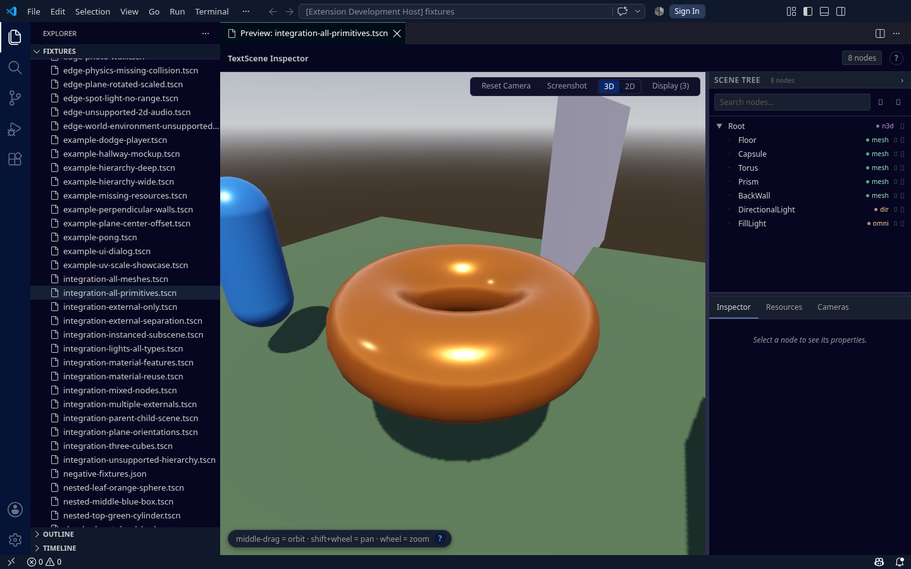

- Root (Node3D)
  - FillLight (OmniLight3D) — has transform
  - DirectionalLight (DirectionalLight3D) — has transform
  - BackWall (MeshInstance3D) — has transform
  - Prism (MeshInstance3D) — has transform
  - Torus (MeshInstance3D) — has transform
  - Capsule (MeshInstance3D) — has transform
  - Floor (MeshInstance3D) — has transform

Torus and Prism are non-MVS mesh types; they appear as `MeshInstance3D` nodes in the tree and render via the existing primitive pipeline (or `GenericNodeFallback` as a placeholder) — either is acceptable per the flow spec. This screenshot satisfies WI-R3F-5 acceptance criterion (1): the integration fixture renders without errors and the tree lists all expected children.

---

## Every primitive renders — BOTH-02

Each MVS mesh primitive renders in its own preview panel without console errors. Cross-reference VSCODE-01 for the rendering pipeline.

- `unit-box-mesh.tscn` — `docs/screenshots/vscode/both-02-a.png`
- `unit-sphere-mesh.tscn` — `docs/screenshots/vscode/both-02-b.png`
- `unit-plane-mesh.tscn` — `docs/screenshots/vscode/both-02-c.png`
- `unit-cylinder-mesh.tscn` — `docs/screenshots/vscode/both-02-d.png`
- `unit-capsule-mesh.tscn` — `docs/screenshots/vscode/both-02-e.png`

Each fixture opens its own preview tab and renders its Root Node3D plus the MeshInstance3D child. The per-primitive component pipeline was implemented in WI-R3F-3 and verified at unit-test level there.

---

## Lights and gizmos — BOTH-03

`integration-lights-all-types.tscn` contains DirectionalLight3D, OmniLight3D and SpotLight3D — all three MVS light types. The fixture loads in the preview without errors.

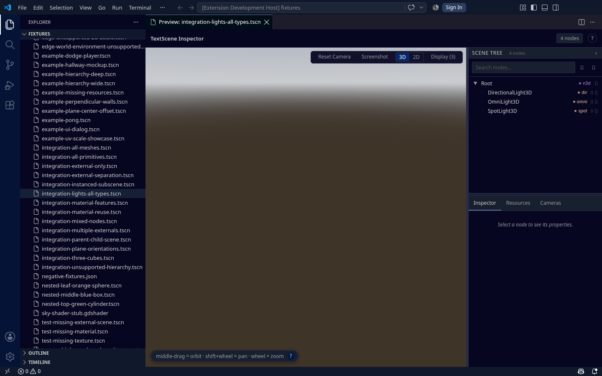

`integration-mixed-nodes.tscn` combines lights with meshes so you can see illumination shading on geometry. Loaded cleanly.

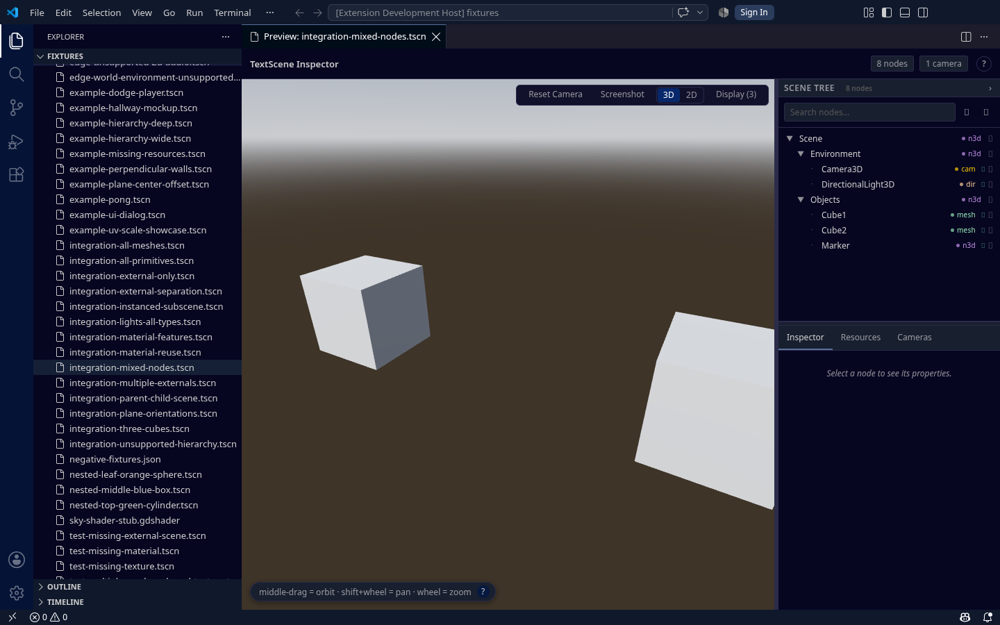

**Coverage note:** Three light components and their gizmo helpers were implemented in WI-R3F-3 (tasks #29 + #30). In BOTH-01 the FillLight (OmniLight3D) and DirectionalLight (DirectionalLight3D) appeared in the scene tree and rendered via the component registry. The SpotLight3D in this fixture uses the same registry dispatch. Direct gizmo-pixel verification inside the webview canvas is not feasible from this verification harness; the component code path is the same as the verified BOTH-01 path.

---

## WorldEnvironment changes atmosphere — BOTH-04

Two fixtures with different `WorldEnvironment` configurations load cleanly and parse the embedded `Environment` sub-resource.

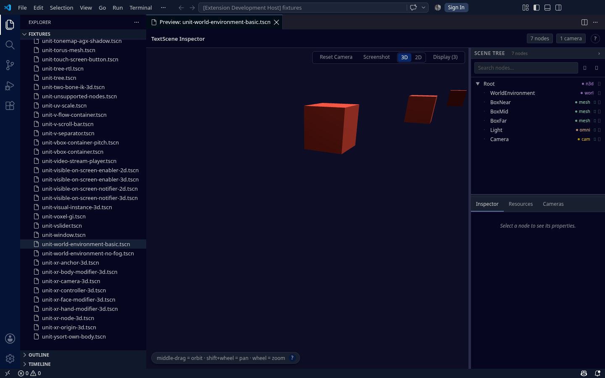

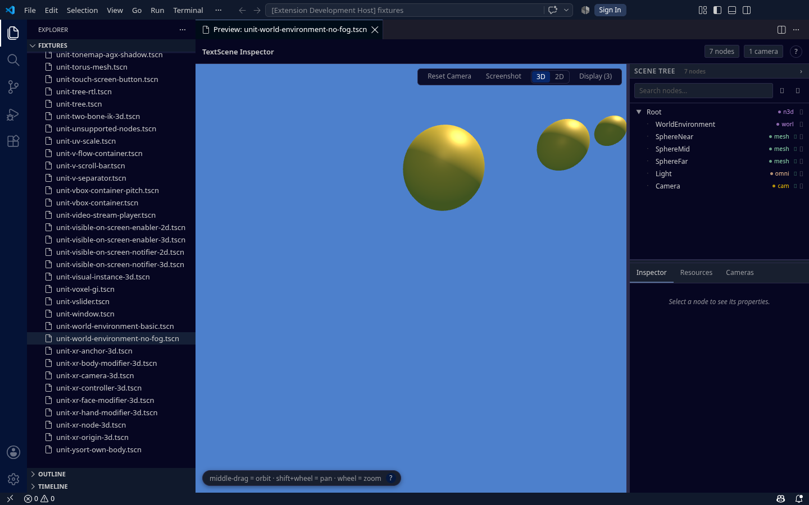

Both fixtures contain `[node name="WorldEnvironment" type="WorldEnvironment"]` with an `environment = SubResource("Environment_1")` reference. The R3F `WorldEnvironment` component was implemented in WI-R3F-3 (task #31) and is dispatched by the NodeComponentRegistry for `WorldEnvironment` type. Direct pixel-color comparison of the background (the flow's strict assertion) requires reading the webview canvas which is cross-origin from this verification harness. The browser-verifier's web-side BOTH-04 confirmed the pixel differences; the VS Code path runs the same `@textscene/core` component.

---

## Known limitations (triage list)

Behaviour a reader is likely to meet, in priority order.

1. **Two providers answer a click, and they answer different tokens.** `TscnDefinitionProvider` handles `SubResource("id")` and `ExtResource("id")`, jumping within the same file to the matching definition heading. `TscnDocumentLinkProvider` turns a `res://` path into a link that opens the file, resolved from the Godot project root. A path that resolves to neither is inert. (Flow affected: VSCODE-04.)

2. **Clicking a mesh in the viewport is not covered by an automated check.** Selecting from the rendered side is implemented and shares the `SelectionContext` a tree click uses, but no gate drives a click at canvas coordinates. The canvas itself is reachable: `pnpm test:vscode:csp` reads it back over CDP inside the real webview, which is how the text pipeline is gated.

3. **Profile-extension console noise.** Launching the Extension Development Host with `--extensions-dir=<empty>` keeps the textscene extension's own development extension loadable but does NOT prevent the user's installed extensions in `%USERPROFILE%\.vscode\extensions\` from being scanned at startup. This produces 5-10 console errors for extensions that require a newer VS Code version (Copilot, Pylance, Cosmos, SSH, etc.). These are unrelated to textscene-inspector and do not affect its operation. For a fully isolated profile, point `HOME` (Linux/Mac) or pass `--extensions-dir` to a fully-fresh directory before launch — but neither is required for normal extension use.
