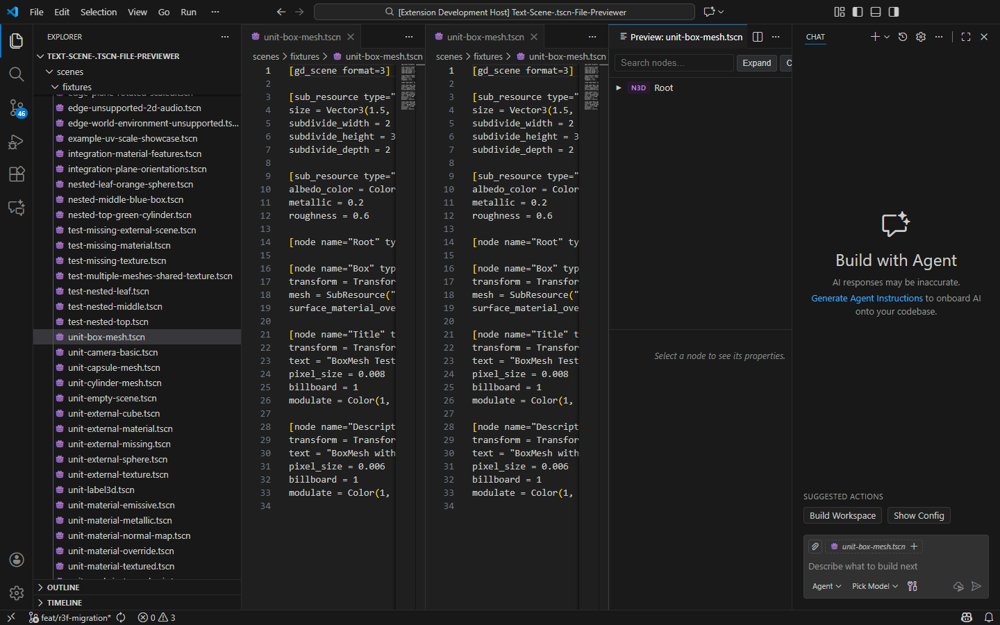
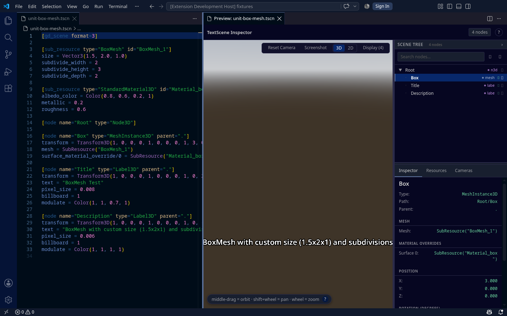

# VS Code extension user guide

The extension shows a live preview of a `.tscn` file beside its text. It works in desktop VS Code and in vscode.dev.

## Open the preview

1. Open the folder that holds `project.godot`. The extension resolves `res://` paths from there.
2. Open a `.tscn` file.
3. Run **TextScene: Open Preview to the Side**, or press <kbd>Ctrl+K V</kbd> (<kbd>Cmd+K V</kbd> on macOS).

The editor-title bar has the same command as a button. Each `.tscn` file can have its own preview, and each preview keeps its own selection.

## Use the preview

The preview is the same viewer as the [web previewer](user-guide-web.md):

- [Move the 3D camera](user-guide-web.md#move-the-3d-camera) with Godot's editor controls. Press <kbd>?</kbd> for the list.
- Use the scene tree and the **Inspector**, **Resources** and **Cameras** tabs the same way.
- Double-click a node in the tree to jump to its line in the source.
- A mesh whose texture is missing renders magenta. The **Resources** tab lists the missing path.

## Edit and save

Save the `.tscn` file, and the preview updates. The camera stays where it is.
The preview also updates when a texture, material or sub-scene it uses changes on disk.

## Editor features

- **Problems panel:** the linter checks each open `.tscn` file.
- **Outline:** the scene tree of the file. Click an entry to jump to its `[node]` line.
- **`res://` links:** Ctrl-click (Cmd-click on macOS) a path to open the file.
- **Go to Definition** on `SubResource("id")` and `ExtResource("id")` jumps to the declaration in the same file.

## Settings

| Setting | Default | Effect |
| --- | --- | --- |
| `textscene.defaultViewportMode` | `auto` | The viewport a new preview opens in: `auto`, `2D` or `3D` |
| `textscene.diagnostics.enabled` | `true` | Lint open `.tscn` files |
| `textscene.diagnostics.lintDebounceMs` | `300` | Delay before a re-lint, in milliseconds |

## Limitations

- Rendering approximates Godot. Custom shaders and some material and lighting features look different.
- Other installed extensions can log console errors in the Extension Development Host. They do not affect this extension.
