# TextScene Inspector — Web Previewer User Guide

The TextScene Inspector web previewer is a browser-based viewer for Godot `.tscn` scene files. Open your own `.tscn` from disk or pick a fixture from the scene palette (Ctrl/Cmd+K), the 3D scene renders inline, and the right-hand Split Dock shows the scene-tree hierarchy and per-node properties. The viewport navigates like Godot's own 3D editor (see below), and clicking a mesh selects it.

This guide walks through every user-visible feature against the verification scenarios in `docs/user-flows.md`. Each section captures one flow, embeds the screenshot the verifier took, and is honest about what works today and what does not.

**Source of verification:** verified against the current code, 2026-06-10. Dev server runs on `http://localhost:3000/` after `pnpm --filter @textscene/web-previewer dev`. Some screenshots predate the Split Dock shell (ADR-0007) and the scene palette; the prose describes the current behavior.

---

## Viewport navigation

The 3D viewport uses Godot's own editor navigation, so muscle memory carries over. You never
need this table in front of you: the viewport shows a summary pill, and clicking it — or
pressing **?** or **F1** — opens the full list for whichever device you are on (ADR-0029).

**Mouse**

| Input | Action |
| --- | --- |
| Left-click | Select |
| Middle-drag | Orbit |
| Shift + middle-drag | Pan |
| Ctrl + middle-drag, or the wheel | Zoom |
| Shift + wheel | Pan |
| Alt + left-drag / Alt + Shift + left-drag | Orbit / pan, for mice and trackpads without a middle button |
| Right-drag | Freelook — turn the camera in place |

**Trackpad**

| Input | Action |
| --- | --- |
| Two-finger scroll | Zoom |
| Shift + two-finger scroll | Pan |
| Pinch | Zoom |

A browser reports a two-finger scroll and a mouse wheel as the same event, so the unmodified
one keeps the wheel's meaning (zoom) and Shift is what gives a trackpad its pan. Ctrl + wheel
zooms the viewport rather than the page, because a pinch arrives as exactly that event.

**Touch** (tablets — no Godot equivalent, so these follow the usual 3D-viewer conventions)

| Input | Action |
| --- | --- |
| Tap | Select |
| One-finger drag | Orbit |
| Two-finger drag | Pan |
| Pinch | Zoom |

**Keyboard**

| Input | Action |
| --- | --- |
| W A S D Q E while right-dragging | Fly (Shift sprints) |
| Numpad 1 / 3 / 7 | Front / right / top view; Ctrl for the opposite face |
| Numpad 5 | Perspective ⇄ orthographic |
| F | Frame the selected node, or the whole scene when nothing is selected |
| ? or F1 | Show every viewport control |

Plain left-drag deliberately does nothing: left-click selects, as it does in Godot.
There is no damping — the camera stops the moment you release.

The 2D viewport pans on a drag (one finger or two) and zooms on the wheel or a pinch, anchored
to the pointer, with a −/+/Fit HUD along the bottom.

---

## Opening the app — WEB-01

**Status:** PASS

Start the dev server and open the URL the Vite banner prints (typically `http://localhost:3000/`). The page boots directly to a working canvas — no flag, no setup, no waiting for assets beyond the initial bundle. On a first visit the default scene is `unit-plane-mesh.tscn` (WI-UX-15: a single PlaneMesh with zero external resources, so the first paint is clean rather than a wall of missing-file warnings). On subsequent visits the app restores the last scene you had open (persisted in `localStorage`), and a `?fixture=<file>` query parameter deep-links straight to a specific scene — handy for sharing a link or scripting captures. Append `&camera=<node path>` (e.g. `?fixture=integration-material-features.tscn&camera=Root/Camera3D`) to open looking through a scene's own Camera3D instead of the free-orbit editor camera; the path is the one the Cameras panel lists, and an unknown path just falls back to free orbit. It is read once at open (the usual camera controls take over from there) and is not written back into the URL. The Split Dock on the right shows the scene-tree panel on top and the tabbed detail panel (Inspector / Resources / Cameras) below.

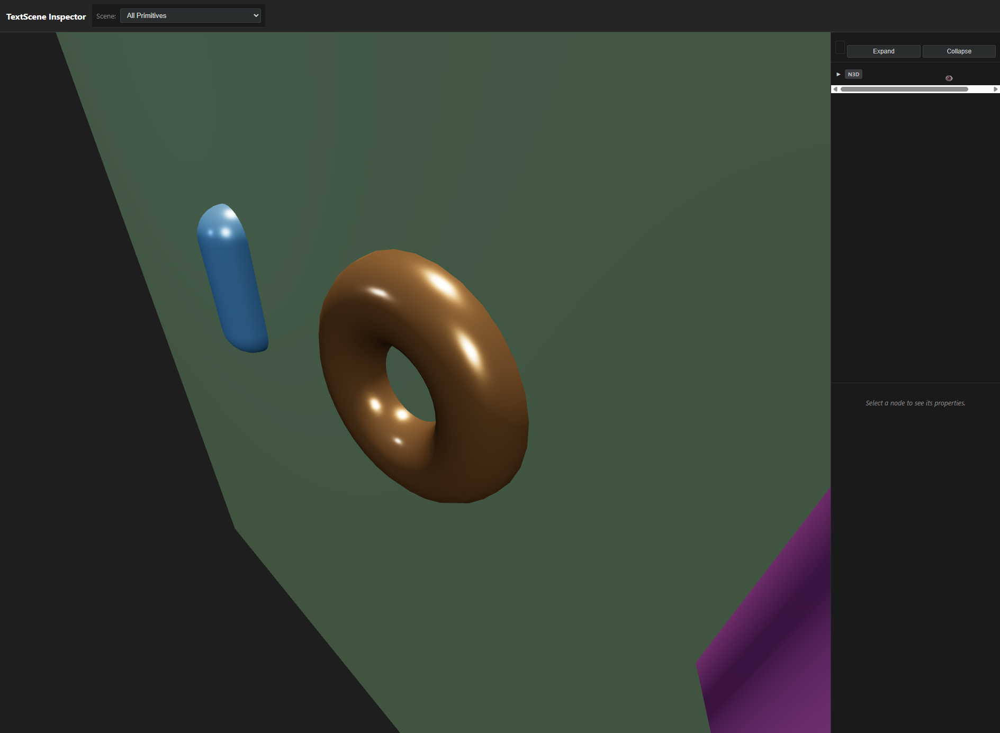

You will see one harmless console message about a missing `favicon.ico` and a deprecation note about `THREE.Clock` coming from the bundled three.js — neither affects rendering.

---

## Cycling through fixtures — WEB-02

**Status:** PASS

The toolbar shows a compact **scene chip** naming the current scene. Clicking it (or pressing **Ctrl/Cmd+K**) opens a searchable command palette whose primary action is **"Open a `.tscn` from disk…"**; below that it lists the bundled fixtures (132 entries in the auto-generated `apps/textscene-web/src/fixtures.ts` manifest) grouped into categories (Edge Cases, Examples — Complex Scenes, Integration — Multi-Node, Unit — Primitive Meshes, and so on). Type to filter, use the arrow keys + Enter to pick, Escape to close. Selecting any entry switches the viewport and tree panel to that scene. The verification cycled through the ten MVS-scope unit fixtures listed below and confirmed each renders cleanly:

- `unit-empty-scene.tscn` — empty tree, canvas is the default background, no crash
- `unit-node3d-basic.tscn` — single Node3D root
- `unit-mesh-instance-basic.tscn` — Node3D root + MeshInstance3D child
- `unit-box-mesh.tscn` — see Box screenshot below
- `unit-sphere-mesh.tscn` — see Sphere screenshot below
- `unit-plane-mesh.tscn` — see Plane screenshot below
- `unit-cylinder-mesh.tscn` — see Cylinder screenshot below
- `unit-capsule-mesh.tscn` — see Capsule screenshot below
- `unit-camera-basic.tscn` — Camera3D node + frustum gizmo
- `unit-world-environment-basic.tscn` — see WorldEnvironment section (BOTH-04) below

Each MVS mesh primitive renders with the correct shape:

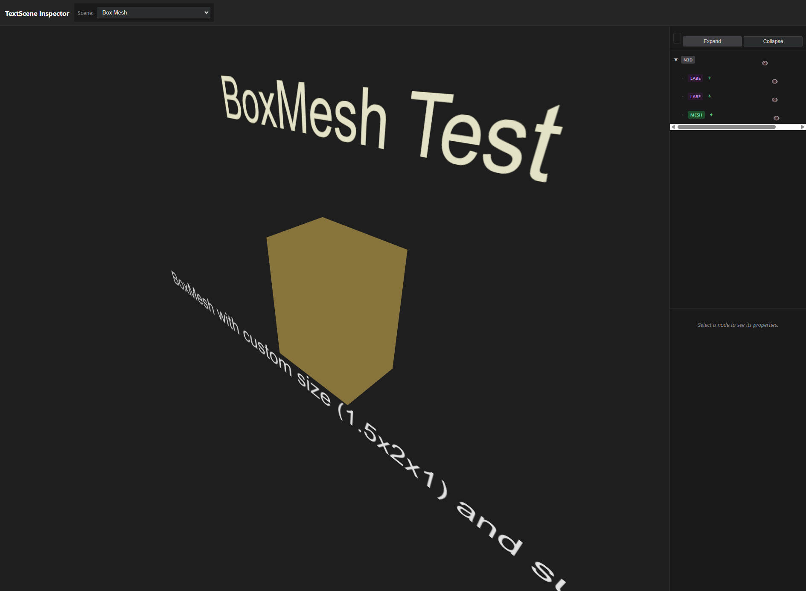

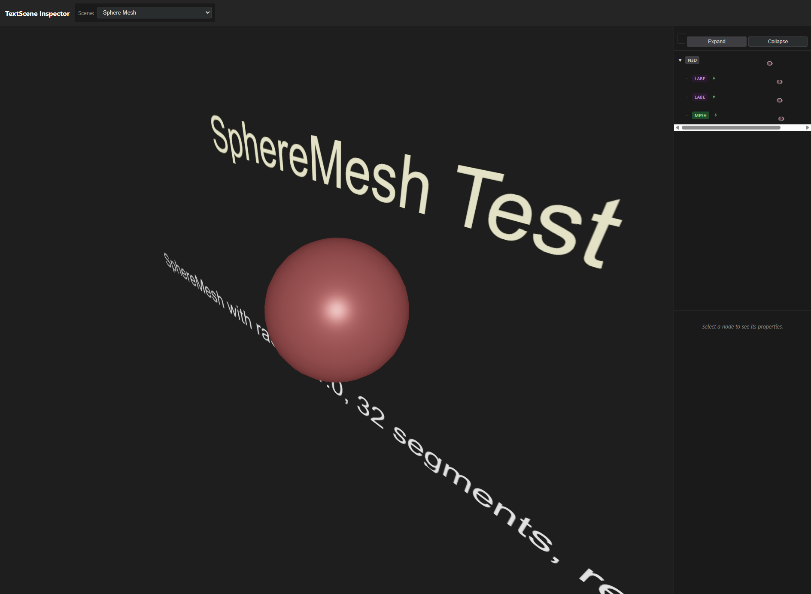

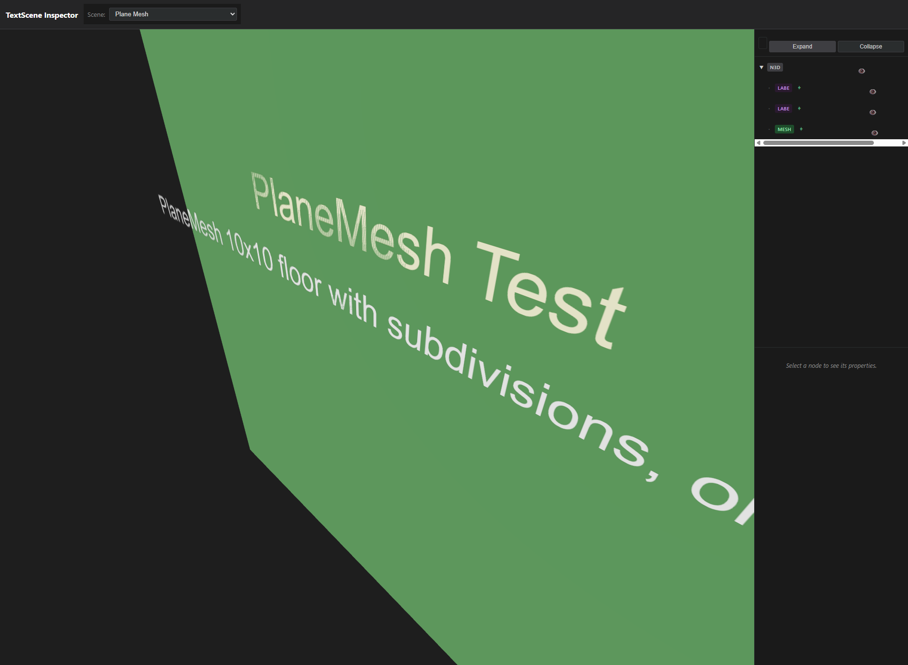

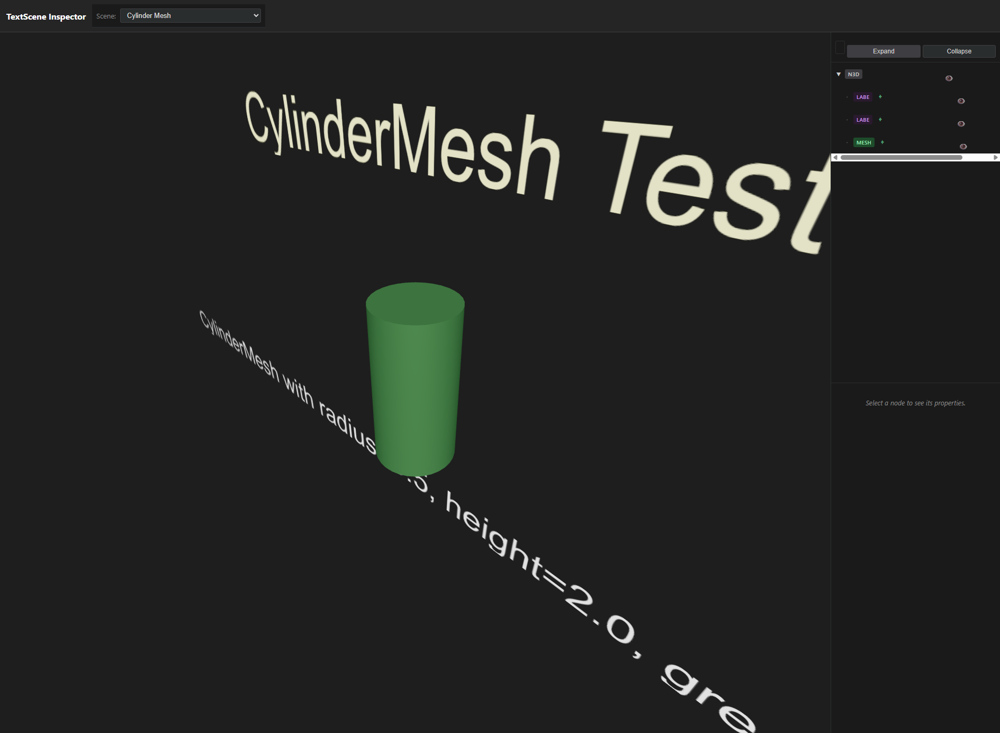

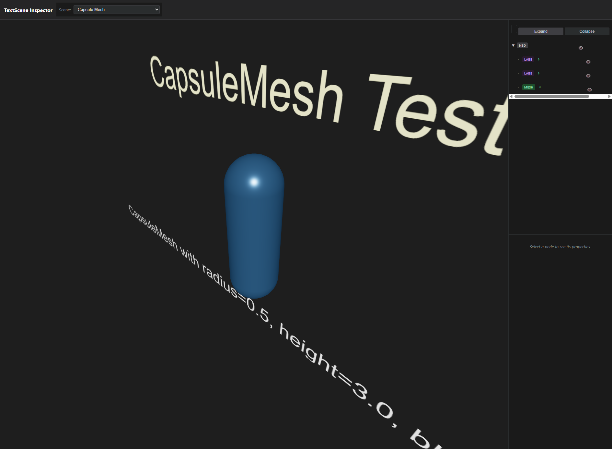

A few unit fixtures (Box, Sphere, Cylinder, Capsule) include floating "Test"-labeled text in the scene — those are Label3D nodes embedded for documentation. They look oversized because the default camera is close to the mesh; orbit out (scroll wheel) to put them in proportion.

---

## Missing-texture meshes — WEB-03

**Status:** PASS (fixed in WI-R3F-7b)

When you load a scene that references an external texture file the dev server cannot resolve, the affected mesh renders as a magenta-tinted placeholder with a floating label naming the missing path. The label is billboarded toward the camera so it stays readable as you orbit. Other meshes in the scene are unaffected.

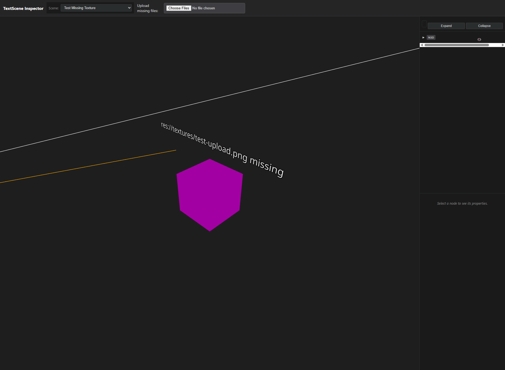

The fixture above (`scenes/fixtures/test-missing-texture.tscn`) references `res://textures/test-upload.png`, intentionally absent from the repo. The placeholder behaviour applies whether the texture is referenced directly by an ExtResource or indirectly through a SubResource StandardMaterial3D's `albedo_texture`. To clear it, upload the missing file via the **Resources** tab documented in the next section.

---

## Uploading a missing file at runtime — WEB-04

**Status:** PASS (fixed in WI-R3F-7b; upload flow reworked per-path in WI-UX-3)

Open a scene with a missing texture, then provide the correct file later via the Split Dock's **Resources** tab. The dependent mesh re-renders with the new texture; meshes that depend on a different (still-missing) file stay magenta. No page reload, no fixture re-selection.

The Resources tab's `MissingResourcesPanel` lists one row per missing `res://` path, each marked with a ⚠ icon and carrying its own file input — there is no global filename-guessing picker. Choosing a file for a row (any image — e.g. a PNG to satisfy `res://textures/test-upload.png`) applies the texture immediately:

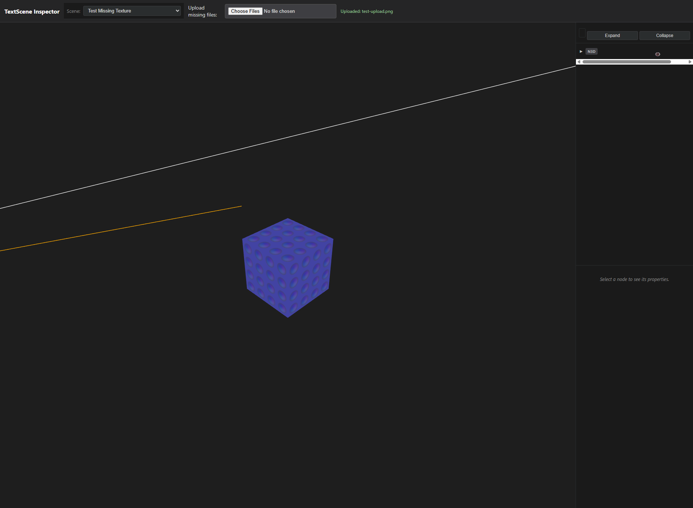

After the upload, the row flips to a ✓ "uploaded" state with a **Remove** button; clicking Remove reverts the path to missing and the dependent mesh back to the magenta placeholder. Uploads persist across fixture switches, so the same file applies to any other scene that references it, and only the meshes that actually depend on the new file re-render. The showcase clip [`docs/showcase/web/missing-upload.webm`](showcase/web/missing-upload.webm) records this flow end to end against the current UI.

---

## Shared-texture late arrival — WEB-05

**Status:** PASS (fixed in WI-R3F-7b)

`test-multiple-meshes-shared-texture.tscn` has three meshes: Mesh1 and Mesh2 share a material backed by `res://textures/shared.png`; Mesh3 uses a different material backed by `res://textures/different.png`. Both files are intentionally absent. All three meshes start as magenta placeholders, each with its own "&lt;path&gt; missing" label, and the Resources tab lists both paths as missing (⚠).

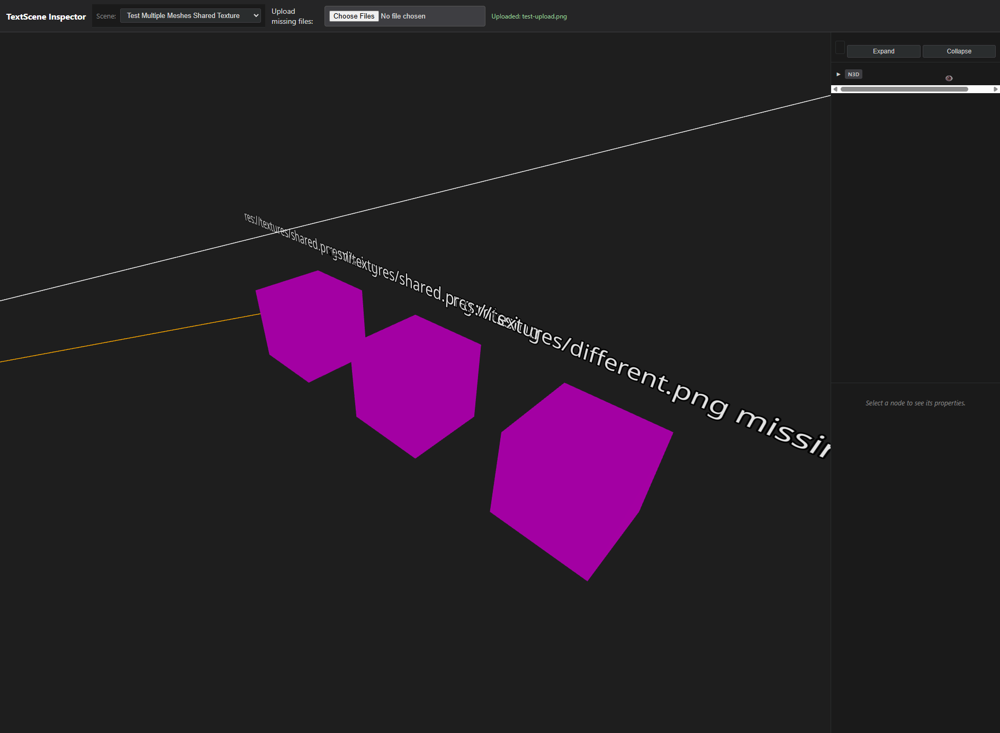

Upload a real PNG on the `res://textures/shared.png` row in the Resources tab. Mesh1 and Mesh2 update in the same animation frame; Mesh3 stays magenta because its texture (`different.png`) is still missing.

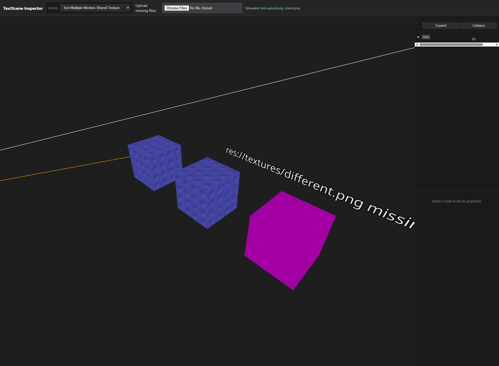

Two meshes pointing at the same texture path receive the new resource simultaneously through a shared cache — no double load, no perceptible lag between them. The Resources tab keeps every uploaded path listed with a ✓ so you can see (and Remove) the late-arrival files you have provided this session.

---

## Click-to-select a mesh — WEB-06

**Status:** PASS (verified on a deviation fixture)

Clicking a mesh in the viewport selects it: the matching row in the scene-tree panel becomes highlighted blue, and the right-hand details panel populates with the node's type, path, mesh sub-resource, material override, position, rotation and scale. Clicking a different node in the tree switches the selection and updates the details panel in the same way.

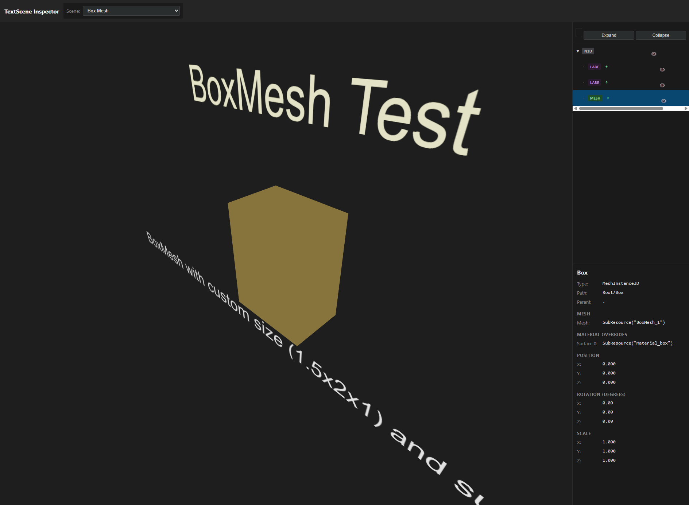

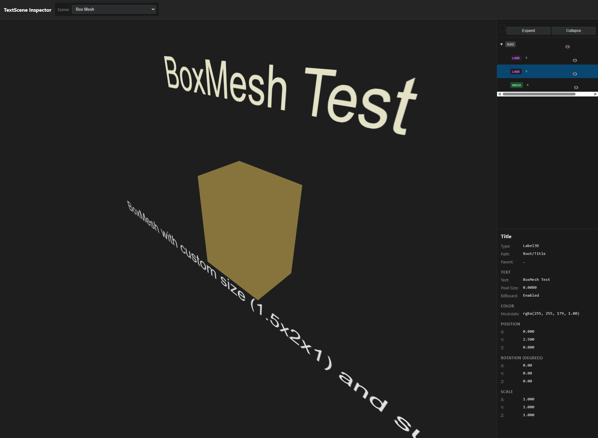

**Deviation note (resolved):** The spec asked for `integration-three-cubes.tscn`, which instances a child scene three times via `instance = ExtResource("...")`. At the time of the original verification the build did not render instanced PackedScene children, so `unit-box-mesh.tscn` was used instead. PackedScene instancing has since been implemented — `NodeDispatcher` resolves the `instance = ExtResource(...)` reference and mounts the external scene's subtree under the instance transform (see `NodeDispatcher.instance.test.tsx`) — so `integration-three-cubes.tscn` now renders its three cubes and can be used exactly as the spec intended.

---

## Hot-reload preserves camera — WEB-07

**Status:** Architecturally FAIL on web (works in VS Code)

The PRD wants the camera to keep its orbit position when you edit the source `.tscn` file and save. In the web app this is not testable because the web app loads scenes via `fetch('/fixtures/<name>.tscn')` on scene selection — there is no file-watch subscription. Vite serves `public/fixtures/` as static assets and does not HMR-watch them. The only way to see edited content is to re-select the scene from the palette (or reload the page), and both reset the camera by design.

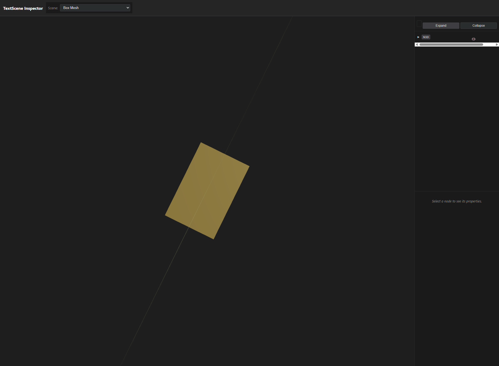

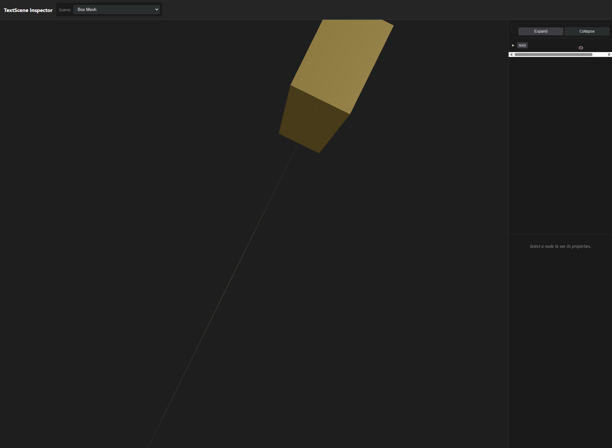

The two screenshots above show the box translating from origin to X=3 after the verifier edited the fixture, confirming the parser and renderer handled the new content correctly. The camera angle, however, was reset because re-selecting the fixture counts as a full scene reload.

**Known issue:** PRD US-8 (camera survives content-only hot reload) is meaningful in the VS Code extension, where `vscode.workspace.onDidSaveTextDocument` (for the previewed scene) plus a `FileSystemWatcher` (for dependent resources) drive a `webview.postMessage` flow that updates the existing webview without a full reload. The web app would need a parallel mechanism (a Vite plugin watching `scenes/fixtures/` plus a custom HMR event the app subscribes to, or moving fixtures out of `public/` and into the module graph). Tracked for design decision.

---

## Unsupported node types — WEB-08

**Status:** PASS (behavior updated since the original verification)

`unit-unsupported-nodes.tscn` contains `Area3D` (PhysicsArea), `AnimationPlayer` (AnimPlayer) and `Timer` (GameTimer). Since the original verification, two of those types have gained registered renderer components: **Area3D** renders as a transform-only group (ADR-0008 — physics bodies position their children and draw nothing themselves, per ADR-0005), and **AnimationPlayer** has its own slice whose node renders and — since WI-42 (#100) — drives playback of its clips through the selection-driven Animation transport (ADR-0011/0012). Neither triggers the fallback any more.

**Timer** remains unregistered and shows the actual fallback behavior: in the viewport it renders through `<GenericNodeFallback>` as an invisible transform-only group (ADR-0008 — no placeholder gizmo is drawn), and the scene tree tags it with a yellow **`Not Implemented`** chip next to its type abbreviation. Unsupported types stay discoverable through the tree, not by cluttering the viewport.

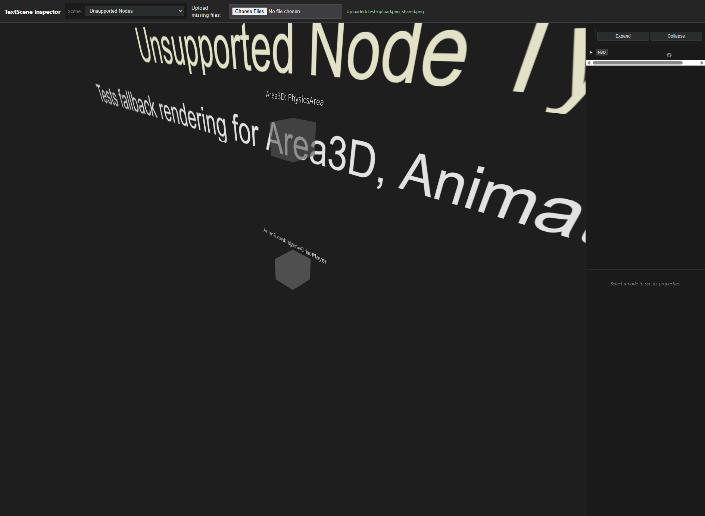

The screenshot above predates the current behavior: it shows the old placeholder-gizmo fallback with floating `<Type>: <Name>` labels, which has been replaced by the invisible-group + tree-chip design.

---

## Light and camera gizmos — WEB-09

**Status:** PASS

Light and camera nodes do not produce geometry of their own, so the previewer draws helper wireframes at their transforms so you can see where they sit in the scene.

Loading `integration-lights-all-types.tscn` and zooming out shows all three light helpers:
- **SpotLight3D** — a cone/frustum with the apex at the light's position
- **OmniLight3D** — a large wireframe sphere around the light at its falloff radius
- **DirectionalLight3D** — a small octahedron at the light's position (three.js's standard DirectionalLightHelper)

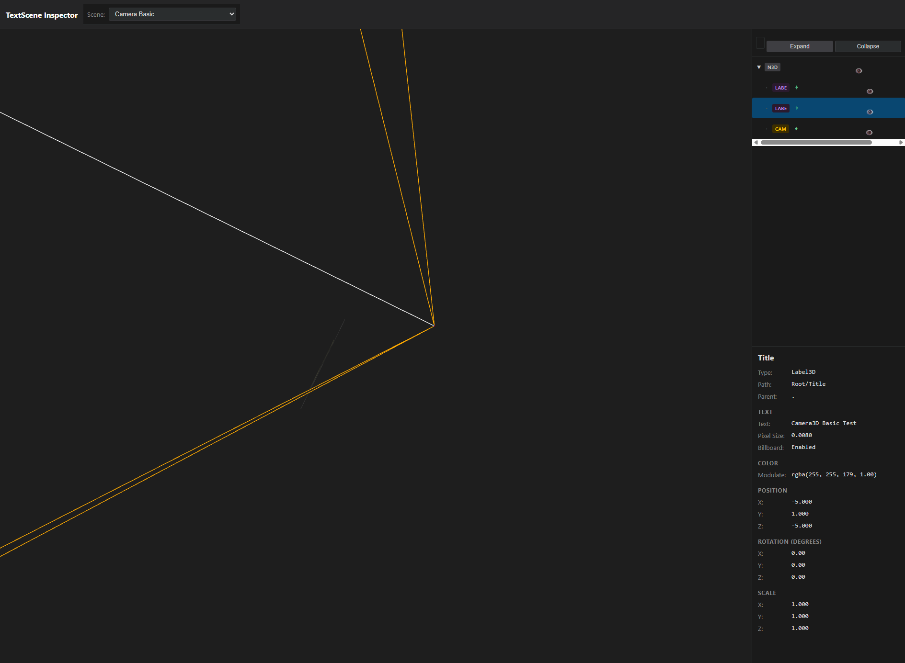

Loading `unit-camera-basic.tscn` shows the Camera3D as a frustum wireframe — orange lines extending from the camera origin outward to define its view volume.

Tip: the default camera is often inside the gizmo geometry for these single-node fixtures, so you may see only line fragments. Scroll out a few clicks to get a comfortable view.

---

## Malformed `.tscn` files — WEB-10

**Status:** PASS (fixed in WI-R3F-7b)

If you load a fixture with broken syntax (e.g. `edge-malformed-bracket.tscn` with missing closing brackets), a dark-red error banner appears above the viewport area reading "**Parse error:** Parser could not extract any nodes from the content. The file may be malformed." The app stays responsive — the scene picker and panels remain interactive. While the banner is up, the tree pane shows a dedicated empty state ("No scene loaded — fix the parse error above to continue.") rather than a stuck loading indicator. Switching to a well-formed fixture afterwards loads normally, the banner disappears, no leftover state.

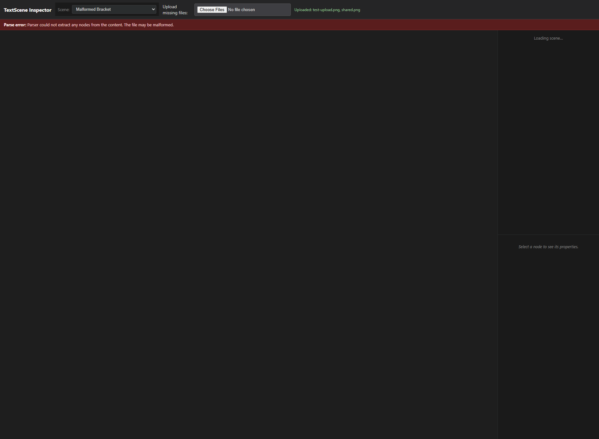

The banner distinguishes a parse failure from a legitimately empty scene (which simply shows "No nodes to display" without the red banner).

---

## Integration scene — BOTH-01

**Status:** PASS

`integration-all-primitives.tscn` is the canonical integration fixture and renders correctly: blue capsule, brown torus, green floor plane and the corner of the purple prism are all visible together. Lighting is non-flat — the torus shows a strong highlight on top with a darker bottom edge, and the capsule has a bright spot on its top hemisphere with a shadow side. The BackWall is offscreen at the default camera angle; orbit to see it.

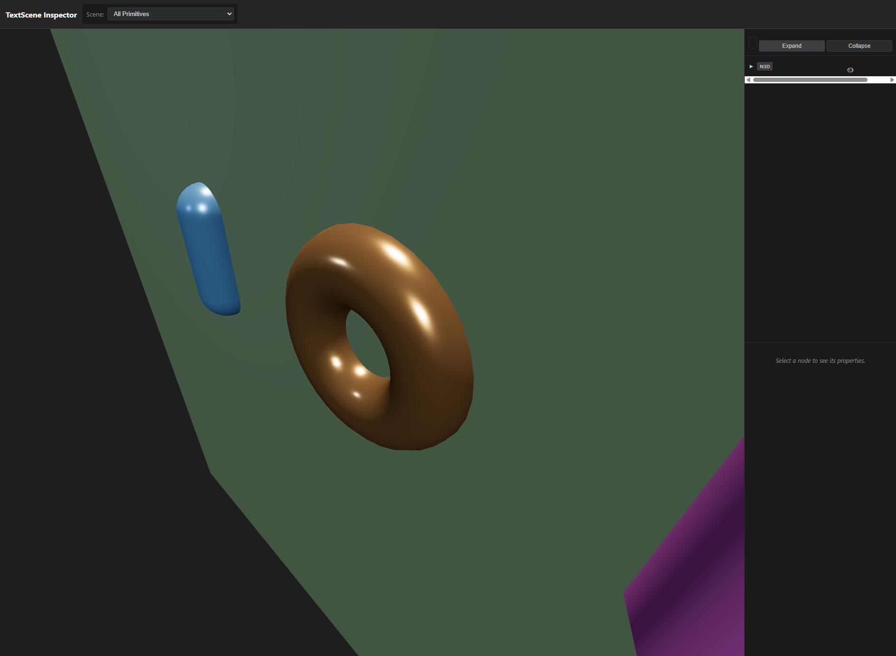

This screenshot satisfies WI-R3F-5 acceptance criterion (1) — the integration fixture renders without errors and the scene-tree panel lists all expected children (Root, Floor, Capsule, Torus, Prism, BackWall, DirectionalLight, FillLight).

---

## Every primitive renders — BOTH-02

**Status:** PASS

Cross-reference WEB-02. Each MVS mesh primitive renders with a distinguishable shape and no console errors:

- `unit-box-mesh.tscn` — tan box (`docs/screenshots/web/both-02-a.png`)
- `unit-sphere-mesh.tscn` — maroon sphere (`docs/screenshots/web/both-02-b.png`)
- `unit-plane-mesh.tscn` — green floor plane (`docs/screenshots/web/both-02-c.png`)
- `unit-cylinder-mesh.tscn` — green cylinder (`docs/screenshots/web/both-02-d.png`)
- `unit-capsule-mesh.tscn` — blue capsule (`docs/screenshots/web/both-02-e.png`)

(The screenshots are identical to the WEB-02 captures, just stored under the BOTH-02 file slots.)

---

## Lights illuminate meshes — BOTH-03

**Status:** PASS

Two scenes together prove that lights produce both gizmos AND illumination on neighbouring meshes.

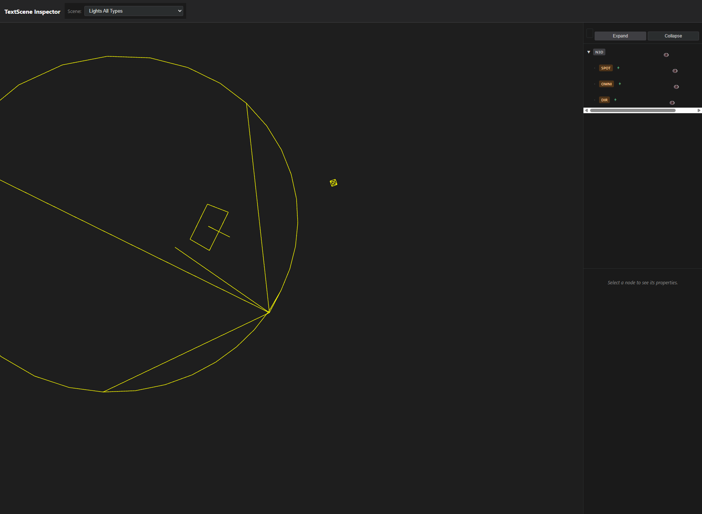

`integration-lights-all-types.tscn` (above): all three light helpers visible at their transforms. Same content as WEB-09-a; the fixture is mesh-free by design.

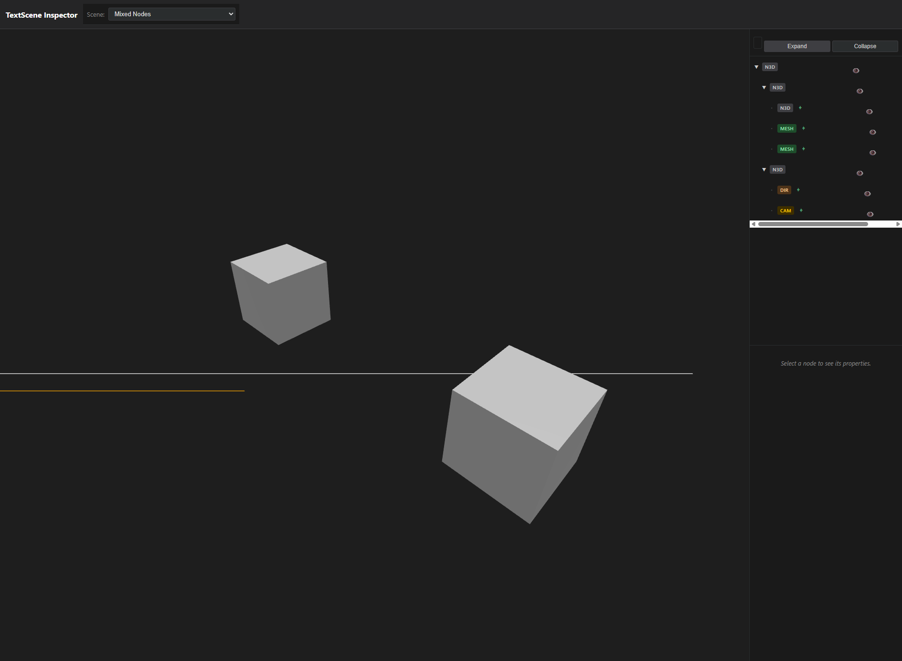

`integration-mixed-nodes.tscn` (above): two grey cubes show clear directional shading from the scene's DirectionalLight3D — top faces brightest, side faces mid-grey, bottom-side darker. (This fixture only has one light, not the multi-light setup the spec hoped for, so the "colored highlights from the spot light's tint" sub-claim is not testable on this scene. The underlying "lights illuminate meshes" requirement passes.)

---

## WorldEnvironment changes atmosphere — BOTH-04

**Status:** PASS

A `WorldEnvironment` node controls the rendered background and ambient atmosphere. Two fixtures with different WorldEnvironment configurations produce visibly different backgrounds, confirming the node drives the rendered state rather than a hard-coded default.

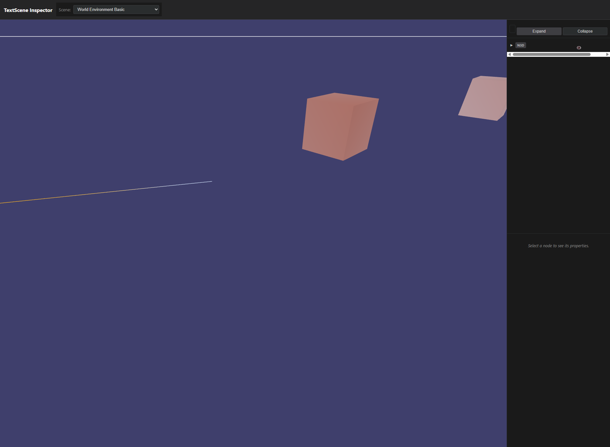

`unit-world-environment-basic.tscn` (above): deep blue-purple background, two pinkish cube meshes.

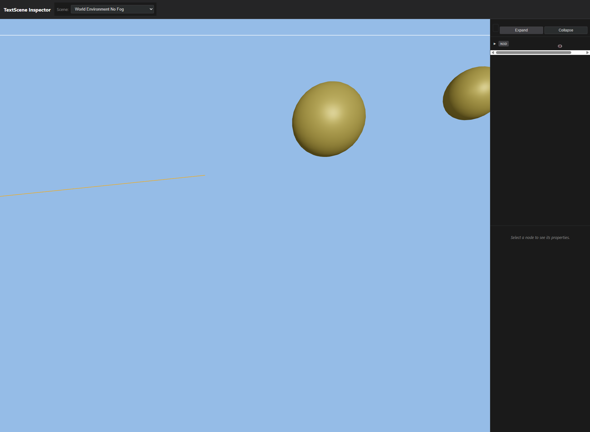

`unit-world-environment-no-fog.tscn` (above): light sky-blue background, two yellow/olive spheres. The visible colour difference is the spec's confirmation that the WorldEnvironment node is plumbed through to the renderer.

---

## Known limitations (triage list)

After the WI-R3F-7b fixes, all five missing-resource and fallback-label gaps from the v1 verification pass. Two limitations recorded here previously have since been fixed: PackedScene instancing now renders (see WEB-06), and the parse-error tree pane now shows a dedicated empty state instead of "Loading scene…" (see WEB-10). The remaining outstanding item is below.

1. **No content-only hot reload on web.** Editing a scene file in the source tree does not propagate to the open page without a re-selection from the scene palette or a full page reload, both of which reset the camera. PRD US-8 (camera survives content-only hot reload) is unreachable on web. The VS Code extension implements the equivalent via `onDidSaveTextDocument` plus a `FileSystemWatcher` for dependent resources; the web app would need a parallel mechanism (a Vite plugin watching `scenes/fixtures/` plus a custom HMR event the app subscribes to, or moving fixtures out of `public/` and into the module graph). (Flow affected: WEB-07.)
